# Manage a dataflow
**How to work with the dataflows page**

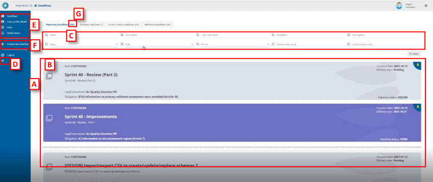

  * [A] – The main part of the page comprises the list of dataflows which you have access
to – ‘My dataflows’.
  * [B] – A dataflow is colour coded according to the current status – grey in design and
purple when reporting is open. On the dataflow card, you can see various metadata –
Your role; Delivery date; Creation date; Dataflow name; Dataflow description;
Associated obligation and instrument; Dataflow Status.
  * [C] – Filters and sort on the various metadata of the dataflows list allow you to find
things easily in the dataflows list.
  * [D] – This button will expand the menu, to show the icon labels.
  * [E] – The static menu is available on every page and has four buttons. From top to
button, the buttons are:
o My dataflows – will return you to this page.
o User profile details – allows you to manage some global settings and see your
user profile.
o Help – Triggers a help walkthrough of the page you are currently on.
o Notifications – Provides the history of all notifications (which appear in the top
right of the screen) as a list. Note: the indicator only tells that the process has
started or ended and there is no progress bar to know the percentage of the
process (import, validate, …). Also, although the indicator says that a process
has been sent, it doesn’t mean that it has started processing. Depending on the
number of other processes that are in ReporteNet3 server maybe it will be held
waiting in queue until other previous processes have finished.
  * [F] – Below the line is the context menu. The context menu changes on each screen. On
this screen, you can:
o Create a new dataflow.
  * [G] – Amount of this kind of dataflow.

**How to sort and filter my dataflow list**

  1. The dataflow list is by default ordered first by status (design dataflows at the
top) and secondly by delivery date (descending).
  2. Each of the metadata fields on the dataflows (name, description, legal
instrument, obligation, id obligation, status, role, pinned, delivery date range,
creation date range (only available for custodians)) can be filtered or sorted on
using the filter bar at the top of the dataflows list. The filters are applied on
entering.
  3. Combinations of more than one filter can be used.
  4. The button on the right ‘Reset’ will put the list back to its default state.

**How to pin a dataflow**

  1. There is a pin icon in the top right of each dataflow card.
  2. When clicking on pin, there is a notification message. The dataflow displays a
pin icon in the right side and it goes to top of the list.
  3. When I have others already pinned, it keeps the same order criteria than when
unpinned.
  4. When I unpin any, there is a notification message. The dataflow turns unpinned
and come back to dataflow list following proper order criteria.

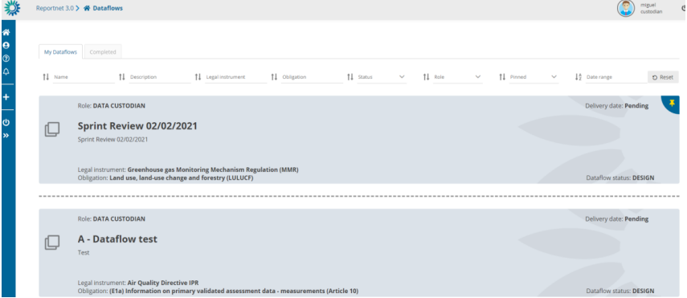

**Permissions depending on user role**

Different permission depending on role during reporting phase:

  * Custodian/Steward – read-only permission except for TEST dataset with write
permission
  * Observer – read-only permission.
  * National Coordinator – read-only permission.
  * Lead-reporter – Write permission
  * Reporter write – Write permission
  * Admin – can see the list of all dataflows of any type and have option to give rights. Inside
the dataflow you can see the dataflow help and manage the requesters.
  * Steward support – read-only permissions except for test dataset edition, full access to
technical acceptance workflow, can update documentation and weblinks, can manage
lead reporters and gets mail notification when there is a delivery.

**How to work with the dataflow page during reporting**

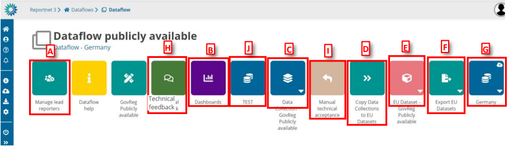

  * [A] – Add new lead reporters to the dataflow.
  * [B] – Dashboards present an overview of the reporting process (validations, release
status).
  * [C] – View the collated submitted data from here – the data collection (DC).
  * [D] – Take a copy of the data in the current data collection over to the EU dataset.
  * [E] – View the EU dataset.
  * [F] – Export the EU dataset to the Common Workspace (triggers a configurable FME
process, see section 4.1.7).
  * [G] – You can see the reporting status of each single country by clicking on the icon
associated with the country name (only one country is shown in the above).
  * [H] – Communication between Lead Report and Custodian during release phase (see
section 4.1.10).
  * [I] – Review of the data released in the data collection (see section 4.1.9)
  * [J] – TEST dataset for supporting reporters and trying to reproduce a situation (see
section 4.1.15)

**How to see an overview of reporting progress**

  1. From the ‘Dataflow’ page click on ‘Dashboards’.
  2. For each country reporting under the dataflow, you can see an overview of the
errors – under the ‘Validation dashboards’.
  3. You can also see the status under the ‘release status dashboards’ –
released/unreleased, which reflects whether they have delivered a snapshot to
the data collection.
At the top of the page, there are means for filtering by country and/or the table
within each dataset. It is possible to filter by error type.

**How to see the latest draft data**

From the ‘Dataflow’ page click on the dataset for the country you are interested in.
You see the data as read only in the individual data for each reporter in its latest
state, which may be different to the version released to the data collection, if
they have continued to work on it.

  2.

**How to review the data released**

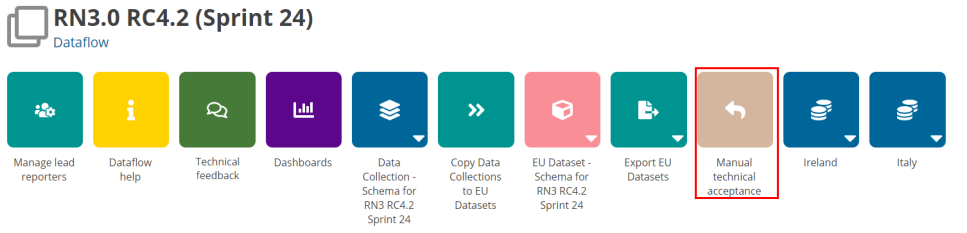

The custodian can review data released and send feedback using ‘Manual technical acceptance‘ button.

  1. When the reporter releases data the status is marked as ‘Final feedback’.
  2. The custodian can now make a review of the data released in the data collection.
  3. It is possible to set the status to ‘technically accepted’ or ‘correction requested’.
  4. If ‘correction requested’, the data stays in the data collection and feedback is
sent to Lead Reporter and Reporting Dataset status is updated.
  5. If its ‘technical accepted’ then the version in the data collection is marked as
such and Reporting Dataset status is updated

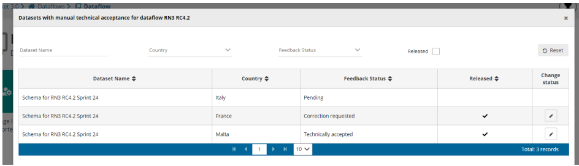

**How to mark for automatic data+snapshots deletion**

Some dataflows must store data for a maximum period of time and system must be remove
automatically some data. You can configure a dataflow to be deleted reporter datasets after
technical acceptance step was set to ACCEPTED.

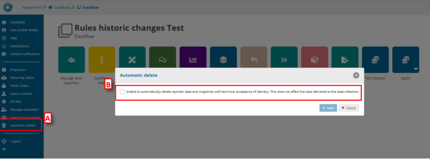

  1. Go to the dataflow page.
  2. There is an icon on ‘Automatic delete’ [A].
  3. A pop-up will appear where you check if enable/disable [B] the automatically
delete reporter data and snapshots with technical acceptance of delivery. This
does not affect the data delivered to the data collection.

**How to close/open release process**

When you create a data collection the status by default of this dataflow is OPEN

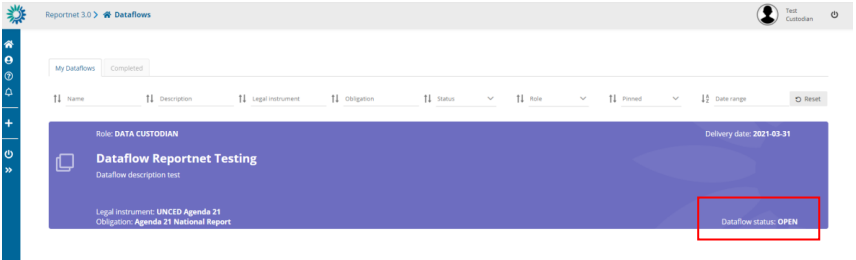

If you want to change the status, you can click on “Releasing status” and a check appears
showing if reporting is open or not. You can change it by clicking on check and saving.

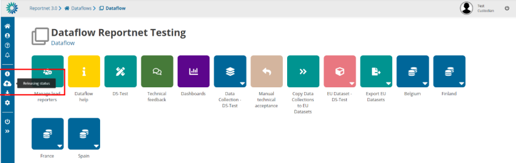 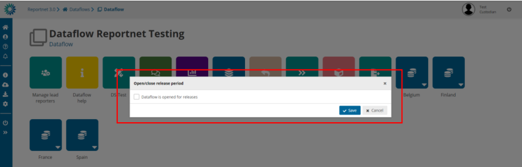 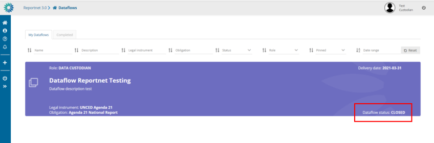

If you close the reporting, reporters won’t be able to release data. It means that the button
‘Release to data collection‘ will be disabled and a tooltip will be appear explaining that the
releasing period is closed.

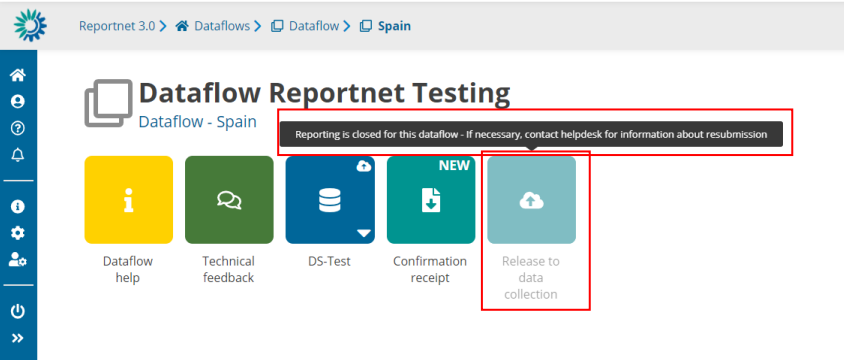

**How to reproduce reporters´ feedback**

Once data collection has been opened, a TEST dataset is created where the data
custodians have a place to do also tests, in support of the reporters trying to reproduce
a situation.

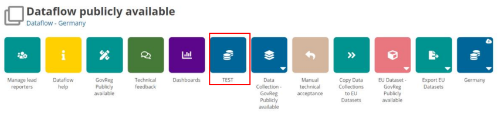

There is no option to release data, no dashboard and no public information.
