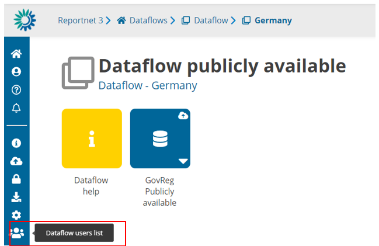
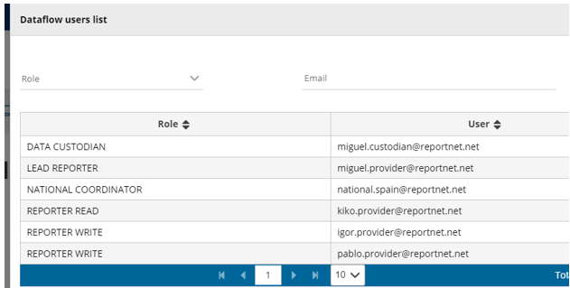

# Dataflow users list
 

  1. From a dataflow inside a country selection (if applies, if there are not more than
one country, directly in dataflow main page), the user can see all users assigned
to this dataflow country by selection ‘Dataflow users list’ in the left bar.
  2. All roles, when applies, are displayed: Data Custodian, Lead Reporter, National
Coordinator, Reported Read, Reporter Write, …

It is important to remember that only the users that appear on the list will be able to view the
country information, so other lead reporters from other countries will only be able to see their
corresponding country and not the information from other member states.
A user is only allowed to add users that have the same or lower privileges while for removing
users, only the ones that have lower permissions.
