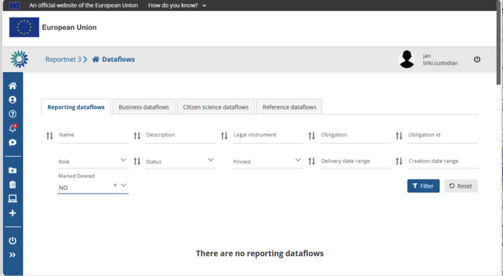

# Different dataflow types

On the dataflow overview page you will see four different tabs. Each tab represents a different data flow type. **Notice that the left bar functions will be reflected to the tab you have activated**. For example when you are the “Reference dataflows”-tab. The new dataflow button (+)-sign will create a “New Reference dataflow”.

## Reporting dataflows

These dataflows focus on collecting information from Member States. Typically, each participating country receives a dedicated data collection request. By gathering standardized data from each Member State, Reporting Dataflows support accurate comparisons, facilitate regulatory compliance, and help maintain a unified dataset at the European level.

## Business dataflows

Designed to capture inputs from businesses and industries—such as car manufacturers—Business Dataflows collect data on a per-entity basis. This structure makes it easier to track and compare performance or compliance across different companies. Whether it’s a large-scale factory or a smaller enterprise, each entity provides the relevant data as required by this specific dataflow. Business dataflows can only be created by the Reportnet administrator because the list of providers is considered sensitive none classified.

## Citizen science dataflows

In an era of participatory engagement, Citizen Science Dataflows enable NGOs, research groups, or community projects to contribute valuable observations and measurements. This inclusive approach not only broadens the scope and diversity of data but also fosters collaboration and shared responsibility for environmental and societal challenges.

## Reference dataflows (Not shown to reporters)

Unlike the other types, Reference Dataflows are not tied to any direct reporting obligation and do not have designated reporters. Instead, they function as foundational datasets—vital building blocks that underpin the other dataflows. A prime example is the Eurostat administrative boundaries dataset (NUTS). Member States referencing their administrative boundaries often rely on these established codes. By serving as a consistent point of reference, Reference Dataflows ensure accuracy and uniformity across multiple data reporting processes.
