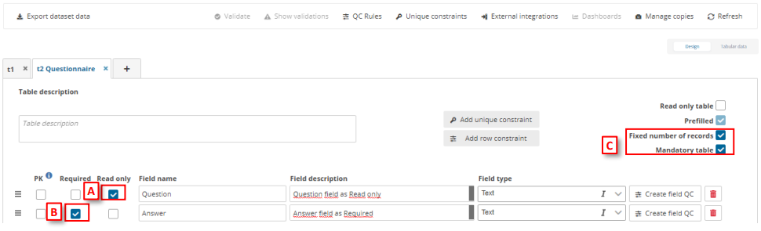
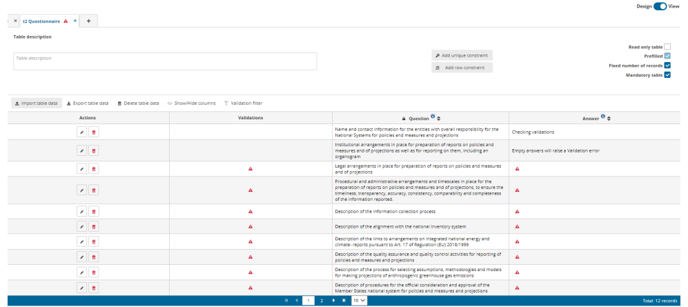

# Example: Configure a simple questionnaire
By configuring fields in a specific way, it is possible to create a simple questionnaire:

[A] – Question field configured as Text type and Read Only – the Reporter won´t
be able to change it.

B] – Answer field configured as Text type and Required – to ensure all the
questions are answered.

C] – Prefilled and Fixed number of records set – when dataflow is moved to
reporting phase, Questions added are maintained and no more rows can be
inserted.

