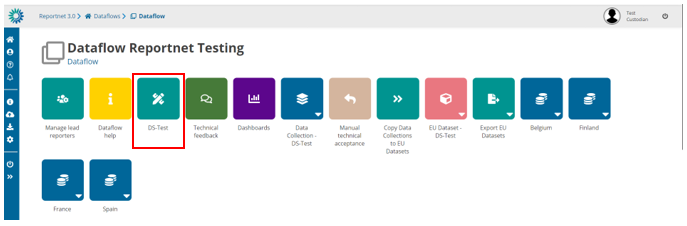
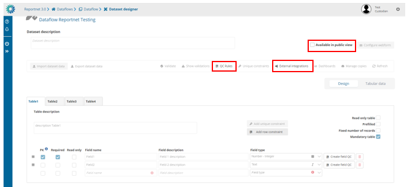

# External integration possibilities
You can be able to manage the external integrations for all datasets in reporting phase. If you click on the design dataset you can see that everything is read-only except the external integrations configurations, QC Rules and publicly available.

 
