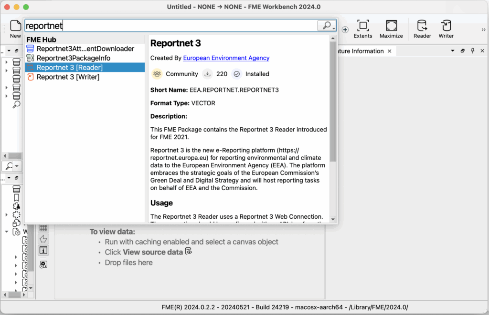
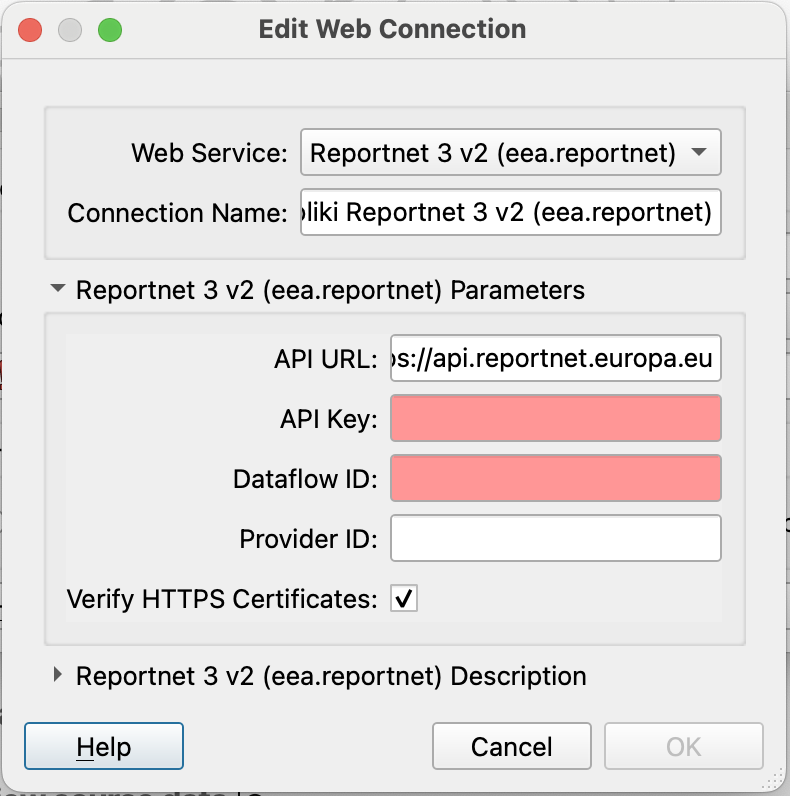

# FME connectors
The EEA Produced an FME Package contains the Reportnet 3 Reader in order to have an easy entry point for data extraction.

The Reportnet 3 Reader uses a Reportnet 3 Web Connection. The connection should be configured with a Dataflow ID and API-key from the e-Reporting platform. When this is configured the user may browse the Datasets the API-key grants access to.

FME Feature Types are defined by selecting the corresponding Reportnet 3 Tables.

You can find the Reportnet 3 Reader in FME Hub. In order to access this open FME Form application and click on the main canvas, type “Reportnet” and follow the instructions.

The reader is an open source solution and can be found on the following places.

FME Hub: [Reportnet 3 – FME Hub](https://hub.safe.com/publishers/eea/packages/reportnet)
GitHub: [Reportnet 3 – FME Hub](https://hub.safe.com/publishers/eea/packages/reportnet)
