# Custom validations (SQL)
Custom validations are based on the underlying database solution and require the knowledge of SQL syntax. Reportnet is transitioning from PostgreSQL towards a data lake house solution (Dremio). Both solutions are available today. The overall aim is to move away entirely from PostgreSQL for the data validation.

The type of database solution you are using is decided when you created the dataflow. The data lake house solutions is chosen when “Big data storage” is checked. When unchecked PostgreSQL is used.

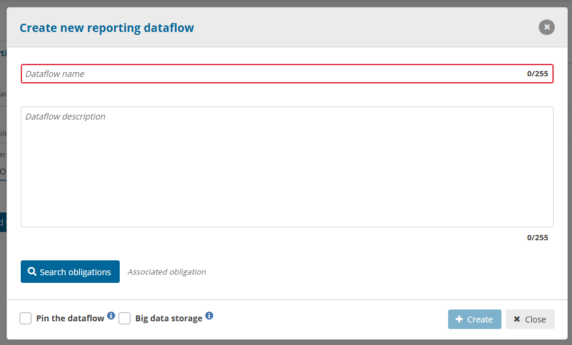

# Data lake house (big data)

The latest storage solution inside Reportnet 3 has a focus on Big Data and complex data flow support. Reportnet is moving all data flows towards a data lake house as scaling this technology is endless and can provide a robust storage and compute platform. Reportnet has chosen Dremio because it can be installed on premise and in the cloud. Dremio has also a open source version that allows for a deep integration within the Reportnet product.

## Dremio SQL Functions (Latest version 25.1.1)

Reportnet keeps the Dremio engine up to date as fast as possible. While the Dremio help is describing the full SQL command set you only will get access to the functions itself. Ceation of tables, functions and views will not be allowed inside Reportnet 3.

Here you can find the [lastest Dremio SQL functions](https://docs.dremio.com/24.3.x/reference/sql/sql-functions/)

### Geo-spatial functions (Latest version 0.18.x)

Reportnet 3 has included the custom functions produced by Idan Sheinber. The following [link](https://github.com/sheinbergon/dremio-udf-gis/wiki) brings you the implemented functions at this stage. All these functions have been based on the [PostGIS-functions](https://postgis.net/docs/reference.html). Reportnet can’t promisses that we have no slight differences. We will always have slight delays when new versions come available. Reportnet needs to test every change against the operational platform to ensure a full working environment.

### Other custom created function by the Reportnet 3 team

Currently one additional custom functions has been created inside Dremio by the Reportnet 3 development team. We are in communication with Idan Sheinber to add this with the other geo spatial functions.

integer **ST_SRID**(geometry g1);
returns the spatial reference identifier for the ST_Geometry. A geometry is associated with a Spatial Reference System by its SRID value. You can read more about this [here](https://postgis.net/docs/using_postgis_dbmanagement.html#spatial_ref_sys)

* * *

# PostgreSQL database

The first version of Reportnet 3 is based on PostgreSQL that was extended with a horizontal scaling solution called CITUS. Reportnet detected a number of scaling issues that are partly related to the implementation choices but as well came short handling the complex data types we have to manage. Are aim is to move away from this technology and move fully towards a data lake house solution.

## The PostgreSQL functions

The old backbone engine will be depricated over time as it is not scaling efficiently. Dataflows that are still under PostgreSQL database will need to follow the SQL functions of PostgreSQL For custom validations. That is the case If you have not checked the “**Big data** ” option during creation of the data flow.

We re-direct you to the standard SQL functions descriptions as our custom validations are based on the [PostGreSQL engine](https://www.postgresql.org/docs/current/functions.html). It needless to say that only SELECT statements are supported.

* * *

**How to introduce SQL sentences**

There are different ways to introduce SQL sentences. These sentences are executed exactly as
it is introduced in the system in a raw SQL language.

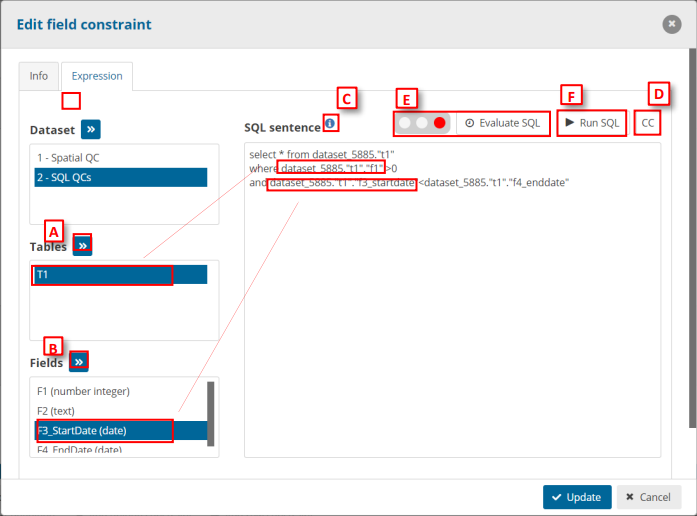

  * We can introduce the schema, table and field names in a semi-manual
way by selecting the schema and the tables or field we want to declare
in the sentence [A].
  * Field types are displayed between brackets (Text in the example) to
have the information of them when we are writing the SQL sentences
[A-B].
  * Detailed help info to create the SQL rules [C]
  * The SQL sentence will have this text replaced by the country code
(refers to ) [D]
  * We can evaluate the SQL sentence [E]. This traffic light indicates the
complexity of the expression of the SQL sentence. You can see it too on
the list of QC rules in the column ‘SQL evaluation’.

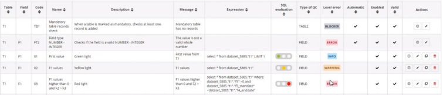

  * We can run the SQL sentence by clicking the button ‘Run SQL’ [F] and it
will show a dialog with the results of this SQL sentence.

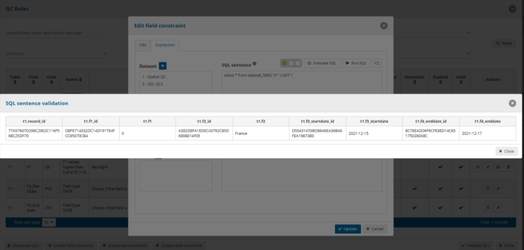

Note: if you add a wrong SQL sentence and you click on ‘Evaluate SQL’
or ‘Run SQL’, you will see highlighted in red the area of the SQL sentence
and below of this area, we can see the error

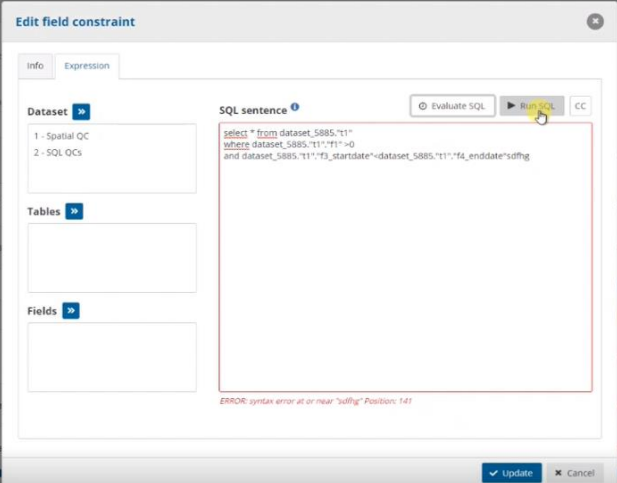

  * We can include SQL fields in the message setting the text between . This keyword is replaced in the SQL result for this field. We can use
an Alias or add more fields in the message

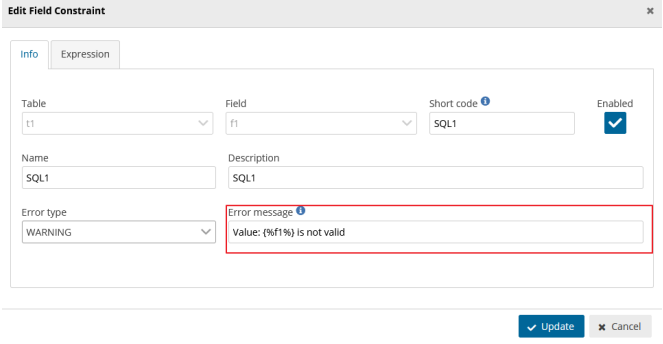 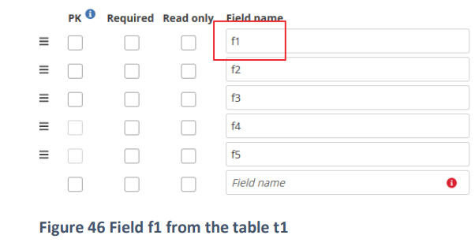 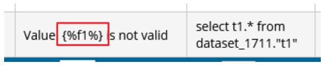

**Manually**
We also have the possibility to introduce the sentences in a completely manual way.
In the info button we can display the SQL Help dialog that show us the
way we have to introduce the sentences and names of each element
(SQL Help will display differently if we are creating a field, record or
table constraint):

**Table SQL sentences:**

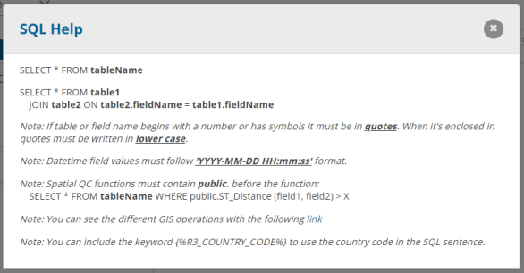

**Record SQL sentences:**

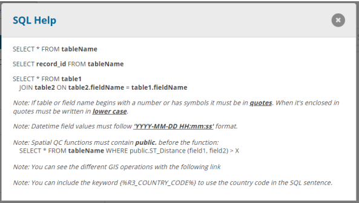

**Field SQL sentences:**

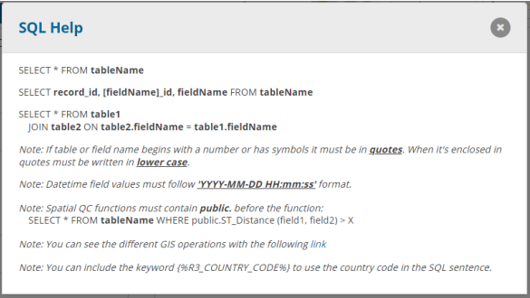

The main difference between them it’s in the field and record SQL sentences:

  * If it’s a record it needs record_id in the select.
  * If it’s a field it needs record_id, field_id and the field name.

The note in the bottom part it’s for all the SQL QCs: If a table or field name begins with a number
or has symbols in the name it must be written in quotes. When a name it’s enclosed in quote it
must be written in lower case.

For POSTGIS spatial functions which are exposed to the SQL interface – the revenant ones are
here: [PostGIS reference](https://postgis.net/docs/reference.html#Spatial_Relationships)

**How to develop SQL sentences**

Differences between MSSQL and PostGresSQL:

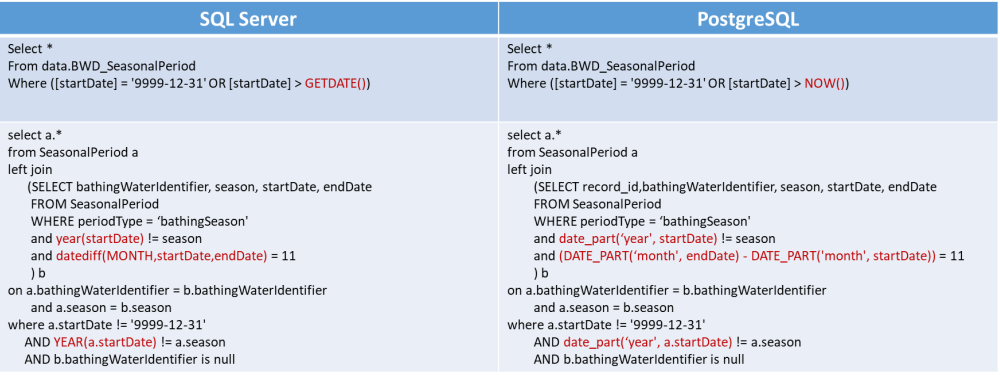
