# Manage quality control rules
##

## How to manually add field constraints (field QC rules)

You manually add further field constraints by clicking on the ‘Create field QC’
button to the right of the field definition row. Click on this to open a validation
builder in a new window.

Alternatively, open the ‘QC rules’ dialog and click the button ‘Create field constraint’ at the bottom left.

Moreover, you can clone a QC rule by clicking on the ‘Duplicate’ button where
you will be able to prefill new QC from an existing one and you can ‘Quick edit’
the basic information (code, name, description, message, level error and status)

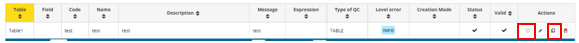

Each QC can be provided with some metadata to help the reporter understand
what restrictions have been imposed on the schema (name, description). Here
you also set the error message when which is triggered when the value fails the
validation, and you can also set the level of validation.

Different levels of validation can be set depending on severity:

  * **BLOCKER** : Blocker messages indicate that the detected error will prevent data submission (data release is not possible).
By default, the automatic QCs are created with this level of validation.
  * **ERROR** : Error messages indicate issues that clearly need corrective action by the data reporter.
  * **WARNING** : Warning messages indicate issues that may be an error.
Data reporters are expected to double-check relevant records.
  * **INFO** : Informative message. Neutral or statistical feedback about the delivery, e.g. number of species reported.

Examples of field constraints, which are dependent upon the type of field:

  * **dates** must fall within a certain range;
  * **text** which is limited to a certain number of characters;
  * a **number** field with thresholds the values must fall between
  * for a **text** field, use the string and MATCH operator to validate patterns
using RegEx, e.g. an ID of two digits and four numbers: [A-Z]{2}\d{6}
  * **QC based on SQL sentences** (see section 3.3.14).

Important note for SQL rules:
Semicolons (;) are automatically converted to _CHR(59)_.
If a semicolon is required inside a string literal, do not type it directly.
Use for example:
```
WHERE column_name LIKE '%' || CHR (59) || '%'
    -- or
    WHERE column_name LIKE CONCAT ('%', CHR (59))
```

If you have more than one expression which are related, then you can add them
with the ‘add new rule’ button. You need to establish the relationships between
the rules – AND or OR. For example, a number value must be greater than 0
AND less than 10.

It is also possible to create expression groups and establish relations between
groups and individual rules, or groups and groups. To enable a group – tick at
least two tick boxes on the left for the rules you wish to group. As soon as more
than one isticked, then a ‘Group’ button appears. Press this to create the Group.
Then you establish the relation between this group and other rules or groups
using AND or OR dropdown.

Once you have finished then press the ‘Create’ button.

After rule creation, the rules engine will validate the rule to ensure it is logically
valid. If there is an issue, you will see a red notification window appearing in the
top right. The user has also the option to validate QCs on demand (revalidates
all the QCs, required for SQL rules when table or field names has been changed).

To review a created rule, click on the ‘QC rules’ button in the table menu bar. A
dialog will appear listing all the rules – both those created automatically as well
as manually.

It is possible to edit the created rule by clicking on the edit button on the right
of the rules in the ‘Actions’ column.

It is possible to download the list of QCs in a CSV file by clicking on the
‘Download QCs’ button.

## How to ensure records in a table are unique

  * On the field which is the unique identifier for the records in the table, enable
‘PK’ (Primary Key) tick box to the left of the field name (If not already enabled,
this will also make this field ‘Required’).

  * Go to the ‘QC Rules’ dialog and you will see that an additional QC rule has been
automatically added with name ‘Table type unique Constraint’ and description
‘Checks if either one field or combination of fields are unique within table’. Edit
the error message to make it more meaningful.

## How to link tables together and validate values in child table

You can link tables together with type ‘Link’ (linked with table defined on the current
dataflow) or ‘External Link’ (where you will be able to create an external link to a
reference dataset inside a reference dataflow).

  1. On the parent table enable ‘Primary Key – PK’ tick box to the left of the field
name, for the field which is going to be the link between tables. (If not already
enabled, this will also make this field ‘Required’).
  2. On the second (child) table, create a field with the same name, and for the field
type select ‘Link’.
  3. In case of type ‘Link’, in the dialogue window, select the field in the first table,
which you made the ‘PK’ in the first step, and optionally the linked table label
field and conditional fields, and press ‘Save’.

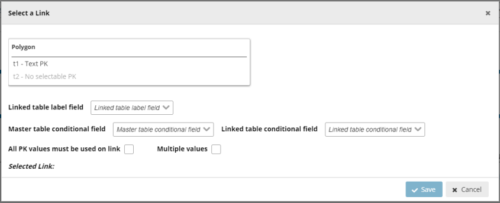

  4. In case of type ‘External Link’, in the dialogue window, you first must select the
‘reference dataflow’ [A] and then select the schema and table to use the link.
Moreover, select the field in the first table, which is the ‘PK’, and optionally the
linked table label field and conditional fields, and press ‘Save’.

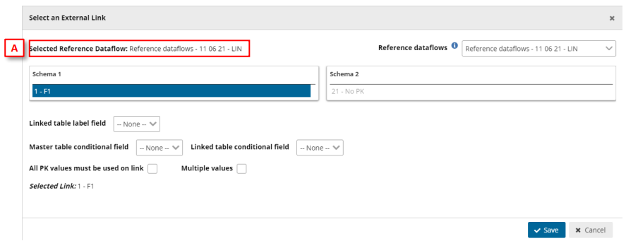

  5. In the second table, the only allowable values are those which have been
entered as ID on the first table (table which PK is enabled). A relation has been
established between the two tables and all fields involved with the conditional
data. If you import data to the second table and the ID value is not existing in
table 1, then you will receive an error message.
  6. Go to the ‘QC Rules’ dialog and you will see that an additional QC rule has been
automatically added with name ‘Field type LINK’ and description ‘Checks if the
record based on criteria is valid LINK’. Edit the error message to make it more
meaningful.
  7. Note: Fields type Point, Line, Polygon, Multiple points, Multiple lines and
Multiple polygons can´t be set as Primary Key (PK).

## How to establish Conditional fields in Linked tables

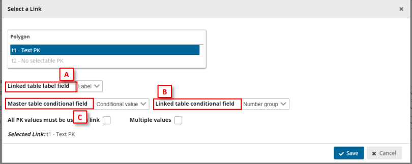 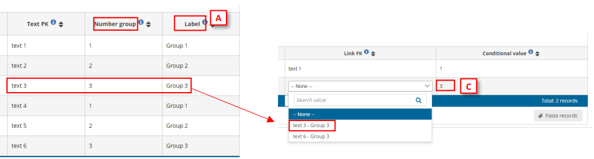

[A] – Set a label for the data (only visible when combo is expanded, once the data is
chosen, the label will not appear).

[B] – Set the data linked with primary key.

[C] – Set the data which will conditionate the possible values for the linked field.

Therefore, when in Table 2 we set a value in [C], the Link FK field will only display Text PK possible
field values depending on conditional values on [B].
Note: These fields are optional when linking fields between tables.

## How to validate values between linked tables so all PK values in parent table
are present in the child table

  1. To create a new relation between tables, follow steps in the previous section up
to step 3 to link two tables together, but do not save from the ‘Select a link’
dialog.
  2. For an existing relation between two tables, click on the button to the right of
the linked field, field type which shows the established relation in the ‘Select a
link’ dialog.
  3. In the ‘Select a link’ dialog, enable ‘All PK values must be used on link’.
  4. Click ‘Save’.
  5. In the child table, the only allowable values are firstly those which have been
entered as ID on the parent table (table which PK is enabled), and child table
must also contain all the values which are have been entered as ID on the parent
table.
  6. Go to the ‘QC Rules’ dialog and you will see that an additional QC rule has been
automatically added with name ‘Table Completeness’ and description ‘Checks if
contains all the records based on set criteria’. Edit the error message to make it
more meaningful.

## How to validate values between non-linked tables, e.g. reference data

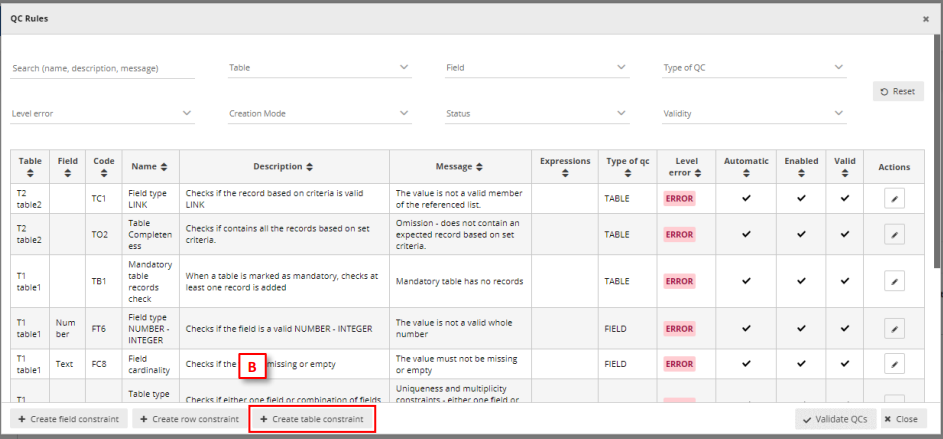

  1. A scenario could be that you’d want to validate the reported data against
reference data e.g. historical data, to ensure, for example, the same monitoring
stations were reported as previously. The reference data is available in the
dataflow as a separate read-only schema but is not part of the reporting schema
and therefore the tables are not linked.
  2. Add the reference data into a table – same schema or different schema in the
same dataflow as the reported data.
  3. Open the ‘QC rules’ dialog in your dataset schema design page.
  4. Click on ‘Create table constraint’ at the bottom of the window.
  5. Moreover, you can clone a QC rule by clicking on the ‘Duplicate’ button where
you will be able to prefill new QC from an existing one and you can ‘Quick edit’
the basic information (code, name, description, message, level error and status).

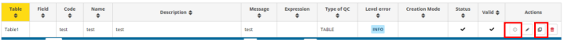

  6. In the dialog ‘Info’ tab, select the table data which you wish to validate (the
reported data).
  7. Add the additional metadata information.
  8. In the dialog ‘Table relations’ tab, select between the target dataset schema
and target table which you are comparing the reported data with (the reference
data) or adding a SQL sentence

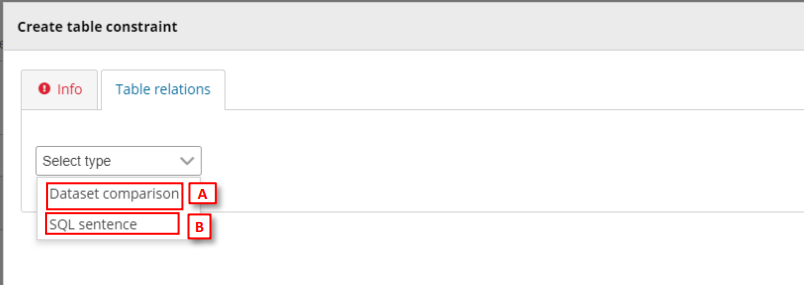

  9. [A] For Dataset Comparison, the field dropdowns will now be enabled and you
can specify the fields in each table which you are checking between. For
example, MonitoringStationID. The field name does not have to be the same in
each table.
  10. [Optional] It is possible to compare the two tables with a combination of fields.
To do this click on the ‘Add new relation’ button and specify which other fields
should be part of this validation.
  11. [B] For SQL sentence, the sentences should look like the examples displayed in
the inline SQL Help. The left table helps the user to provide the exact name of
the item (see section 3.3.14).

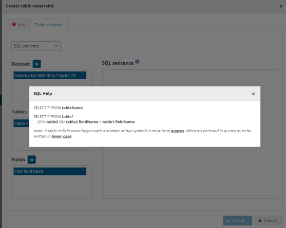

  12. Click ‘Create’.
  13. A validation rule has now been created which will be triggered if any record is
missing in the reported data table data which are present in the target
(reference data) table, based on the specified field. Note: if there are additional
records in the reported data table, no error will be triggered.
  14. After rule creation, the rules engine will validate the rule to ensure it is logically
valid. If there is an issue, you will see a red notification window appearing in the
top right. The user has also the option to validate QCs on demand (revalidates
all the QCs, required for SQL rules when table or field names has been changed).
  15. In the ‘QC Rules’ dialog and you will see that an additional QC rule has been
added with name, description and error message you entered.
  16. [Optional] It is also possible to make the check to trigger an error if there are
additional rows found in the reported data table, which are not found in the
reference data. From the ‘QC rules’ dialog, open the QC rule and go to the ‘Table
relations’ tab. Enable the tick box marked ‘All PK values must be used on link’.
  17. The rule has now been updated and the referenced table will have errors if any
record, based on the specified field, is found in the reported data table which is
not found in the referenced data table.

After a Data Collection is created all provider QCs run on the provider dataset.
For reference datasets:
• **Same reporting dataflow** : an empty table is created for the provider dataset if it is not populated.
• **Different dataflow** : no empty table is created during provider validation.

**Note for Reporting datasets** :
If the reference dataset belongs at the same reporting dataflow, an empty table may be created during validation of the reporting dataset.
If the reference dataset belongs to a different dataflow, no empty table is created during validation.

**For reference datasets belonging to a different dataflow** :
The relationship with the reported data is defined only inside the quality control rule via SQL, not as a schema level relation.

**Note for Big Data datasets** :
For Big Data, empty (header-only) tables may be created automatically during validation
when no data files are available. This is expected behaviour and allows quality controls to run.

## How to add table record constraints (QC rules between fields)

  1. To add a row constraint you need to have first defined fields.
  2. Click on the ‘Add row constraint’ button in the table design area or open the
‘QC rules’ dialog and click the same named button at the bottom left.
  3. Moreover, you can clone a QC rule by clicking on the ‘Duplicate’ button where
you will be able to prefill new QC from an existing one and you can ‘Quick edit’
the basic information (code, name, description, message, level error and
status).

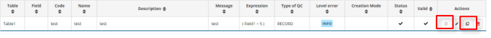

  4. In the popup ‘Info’ tab, first select the table that the row constraint will be
applied to. Also in this tab, provide metadata to help the reporter understand
what restrictions have been imposed on the schema (name, description, error
message). Here you set the error message which is triggered when the value
fails the validation, and you can also set the level of validation.
  5. Different levels of validation can be set depending on severity:
i. BLOCKER: Blocker messages indicate that the detected error will
prevent data submission (data release is not possible).
ii. ERROR: Error messages indicate issues that clearly need corrective
action by the data reporter.
iii. WARNING: Warning messages indicate issues that may be an error.
Data reporters are expected to double-check relevant records.
iv. INFO: Informative message. Neutral or statistical feedback about the
delivery, e.g. number of species reported.
  6. In the popup ‘Expression’ tab, the constraint is applied. The first action is to
define the type of row restriction:

– ‘Field comparison’ – allows you to compare one field with another or
with a fixed value, for example the sampling data field must have the
same year as the Year field.
– . ‘If-then clause’ – allows you to define business relations between
records, for example if field A has a value of ‘Yes’ then text field B must
be filled in, i.e. have a string length greater than 0.
– ´SQL sentence’ see [Custom validations (SQL)](custom-validations-sql.md)

  7. If you have more than one expression, then you can add additional ones with
the ‘add new rule’ button. You need to establish the relationships between the
rules – AND or OR.
  8. It is also possible to create expression groups and establish relations between
groups and individual rules, or groups and groups. To enable a group – tick at
least two tick boxes on the left for the rules you wish to group. As soon as more
than one isticked, then a ‘Group’ button appears. Press this to create the Group.
You then establish the relation between this group and other rules or groups
using AND or OR dropdown.
  9. Once you have finished then press the ‘Create’ button.
  10. After rule creation, the rules engine will validate the rule to ensure it is logically
valid. If there is an issue, you will see a red notification window appearing in the
top right. The user has also the option to validate QCs on demand (revalidates
all the QCs, required for SQL rules when table or field names has been changed).
  11. To review a created rule, click on the ‘QC rules’ button in the table menu bar. A
dialog will appear listing all the rules – both those created automatically as well
as manually. If the rules validator is still running, you will see a spinning circle in
the ‘valid’ column, otherwise a tick if it is OK.
  12. It is possible to edit the created rule by clicking on the edit button on the right
of the rules in the Actions column.

## How to manage existing field QC rules and row constraints

  1. To review a created rule, click on the ‘QC rules’ button in the table menu bar. A
dialog will appear listing all the rules – both those created automatically as well
as manually.
  2. Use the filters to find a rule.
  3. It is possible to edit the created rule by clicking on the edit button on the right
of the rules in the Actions column.
  4. It is possible to edit the metadata and error message for automatically created
rules.
  5. After rule update, the rules engine will validate the rule to ensure it is logically
valid. If there is an issue, you will see a red notification window appearing in the
top right. The user has also the option to validate QCs on demand (revalidates
all the QCs, required for SQL rules when table or field names has been changed).
  6. If validating an SQL sentence there is an error, a message will be shown on the
Valid column to know more about the failure.

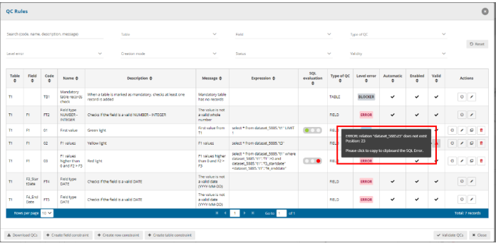

## How to edit several QC rules faster

  1. Click on the QC Rules to view the existing rules.
  2. Under the column “Actions” in each row there is an icon with a clock on it. When you mouseover it, the pop up says “Quick edit”. If you click it, the row enters “Quick edit” mode. In this mode you can edit inline several attributes of this row.
  3. The clock over the Quick edit button is now converted to a tick. If you click this tick button, the row saves the changes and return back to normal view mode.
  4. You can also click the Quick edit buttons on several rows. In this manner all those rows enter quick edit mode and you can edit them.

## How to add complex ‘uniqueness constraints’ to records in a table (QC rules)

  1. Click on the ‘Add unique constraint’ button.
  2. In the dialogue select from the left side which table you wish to set the unique
constraints on.
  3. On the right side of the dialogue select the field or combination of fields, which
you wish to enforce as unique (NB: the primary key for a table will already have
a QC rule to ensure it is unique).
  4. Press ‘Close’

## How to manage existing ‘uniqueness constraints’

  1. To review the unique constraints, click on the ‘Unique constraints’ table menu
bar.
  2. In this dialogue, you can review edit and delete the constraints which have been
set up.

## How to add an external integration with import and export

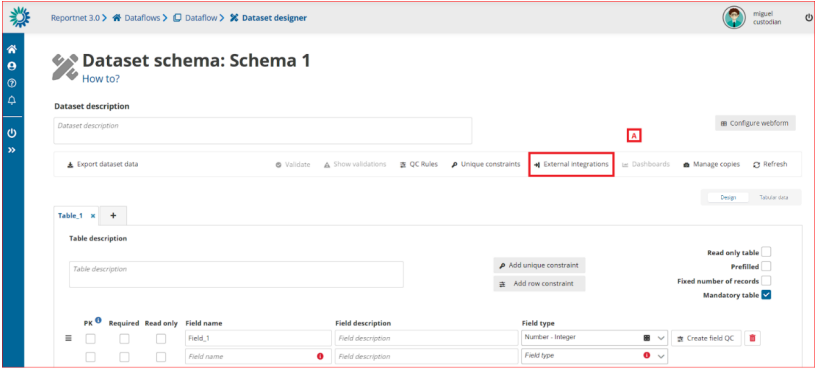 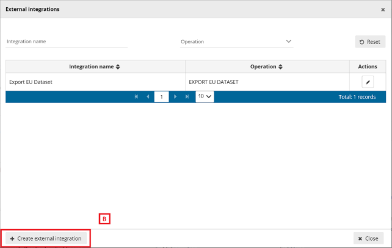

[A] – The ‘External integrations’ button pops up a dialog with a list of the External
integrations set up in the system. An ‘Export EU Dataset’ integration is created by
default on each dataflow creation.

[B] – You can add a new integration by clicking ‘Create external integration’ where you
will be able to set the type of external integration.

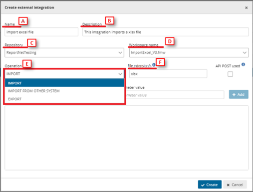

o [A] – Input the external integration name.
o [B] – Input the external integration description.
o [C] – Choose the FME repository from the dropdown.
o [D] – Select the proper FME process.
o [E] – Select the Operation:
▪ For ‘Import’ and ‘Export’ operations it’s mandatory to input the
[F] file extension. You can include more than one extension
separated by commas.
▪ External integrations for imports could have the same
extension more than once.
o Finally click on ‘Create’ to create the external integration.

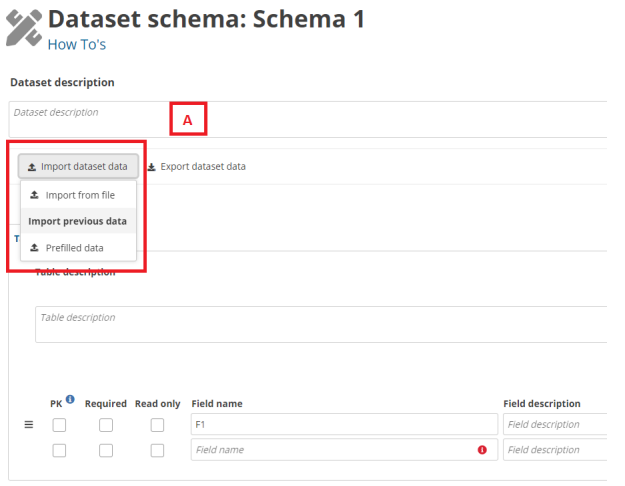 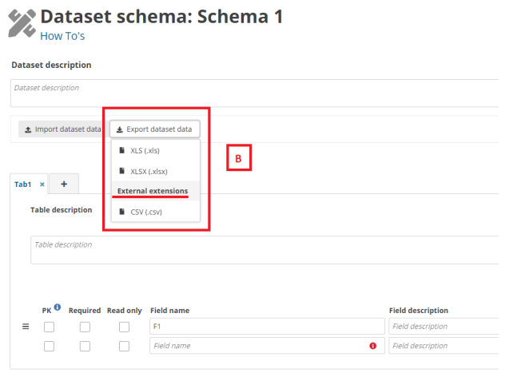 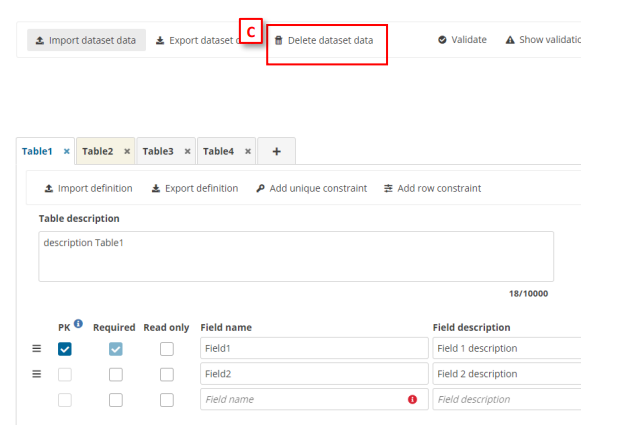

  * [A] – The external integrations import type can be executed by clicking the ’Import
dataset data’ dropdown. ‘Import from file’ refers to the import set up with file
extension and the list below ‘Import previous data’ are the ‘Import from other
system’ imports.
  * [B] – The export extensions export type is executed by clicking the ’Export dataset
data’ and then selecting the options below ‘External extensions’.
  * [C] – The delete dataset data is executed by clicking the ’Delete dataset data’. When
you click, a modal appears with a check to select if prefilled tables must be deleted
or not. If you check the ’Delete prefilled tables data’, all tables must be deleted. If
you uncheck the ’Delete prefilled tables data’ (default value), all tables but prefilled
tables must be deleted.
