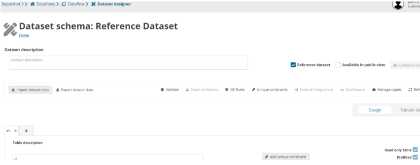
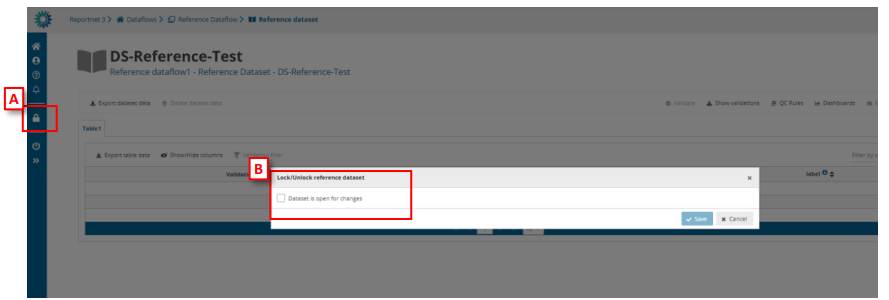
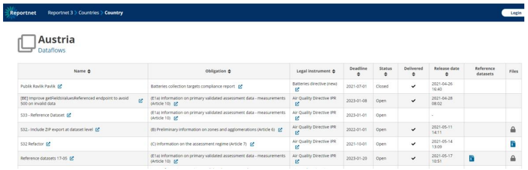
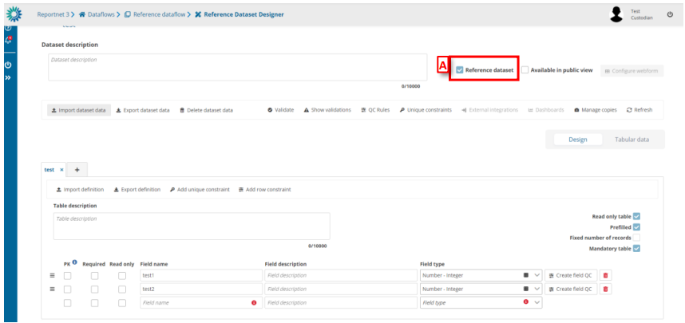
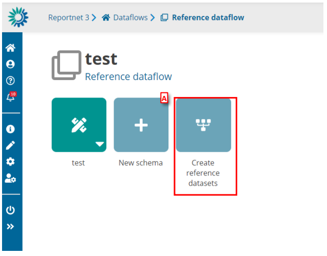
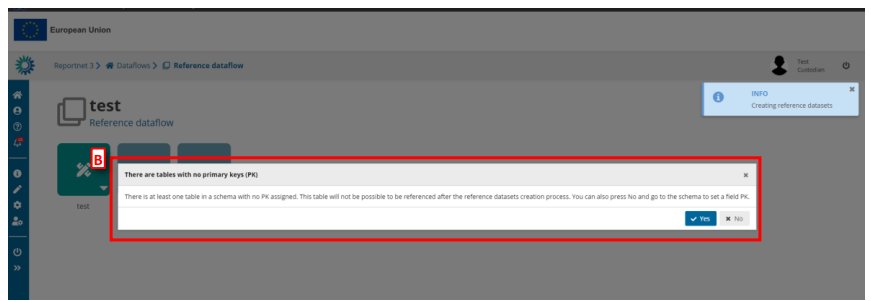

# Manage reference data
## How to set a dataset as Reference Dataset

  1. The custodian/steward has the option to set the design dataset as Reference
Dataset.
  2. All tables in this dataset are set as prefilled and read-only.
  3. No possibility to configure external integrations or webforms.
  4. This reference dataset is unique for the dataflow.
  5. All reporting datasets, test datasets, DC datasets and EU datasets link the same
reference dataset (not needed to copy for each country and copy in release
actions).
  6. Reference datasets could be updateable or not if the dataset is marked as locked
or unlocked by clicking on a button in the left bar [A] and marked as open for
changes or not [B]
i. Option not available on reference dataflows.
  7. From public page, reference dataset schema files can be downloaded.

 

## How to create a Reference dataset on Reference dataflow

Inside reference dataflow you can create a new schema. By default, this new schema will be marked as reference dataset [A].

  1. If you have added at least one dataset and created a dataset schema, then the ’Create reference datasets’ [A] button will be enabled.
  2. Click the ’Create reference datasets’ [A] button. If all tables in all schemas have PKs the process starts. But if there are tables without PK, a modal [B] appears to have the option to continue or cancel the process.

 
