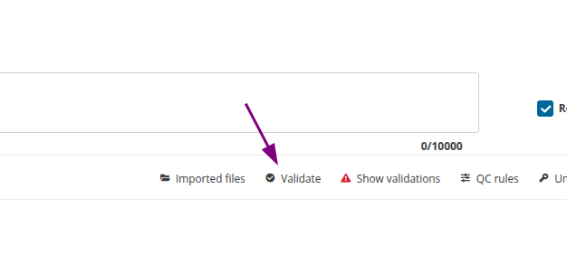
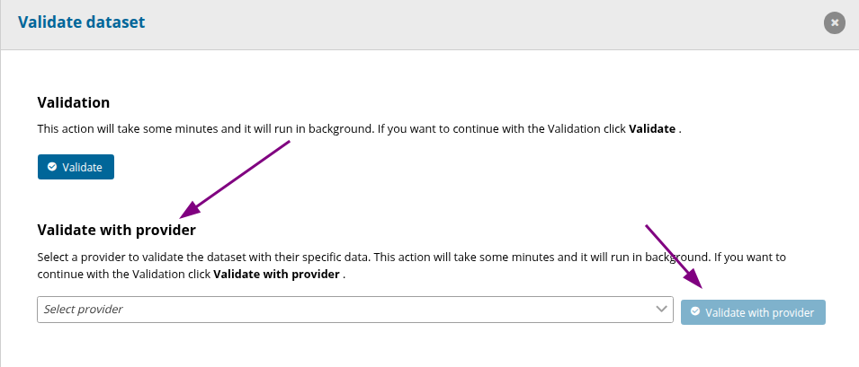
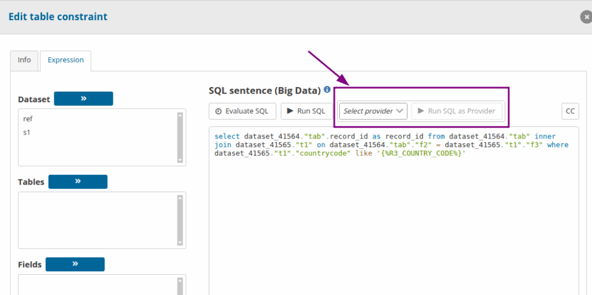

# Validate & Run SQL as Provider
### Validate with Provider

As a requester a “**Validate with Provider** ” option has been added and is available for both Design Datasets and Test Datasets when clicking the **Validate** button.

The dropdown contains all representatives of the dataflow .

When Validate with Provider is selected, the validation process starts with the provider code included in the request.
In the provider’s datasets, only the simple Validation will be available.

### Run SQL as Provider

A “**Run SQL as Provider** ” feature has been introduced for QC rules that include SQL sentences.
This option can be found in QC rules that contain an SQL expression in Tables, Fields and Rows.

The dropdown contains all representatives of the dataflow .

With this call, the provider code is sent along with the SQL expression.
