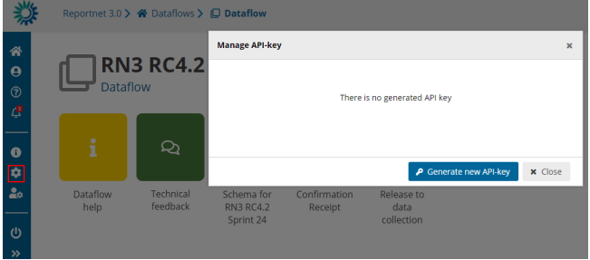
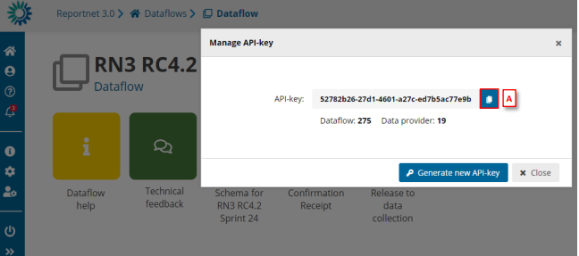

# Rest API
* [Change Release Date of Dataset (Custodian/Admin)](../requester/change-release-date.md)
    * [Data flow monitoring](https://help.reportnet.europa.eu/data-flow-monitoring/)
    * [Dataflow users list](../requester/dataflow-users-list.md)
    * [Export API Endpoints](export-api-endpoints.md)
    * [FME connectors](../requester/import-export-vs-cws/fme-connectors.md)
    * [General](../general/index.md)
      * [Reportnet platforms](../general/reportnet-platforms.md)
      * [What’s new](../general/whats-new.md)
      * [Login to Reportnet](../general/login-to-reportnet/index.md)
        * [Create an EU-Login account](../general/login-to-reportnet/create-an-eu-login-account.md)
        * [How to log off](../general/login-to-reportnet/how-to-log-off.md)
        * [Link my EU-login](../general/login-to-reportnet/link-my-eu-login.md)
        * [About Multi Factor Authentication (MFA)](../general/login-to-reportnet/multi-factor-authentication.md)
      * [User settings](../general/user-settings/index.md)
        * [Privacy policy](../general/user-settings/privacy-policy.md)
    * [Geospatial Data Features](../reporter/submit-data/spatial-data/geospatial-data-features.md)
    * [How to add supporting reporters to my dataflow](../reporter/dataflow-home-page/add-supporting-reporters.md)
    * [Import API endpoints](import-api-endpoints.md)
    * [Poll for job status](poll-for-job-status.md)
    * [Reporter](../reporter/index.md)
      * [Dataflows overview page](../reporter/dataflows-overview-page.md)
      * [Dataflow home page](../reporter/dataflow-home-page/index.md)
        * [Dataflow specific help](../reporter/dataflow-home-page/dataflow-specific-help.md)
      * [Submit data](../reporter/submit-data/index.md)
        * [Dataset actions](../reporter/submit-data/dataset-actions.md)
        * [Table actions](../reporter/submit-data/table-actions.md)
        * [Webform data input](../reporter/submit-data/webform-data-input.md)
        * [Manage records](../reporter/submit-data/manage-records.md)
          * [Manage dataset copies](../reporter/submit-data/manage-dataset-copies.md)
        * [Spatial data](../reporter/submit-data/spatial-data/index.md)
        * [Create CSV-files](../reporter/submit-data/create-csv-files.md)
      * [Validate data](../reporter/validate-data/index.md)
        * [Canceled validation tasks](../reporter/validate-data/canceled-validation-tasks.md)
        * [Quality control rules](../reporter/validate-data/quality-control-rules.md)
        * [Execute validation](../reporter/validate-data/execute-validation.md)
        * [Filter table data](../reporter/validate-data/filter-table-data.md)
      * [Release data](../reporter/release-data/index.md)
        * [External integration possibilities](../requester/import-export-vs-cws/external-integration-possibilities.md)
        * [Show/hide release data](../reporter/release-data/show-hide-release-data.md)
        * [Release to data collection](../reporter/release-data/release-to-data-collection.md)
        * [Release to the public](../reporter/release-data/release-to-the-public.md)
        * [Historical releases](../reporter/release-data/historical-releases.md)
      * [Preparation datasets](../preparation-datasets.md)
    * [ReportNet3 Import/Export (vs CWS)](../requester/import-export-vs-cws/index.md)
    * [Requester](../requester/index.md)
      * [Example: Configure a simple questionnaire](../requester/example-simple-questionnaire.md)
      * [Manage quality control rules](../requester/manage-quality-control-rules/index.md)
        * [Custom validations (SQL)](../requester/manage-quality-control-rules/custom-validations-sql.md)
      * [Manage reference data](../requester/manage-reference-data.md)
      * [Different dataflow types](../requester/different-dataflow-types.md)
      * [Create a dataflow](../requester/create-a-dataflow/index.md)
        * [Manage dataflow help](../requester/create-a-dataflow/manage-dataflow-help.md)
        * [Manage lead reporters](../requester/create-a-dataflow/manage-lead-reporters.md)
        * [Manage a dataflow](../requester/create-a-dataset-schema/manage-a-dataflow.md)
        * [Import/export data schema’s](../requester/create-a-dataflow/import-export-data-schemas.md)
      * [Create a dataset schema](../requester/create-a-dataset-schema/index.md)
        * [Import/Export table definitions](../requester/create-a-dataset-schema/import-export-table-definitions.md)
    * [Rest API](index.md)
    * [SQL DB setup](https://help.reportnet.europa.eu/sql-db-setup/)
    * [Validate & Run SQL as Provider](../requester/validate-and-run-sql-as-provider.md)
    * [Validation API endpoints](validation-api-endpoints.md)
    * [Validation Results per Release Snapshot](validation-results-per-snapshot.md)
    * [Webforms](../webforms.md)

**How to generate API-key**

Go to the dataflow page.
There will not be API generated if it is the first time for the user.
1\. Click on the wheel setting first? ( (is it the wheel setting?)
2\. Click on ‘Generate new API-key’.

Once the API-key is generated, it can be copied on clipboard using [A].

Different API-keys will be generated every time user clicks on ‘Generate new
API-key’.

API-key could be used as explained in the webforms section
