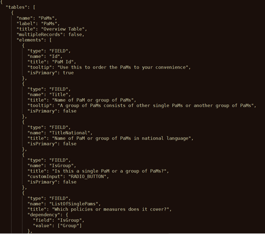
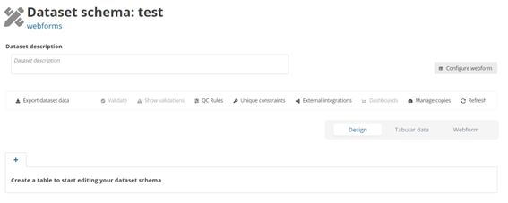

# Webforms
## Introduction

Reportnet 3 includes a web forms framework that data custodians can use to design Web Forms on data set schema’s.

## How to configure a Webform

Webforms are based on a JSON-configuration file that is then uploaded onto the Reportnet 3 platform.

## Dataset schema design

The initial configuration of our webform is specified in a json file. In this file you will see the scheme that will be configured in the webform referring to the different tables and fields. It also includes labels that are shown in the webform, such as tooltips or descriptions, and some extra properties as references to other tables or other fields, which we will have to take into account for their correct operation.

As we can see in the Figure 1, in this Json file we would have the **name** of the table to create [A] , the **fields** [B] to include on this table, if this field is marked as **primary key** or not [C], the **tooltip** [D] that we are going to see with a brief, informative message that appears when a user through a mouse-hover gesture on the field, if we have some **dependency**[F] which performs different actions such as, for example, hide a field based on another attribute and its value, etc..

Json file to configure webform – _National climate change adaptation planning and strategies_ – Governance Regulation Art. 19

Json file to configure webform – _National greenhouse gas policies and measures_ – Governance Regulation Art. 13

## How to configure a Webform – National climate change adaptation planning and strategies

On the Dataset page you will find a button on the right corner called “Configure webform”. By pressing this a popup window will appear where you can upload your webform.

The ‘Configure webform’ button pops up a new dialogue with a dropdown appears. The First option (default) ‘No webform’ and an upload button that allows you to upload a new web form. You can add a new webform by clicking **Save** when you have selected the webform needed.
