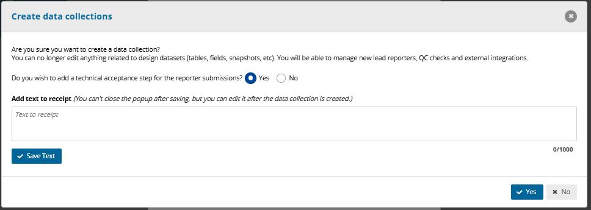
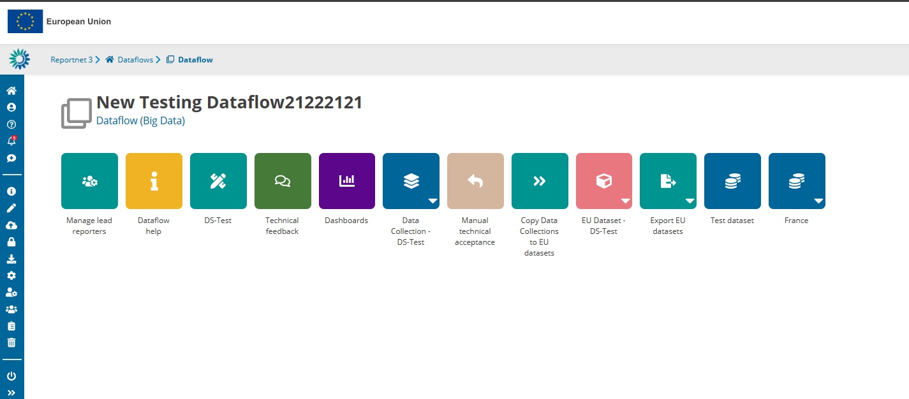
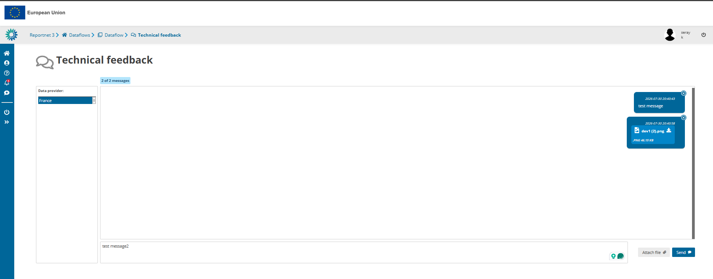
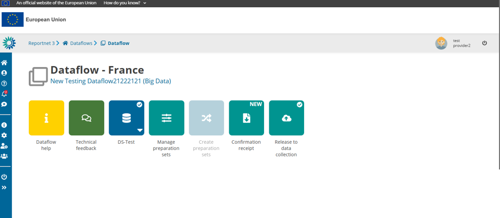
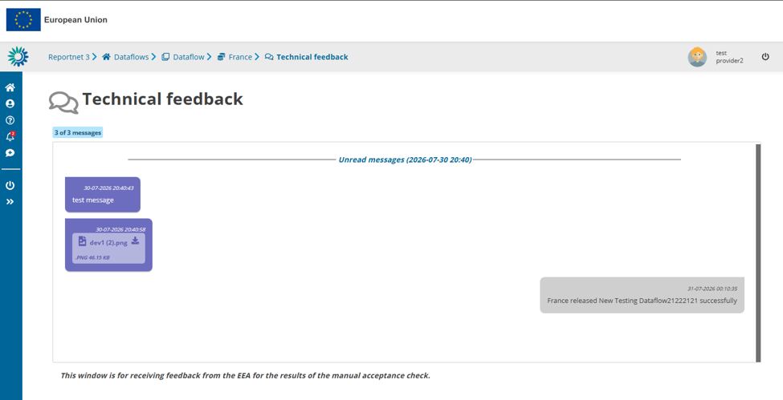
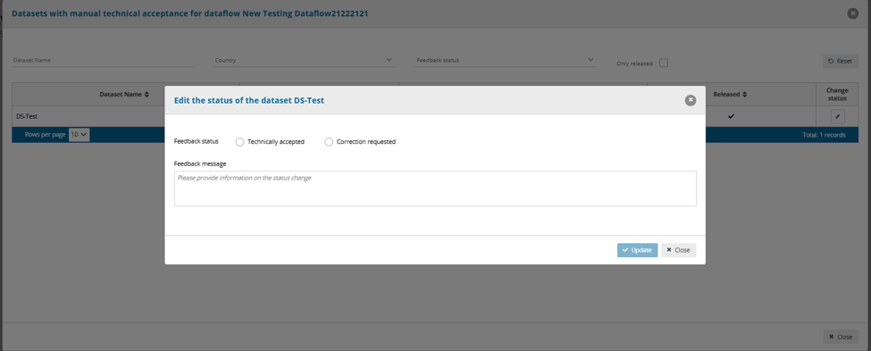
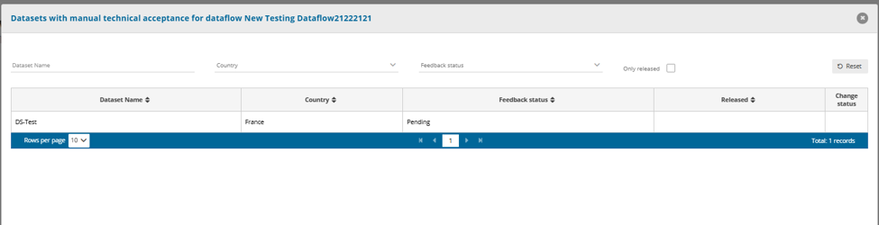
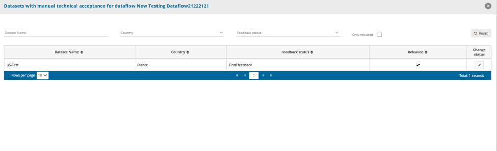

# Technical feedback and manual technical acceptance

Manual technical acceptance lets Data Custodians review released submissions before accepting them. It comes with a dedicated technical feedback area, where Custodians and Data Providers exchange messages and supporting files during the review.

## Prerequisites

1. A Data Custodian creates a Reporting, Business or Citizen Science dataflow.
2. Datasets, tables and fields are configured.
3. A Lead Reporter is assigned.
4. The Data Custodian selects **Create data collections**.
5. The **Add a technical acceptance step** option is enabled.

Enabling this option adds a technical review step to the workflow. A corresponding receipt message is displayed after the release process.

## Technical feedback

Technical feedback lets Data Custodians and Data Providers exchange messages and supporting files during the technical review.

### Access technical feedback as a Data Custodian

1. Go to the dataflow page.
2. Click **Technical feedback**.

From this page the Data Custodian can send messages, upload supporting files and review previous communication.

### Access technical feedback as a Data Provider

Once the submission is released, the Data Provider can open the technical feedback page from the dataflow.

The page shows messages from the Data Custodian, attached files and feedback on the manual technical acceptance.

## Manual technical acceptance

Manual technical acceptance lets the Data Custodian review the released submission and record a technical decision.

### Access manual technical acceptance

1. Go to the dataflow page.
2. Click **Manual technical acceptance**.

The page lists all datasets that need technical review.

### Feedback status

**Pending** means the submission is awaiting technical review.

**Final feedback** means the submission has been released and reviewed, and is awaiting the final decision.

### Change the technical acceptance status

1. Locate the dataset to review.
2. Click the edit icon in the **Change status** column.
3. Select **Technically accepted** or **Correction requested**.
4. Enter a feedback message.
5. Click **Update**.

**Technically accepted** means the dataset meets all technical review requirements.

**Correction requested** means the Data Provider must make corrections before technical acceptance can be granted.

## See also

- [Manage a dataflow](create-a-dataset-schema/manage-a-dataflow.md)
