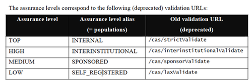

# EU login documentation

Back when it was called ECAS, the primary protocol to use was [Apereo CAS](https://www.apereo.org/projects/cas). The CAS protocol is a ReST protocol, and has a endpoint called `/cas/serviceValidate`. The Commission decided that this should only work for EU employees. But since it is a system that needs to be used by other organisations as well, they implemented four other endpoints. Of these the `/cas/laxValidate` accepts self-registered accounts.

Note that the table says these endpoints are listed as deprecated. However, in the documentation for _ECAS PHP Client 2.x_ , which was reviewed in 2019, these validation URLs are still in use.

[Edit this section](EU_login_documentation/edit.md)

## More information

For more information refer to the attached files. The issue has also been dealt with in ticket [#20006](/issues/20006 "Feature: CAS authentication \(Closed\)").  
The architect of EU Login is Titus PURDEA in the Commission. Email: [Titus.PURDEA@ec.europa.eu](mailto:Titus.PURDEA@ec.europa.eu) Tlf: +352 4301 31442

[Edit this section](EU_login_documentation/edit.md)

## Spring Security CAS

The Spring.io security framework has been adapted to ECAS' way of authenticating. It is possible to override the ticket validator class to use a different url for the endpoint. It was implemented in ROD3 to get the endpoint name from a system property.
[code] 
    import org.jasig.cas.client.validation.Cas20ServiceTicketValidator;
    
    public class ECas20ServiceTicketValidator extends Cas20ServiceTicketValidator {
    
        private String urlSuffix;
    
        public ECas20ServiceTicketValidator(String casServerUrlPrefix) {
            super(casServerUrlPrefix);
            try {
                urlSuffix = System.getProperty("cas.url.suffix", "serviceValidate");
            } catch (Exception e) {
                urlSuffix = "serviceValidate";
            }
        }
        protected String getUrlSuffix() {
            return urlSuffix;
        }
    }
    
[/code]

## Verification notes

This page is from 2019 and is entirely obsolete. Reportnet 3 does not use the Apereo CAS protocol, the `/cas/serviceValidate` endpoint, or any variant of `ECas20ServiceTicketValidator`. The class shown in the code block (`ECas20ServiceTicketValidator`) does not exist anywhere in the `eea.reportnet3` source.

The system currently uses Keycloak as the identity provider. EU Login participates only as an upstream OIDC provider that federates into Keycloak via a token-exchange flow; it is not integrated directly into the application layer. This is documented in `Infrastructure/keycloak.md`, which shows the full authentication flow: the browser authenticates with EU Login via OIDC, EU Login exchanges the token with Keycloak, and subsequent requests carry a UUID session key resolved through the User Management Service and Redis.

The `user-management-service` package `org.eea.ums.service.keycloak` contains the actual integration code (`KeycloakConnectorService`, `KeycloakConnectorServiceImpl`). There is no CAS-related code anywhere in the repository.

Any developer reading this page for guidance on how authentication works will be misled. The page should either be removed or replaced with a pointer to the current `Infrastructure/keycloak.md` document.
