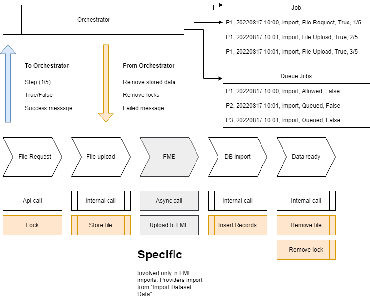

# Feature process orchestration

[Edit this section](Feature_process_orchestration/edit.md)

## Initial concept for import orchestration

The orchestrator use kafka queues to receive success/failure data from microservice operations and logs the change actions.   
In case of an error rolls back the logged action

The process is :

  1. The user selects to "Import dataset data" 
  2. The user uploads the file (the file is stored and locks created by the dataset microservice )
  3. The file is loaded in the database in chunks until the operation is finished. Example import of 145MB will need about 2 hours.
  4. The import operations is completed (releasing any locks)

Process may stuck at (2), (3), (4)

Rollback includes:

  1. Clean data from dataset (if exists)
  2. Remove the file from the storage (if exists)
  3. Remove locks

Notifications may include:

  1. File uploaded
  2. Import process XX%
  3. Import process completed 
  4. Import process failed. Rolling back import 
  5. Import rollback completed

## Verification notes

The description of the import flow is broadly consistent with how the orchestrator works in source. The Orchestrator Service receives import requests via Kafka and manages job state, with rollback on failure. The `orchestrator-service` source contains `JobControllerImpl` which includes a `POST /addImport/{datasetId}` endpoint, confirming that the import is submitted to the orchestrator.

The claim that importing 145 MB takes "about 2 hours" is anecdotal performance data from the time of writing (2022). Whether this figure remains accurate depends on the infrastructure in use and is not verifiable from source code.

The diagram image (`Feature_process_orchestration/attachments/Orchestration_v0.png`) is an attachment and cannot be verified from source. The textual description of the flow (upload, chunk-load, release locks, with rollback cleaning data, files, and locks) is consistent with the orchestrator's job-management logic in source but is described at a high level; no specific class or method names are given, so line-level verification is not possible from this page alone.
