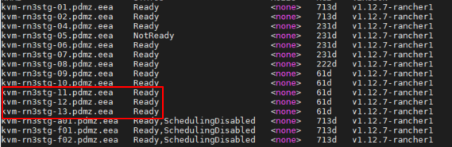

# Performance tests

move on production   
Contain a description of the tests done and the results.  
On the new architecture.

[Edit this section](Performance_tests/edit.md)

## TESTS:

\- 5 Import Schema   
\- 5 Create Snapshots   
\- 5 restore Snapshots  
\- 5 Release Data Collection  
\- 5 Cloning Schemas   
\- 5 Validations  
\- 5 Import File Data 6GB per file

[Edit this section](Performance_tests/edit.md)

## TESTS Description:

[Edit this section](Performance_tests/edit.md)

### **Import Schemas:**

The schemas contains 3 Datasets:  
1º dataset: Table 1 - 2 columns  
2º dataset - 16 tables: Table 1- 6 columns, Table 2- 16 columns, Table 3 - 5 columns, Table 4 - 3 columns, Table 5- 2 columns, Table 6- 3 columns, Table 7- 11 columns, Table 8 - 3 columns, Table 9-22 columns,   
Table 10 - 3 columns, Table 11 - 3 columns, Table 12 - 6 columns, Table 13 - 21 columns, Table 14 - 3 columns, Table 15 - 3 columns, Table 16 - 1 columns,  
3º dataset - 2 tables: Table 1- 2 columns, Table 2- 3 columns, Table 4 - 3 columns

**1st run** : 3 Cloned have failed  
**2nd run** : 3 Cloned have failed

[Edit this section](Performance_tests/edit.md)

### **Create snapshot**

Each snapshot contains: 62.000 Rows

**1st run** : 5 Completed.  
**2nd run** : 5 Completed.

[Edit this section](Performance_tests/edit.md)

### **Restore snapshot**

Each snapshot contains: 62.000 Rows

**1st run** : 5 Completed.  
**2nd run** : 5 Completed.

[Edit this section](Performance_tests/edit.md)

### **1º Release Data Collection**

5 Datasets prepared 120.000 Records

**1st run** : 2 completed 2 failed 3 (validation pods ok)  
**2nd run** : a restart of the validation pods left the processes half done, replanning the pending tasks from the task list finished the processes ok.

[Edit this section](Performance_tests/edit.md)

### **2º Release Data Collection**

12 Datasets, each dataset contains:  
3 Tables which contain:  
1st table => 1000 records, 7 fields  
2nd table => 2000 records, 7 fields  
2nd table => 10000 records, 9 fields

**1st run** : Completed.

[Edit this section](Performance_tests/edit.md)

### **Clone Schemas:**

The DF has 9 schemas 3 table each schema with a total of 8 fields, which are attachment, polygon, text, email, URL, multiline text, number decimal, number decimal

**1st run** : 3 Clones have failed.  
**2nd run** : 3 Clones have failed.

[Edit this section](Performance_tests/edit.md)

### **1º Validation Test:**

Each Dataset contains 240 Rules and 100.000 Rows.

**1st run** : 5 Completed.  
**2nd run** : 5 Completed.

[Edit this section](Performance_tests/edit.md)

### **2º Validation Test:**

Each Dataset contains 240 Rules and 100.000 Rows.

**1st run 4 treads** : 5 tasks Completed. we have been throwing them for 2 hours several times  
**2nd run 8 treads** : 5 tasks Failed.  
**3nd run 6 treads** : 5 tasks Completed. we have been throwing them for 2 hours several times

[Edit this section](Performance_tests/edit.md)

### **Import File Data:**

Each file contains 6GB of rows and geometries.

**1st run** : 5 Completed.  
**2nd run** : 5 Completed.

[Edit this section](Performance_tests/edit.md)

### Failure Tests

The tests carried out during the tests consisted of the following:  
• deleting the master node and having it recover.  
• deleting random worker nodes.  
• delete random worker nodes and the master.

[Edit this section](Performance_tests/edit.md)

## Results:

• During the testing process, some bugs have been found, which have now been fixed.  
• The database configuration has been optimised in order to solve possible bugs.  
• In the crash tests, a very fast recovery has been seen, making the environment unusable for only a few minutes.  
• The process of creating schemas and Data Collection has been slowed down by the distribution of data.  
• The insert process has been affected due to the impossibility to use triggers on distributed tables.  
• The database configuration has been optimised in order to solve possible bugs.  
• the database has been stable throughout the testing process.

[Edit this section](Performance_tests/edit.md)

## Infrastructure configuration:

**Reportnet configuration:**  
• 2 Api-Gateway  
• 1 Collaboration  
• 1 Communication  
• 3 Dataflows  
• 5 Datasets  
• 1 Document  
• 1 Frontend  
• 3 RecordStore  
• 3 Citus PgPool  
• 3 Metabase and Keycloak Pgpool  
• 3 Metabase and Keycloak Database  
• 1 Rod  
• 3 ums  
• 6 Validations

**Kafka Configuration:**  
• 3 instances of Zookeeper  
• 3 instances of Kafka

**Consul Configuration:**   
• 3 Instances of Consul

**Keycloak Configuration:**   
• 2 instances of keycloak

**Redis Configuration:**  
• 4 Redis

[Edit this section](Performance_tests/edit.md)

## Database Configuration:

**CITUS :**

  * • 1 Citus Manager
  * • 1 Citus Master
  * o max_connections = '1500'; 
  * o shared_buffers = '8GB'; 
  * o effective_cache_size = ‘24GB’
  * o maintenance_work_mem = '2GB'; 
  * o checkpoint_completion_target = '0.9';
  * o wal_buffers =’16MB’;
  * o default_statististics_target =‘500’;
  * o random_page_cost=’1.1’;
  * o effective_io_concurrency = '300';
  * o work_mem = '256MB';
  * o min_wal_size = '4GB';
  * o max_wal_size = '16GB';
  * o max_worker_processes = ‘12’;
  * o max_pararel_workers_per_gather=’4’;
  * o max_pararel_workers = ‘12’;
  * o max_pararel_maintenance_workers = ‘4’;
  * o synchronous_commit='remote_apply';
  * o citus.shard_count =64;
  * * o citus.shard_replication_factor=3;

• 15 Citus Workers

**Postgres HA**  
• 3 PgPool Instances with the following configuration per node  
o maxPool=15  
o pgpool.numInitChildren=32

• 3 Postgres Instances (1 master and 2 replicas) with the following configuration per node  
o max_connections = '500';   
o shared_buffers = '1GB';   
o maintenance_work_mem = '256MB';   
o work_mem = '64MB';  
o checkpoint_completion_target = '0.9';  
o random_page_cost = '1.1';  
o effective_io_concurrency = '300';  
o min_wal_size = '1GB';   
o max_wal_size = '4GB';   
o synchronous_commit='remote_apply';

**Mongo**  
• 3 instances of Mongo running in Master-Slave configuration

All Citus nodes: Manager, Master and Workers have been deployed on the 3 most powerful nodes in the environment.  

  *[CITUS]: Datasets
  *[ HA]: Metabase/Keycloak

## Verification notes

No source code verification applicable — this page records the results, test data volumes, and infrastructure configuration of a specific performance test run conducted in June 2022; it does not describe the current codebase or make claims that can be checked against source.
