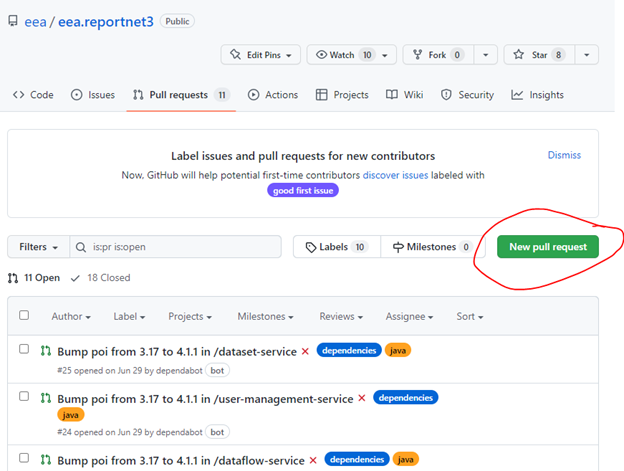
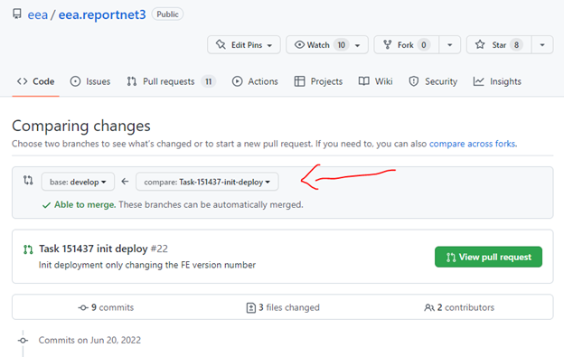
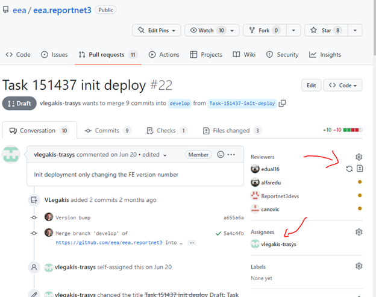

# Suggested gIt flow process

[Edit this section](Suggested_gIt_flow_process_/edit.md)

## Forward Changes

`  
git checkout master  
git pull origin master  
git checkout -b taskid-15000  
`

**CHANGE parent pom.xml version to v3.1.6-ALIAS (alias: a short description of the branch) before branch commit**

Make code changes

`  
git commit -a ** comment for commit **  
git push origin task-15000  
`

Pg in github ->   
Go -> Pul request -> Create new pull request

Select taskid-15000 branch   
Select reviewers and signoff reviewer AND Assignee you user account   
Upon approval: Quash and Merge (by Author -> thats YOU) 

  * Instead of all commits title you could update comment and give a brief summary of fix

[Edit this section](Suggested_gIt_flow_process_/edit.md)

## Rebase

Downwards from master to develop  
Hotfix is inconsistent (missing revisions)  
Sandbox to master is inconsistent (missing changes)

PR for major branch changes

## Verification notes

No source code verification applicable — this page describes a Git branching and pull request process; it contains no technical claims about application code, endpoints, or configuration that can be checked against source.
