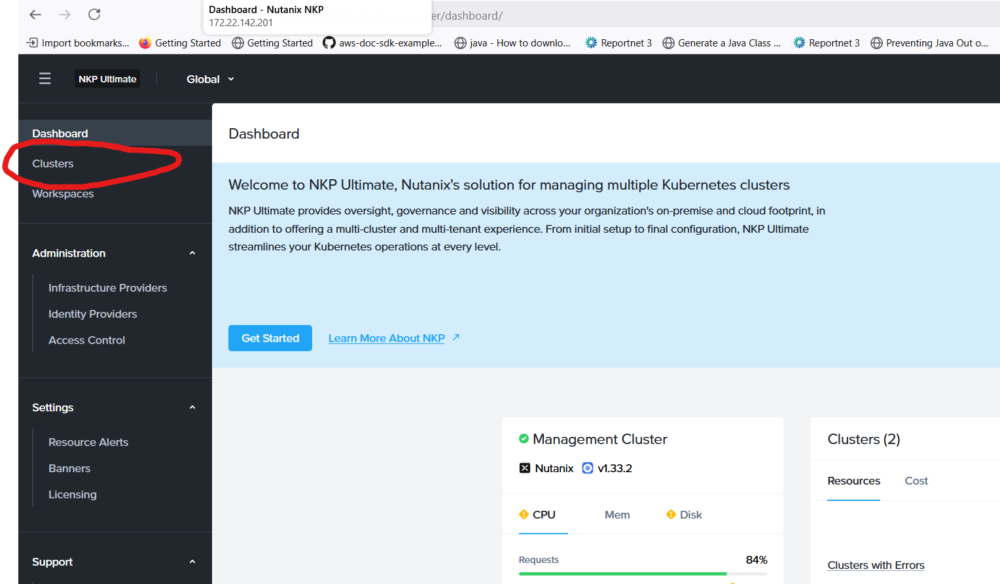
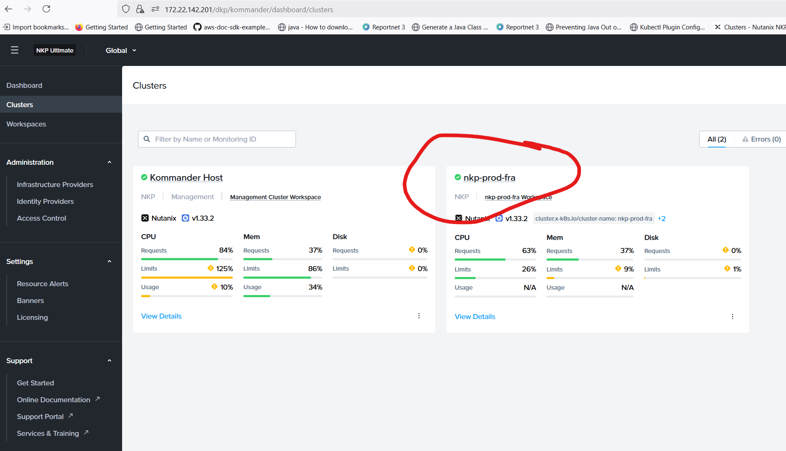
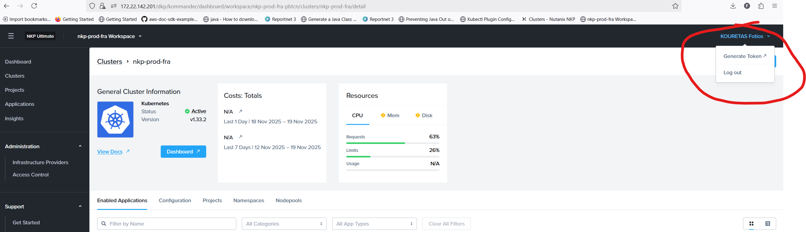
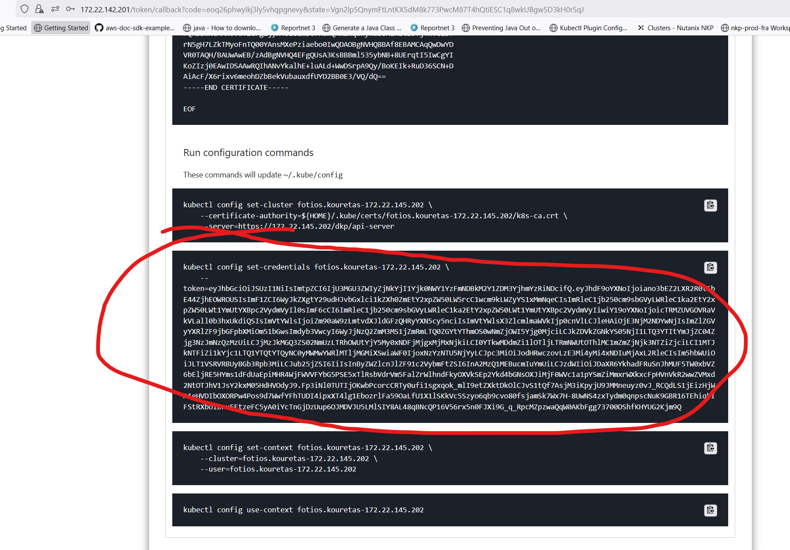
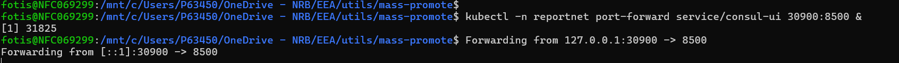
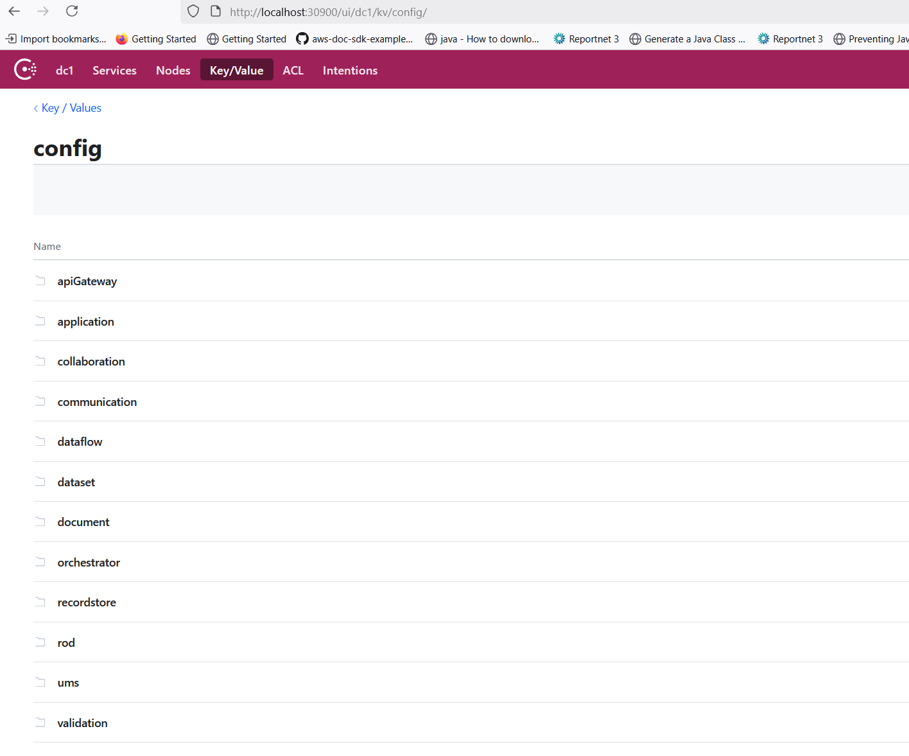

# AWSNKP Service Access

Main console login

<https://172.22.142.201/dkp/kommander/dashboard/clusters/>

[Edit this section](AWSNKP_Service_Access/edit.md)

## Consul access

Login in NKP

Click in Clusters

Select nkp-prod-fra cluster

Then in the top right menu select Generate Token

Then login in Token access and update the key   
(If its the first time follow the instructions list to setup access)

Now you have access to NKP in AWS with kubectl   
Port forward consul ui to you local environment
[code] 
    kubectl -n reportnet port-forward service/consul-ui 30900:8500 &
[/code]

Then open consul from the port-forwared port

[Edit this section](AWSNKP_Service_Access/edit.md)

## Port forward list

Service | Command  
---|---  
Metabase/OrchestratorDB/Keycloak  |  kubectl -n reportnet port-forward service/rn3-pg-helm-pgpool 30002:5432 &  
Citus  |  kubectl -n reportnet port-forward service/rn3-pg-helm-dataset-pgpool 30001:5432 &  
Consul  |  kubectl -n reportnet port-forward service/consul-ui 30900:8500 &  
Keycloak  |  kubectl -n reportnet port-forward service/keycloak-http 30800:80 &  
MongoDB  |  kubectl -n reportnet port-forward pod/mongo-mongodb-replicaset-0 30022:27017 &  
  
**If pod is no longer master, change to correct master pod of mongodb**

For MongoDB connection string is: mongodb://localhost:30022/?directConnection=true&readPreference=primaryPreferred

[Edit this section](AWSNKP_Service_Access/edit.md)

## URLs

Dremio : <https://dremio-rn-aws.eea.europa.eu:9047>

## Verification notes

This page was last updated November 2025 and is the most recently updated page in this folder. It is an operational runbook for accessing services in the AWS NKP (Nutanix Kubernetes Platform) environment. The following observations were identified.

**AWSNKP identity.** "AWSNKP" is not a term used anywhere in the source code or service configuration. From context — the console URL `172.22.142.201/dkp/kommander/dashboard/clusters/`, references to `nkp-prod-fra` cluster, and the Dremio URL at `dremio-rn-aws.eea.europa.eu` — this is a Nutanix Kubernetes Platform (NKP) deployment on AWS infrastructure, hosted at the Frankfurt region. The abbreviation conflates "AWS" and "NKP" and may confuse readers.

**Kubernetes namespace.** The `kubectl` commands use `-n reportnet`, consistent with the namespace used in `Kubernetes_deployment_files.md` and `Reportnet_Deployment.md`.

**Service names confirmed.** The port-forward table references `consul-ui`, `rn3-pg-helm-pgpool`, `rn3-pg-helm-dataset-pgpool`, `keycloak-http`, and `mongo-mongodb-replicaset`. These names are consistent with the Helm chart names used in `Reportnet_Deployment.md` (`rn3-pg-helm`, `consul`, `keycloak-http`, `mongo-mongodb-replicaset`).

**Dremio access.** The page lists `https://dremio-rn-aws.eea.europa.eu:9047` as the Dremio URL. This is consistent with port 9047 used in `Dremio_local_setup.md` and the source-derived `dremio_s3.md`.

**Unverifiable claims.** The screenshots referenced in this page (attachments) are not accessible for verification. The token generation and NKP authentication flow described cannot be verified against source code, as these are platform-level operations outside the Reportnet3 application source.

**Missing services.** The port-forward list omits Redis, Kafka, and Elasticsearch, which are also accessible services in the cluster. This is likely intentional — the page covers only services that developers regularly need to access directly — but developers who need direct Redis or Kafka access will not find instructions here.
