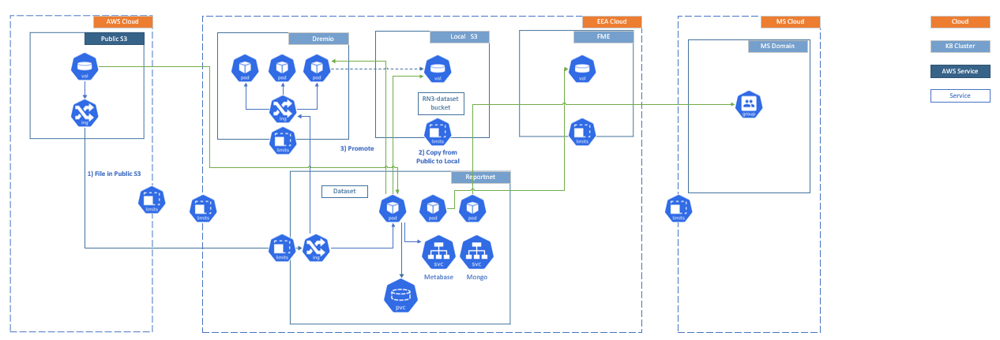

# Architecture

The architectural documentation is maintained on [EEA SharePoint](https://eea1.sharepoint.com/:f:/t/Reportnet3.0-Shared/ErsgwOwQYp1Hj8U4-sb6E30BjhAv7SZre8udgDKiPES5mw?e=csgJRy) from version 3.2 onwards.

  * [TRACASA-ALTIA-RN3-Technical_architecture_v1.docx](Architecture/attachments/167852) (Obsolete)
  * [EEA-CJ.pdf](Architecture/attachments/163081) Orchestrator diagram
  * [RN3-Import.png](Architecture/attachments/171280) \- Sequence diagram
  * [RN3-Validate.png](Architecture/attachments/171277) \- Sequence diagram
  * [RN3-Release.png](Architecture/attachments/171278) \- Sequence diagram
  * [RN3-logging-problem.png](Architecture/attachments/171279) \- Sequence diagram (that caused event storm on Sentry and Graylog)
  * [2023-01-RN3-Upcoming-Architectural-Changes-2023.pptx](Architecture/attachments/171281)

[Edit this section](Architecture/edit.md)

## Current Proposed Architecture Layout for Spring 2024

Data map of all information:

Information | Source  
---|---  
Schemas (Tables/Fields)  |  Mongo   
Member States per dataflow  |  Metabase   
Member States per dataflow table statistics  |  Metabase   
Dataflow Reporting Sets  |  Metabase   
Jobs  |  Orchestrator_DB   
Job Details  |  Metabase   
Records  |  DLH (Storage S3/Query engine Dremio) - Citus (Postgres)   
  
The record analysis in DBs:

Source | Citus | DLH  
---|---|---  
Reported data  |  Records  | Records   
Spatial data |  Records  | Records   
Attachments  |  Records  |  Records and Files   
Data collections  |  Records  |  Records and Files   
EU Dataset  |  Records  | Records and Files   
Reference data  |  Records  | Records

## Verification notes

This page is almost entirely a link index, a data map table, and an embedded image. The substantive architectural content has been superseded by the source-derived `architecture.md` maintained at `/Users/janbliki/Documents/GitHub/R3_documentation/architecture.md`. The following discrepancies and omissions were identified by comparing this page against that document and against the source service directories.

**Services omitted from this page.** The source tree at `/Users/janbliki/Documents/GitHub/eea.reportnet3/` contains thirteen deployable services: `collaboration-service`, `communication-service`, `dataflow-service`, `dataset-service`, `document-container-service`, `frontend-service`, `indexsearch-service`, `maintenance-service`, `orchestrator-service`, `recordstore-service`, `rod-service`, `user-management-service`, and `validation-service`, plus the `inspire-harvester` and `api-gateway`. The page makes no mention of the Orchestrator Service, which is the central job coordinator for all long-running operations, nor of the Inspire Harvester, the ROD Service, or the Maintenance Service. The source-derived architecture document describes all of these.

**Infrastructure components.** The page's data-map table references Consul, MongoDB, Metabase, Orchestrator\_DB, Citus/PostgreSQL, and S3/Dremio, but lists neither Redis nor Elasticsearch. Redis Sentinel is used for distributed locking and caching across several services (confirmed in `architecture.md` and the source-derived `kubernetes.md`). Elasticsearch backs the Index Search Service.

**Kafka.** No mention of Kafka anywhere on this page. Kafka is the asynchronous backbone for the entire event notification model, with four topics and over 170 event types (confirmed in `Infrastructure/kafka.md`). Its omission from this page is a significant gap for a reader trying to understand the architecture.

**API Gateway.** The page does not mention the API Gateway, which is the single external entry point for all traffic.

**Keycloak.** Not listed on this page, though it is a core infrastructure component.

**"Spring 2024 Proposed Architecture" diagram.** The diagram is stored as an attachment and is not reproducible from source. Whether it remains current cannot be verified.

**Metabase.** Listed in the data map as the store for member-state dataflow statistics and reporting sets. Metabase is not referenced as a separately deployed service in the source tree or in the source-derived architecture document. It appears to be a PostgreSQL-backed BI tool running against the Orchestrator database, but its deployment and purpose are not documented elsewhere in this folder.

**Outdated timestamp.** The page was last updated November 2022. The architectural content has changed significantly since then: the Orchestrator Service, the data lake (S3/Dremio), and the `bigData` flag for dataset routing were all added or significantly changed after this date.
