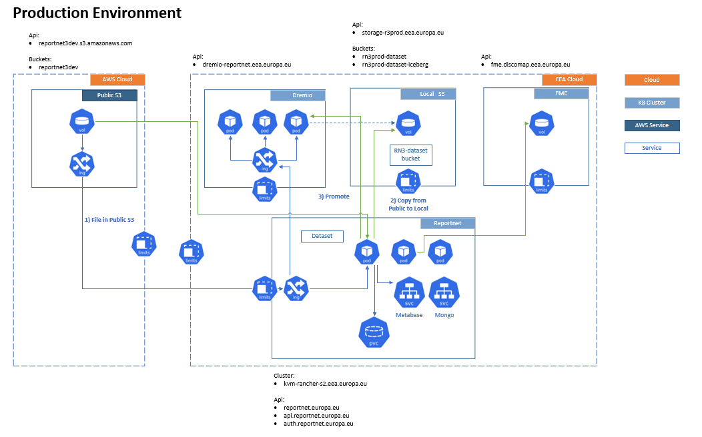
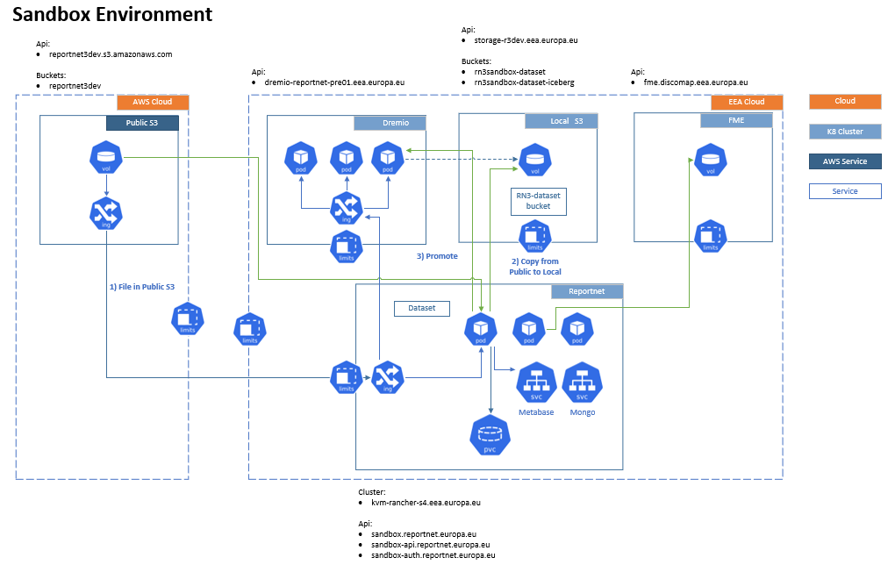
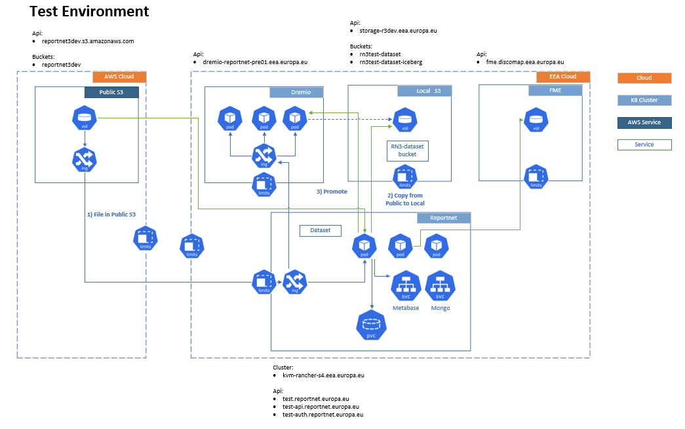

# Environments (Production, Transport, Sandbox, Test, Dev)

  * **Table of contents**
  * Environments (Production, Transport, Sandbox, Test, Dev)
    * Side Services version
    * Production
    * Transport
    * Sandbox (ex Staging)
    * Test
    * Dev
    * Deployment maps
      * Production
      * Transport

[Edit this section](Environments/edit.md)

## Side Services version

Kafka: 2.4.1 (Docker Image bitnami/kafka:2.4.1-debian-10-r45)  
Zookeeper: 3.6.0 (Docker Image bitnami/zookeeper:3.6.0-debian-10-r34)  
Consul: 1.5.3 (Docker Image consul:1.5.3)  
Keycloak: 5.0.0 (Docker Image jboss/keycloak:5.0.0)  
MongoDB: 3.6 (Docker Image mongo:3.6)  
Redis: 5.0.8 (Docker Image bitnami/redis:5.0.8-debian-10-r32)  
Postgresql: 11.7 (Docker Image bitnami/postgresql-repmgr:11.7.0-debian-10-r74)  
PGPool: 4.1.1 (Docker Image bitnami/pgpool:4.1.1-debian-10-r50)

Environment  | Memory[GB] | CPU[core]   
---|---|---  
RN3prod |  418  |  118  
RN3transport |  418  |  118  
RN3sandbox |  366 |  114  
RN3test |  138 |  34  
RN3dev |  170 |  40  
  
[Edit this section](Environments/edit.md)

## Production

Production environment.  
Kubernetes environments: <https://kvm-rancher-s2.eea.europa.eu/login>

Services version:

ApiGateway: v3.2  
Recordstore: v3.2  
Communication: v3.2  
Dataflow: v3.2  
Dataset: v3.2  
Validation: v3.2  
Frontend: v3.2  
Ums: v3.2  
Document: v3.2  
Rod: v3.2  
Collaboration: v3.2

Pods

ApiGateway: 1  
Recordstore: 5  
Communication: 1  
Dataflow: 4  
Dataset: 4  
Validation: 5  
Frontend: 1  
Ums: 1  
Document: 1  
Rod: 1  
Collaboration: 1

System has its own domain name: reportnet.europa.eu and its own ssl certificate. 

  * Home page: <https://reportnet.europa.eu/> \--> Log in using EuLogin 
  * Keycloak (need EEA VPN): <https://rn3prod-auth.eea.europa.eu/auth/>
  * Auth end point: <https://auth.reportnet.europa.eu/>
  * Api: <https://api.reportnet.europa.eu/>

DNS entry: 
  * rn3prod CNAME kvm-rn3prod-f01.eea.europa.eu. ; 
  * rn3prod-api CNAME kvm-rn3prod-f01.eea.europa.eu. ; 
  * api CNAME kvm-rn3prod-f01.eea.europa.eu. ; 
  * rn3prod-auth CNAME kvm-rn3prod-f01.eea.europa.eu. ; 
  * auth CNAME kvm-rn3prod-f01.eea.europa.eu. ;

Ingress: 
  * ingress-apigateway at api.reportnet.europa.eu
  * ingress-fmeapi at fme-api.reportnet.europa.eu
  * ingress-maintenance at reportnet.europa.eu
  * rn3-keycloak-admin at rn3prod-auth.eea.europa.eu
  * ingress-keycloak at auth.reportnet.europa.eu

Map:

[Edit this section](Environments/edit.md)

## Transport

This environment is dedicated to handle Cars and Vans reporting obligations from CET group  
Kubernetes environments: <https://kvm-rancher-s2.eea.europa.eu/env/1a19010/kubernetes/dashboard>

(fill if needed)  
Microservices version:

  * Main page: <https://transport.reportnet.europa.eu>
  * Keycloak (do not need EEA VPN): <http://kvm-rn3prod2-12.pdmz.eea:30252/auth/admin/master/console/#/realms/Reportnet/users>
  * Auth end point: <https://transport-auth.reportnet.europa.eu>
  * API: <https://transport-api.reportnet.europa.eu>

DNS entry:

[Edit this section](Environments/edit.md)

## Sandbox (ex Staging)

This environment is meant to test releases and hotfixes before deploying on Production. This environment can be considered as Pre Production. It should be a copy of production (with less resources) after hotfixes and releases have been tested. It should also be used for dataflow definition, then when ready, the dataflows will be moved to prod.  
Kubernetes environments: RN3Sandbox (<https://kvm-rancher-s4.eea.europa.eu/env/1a7026/kubernetes/dashboard>)

Services version: v3.4-SANDBOX

ApiGateway  
Recordstore  
Communication  
Dataflow  
Dataset  
Validation  
Frontend  
Ums  
Document  
Rod  
Collaboration

  * Main page: <https://sandbox.reportnet.europa.eu> \--> Log in using EuLogin or a precreated user account like <user.name>.custodian or <user.name>.provider
  * Keycloak (need EEA VPN):: <http://kvm-rn3stg-01.pdmz.eea:32126/auth/>
  * Auth end point: <https://sandbox-auth.reportnet.europa.eu/>
  * ApiGateway: <https://sandbox-api.reportnet.europa.eu>

DNS entry: 
  * sandbox CNAME kvm-rn3stg-f01.eea.europa.eu. ;
  * sandbox-api CNAME kvm-rn3stg-f01.eea.europa.eu. ;

Map:

[Edit this section](Environments/edit.md)

## Test

This environment is meant for functional testing. It's used for sprint review and sprint tests. It will be used also for UAT, only for selected EEA's staff  
Kubernetes environments: <https://kvm-rancher-s4.eea.europa.eu/>

Microservices version:

ApiGateway: v3.3.1-ARCHITECTURE_DLH  
Recordstore: v3.3.1-ARCHITECTURE_DLH  
Communication: v3.3.1-ARCHITECTURE_DLH  
Dataflow: v3.3.1-ARCHITECTURE_DLH  
Dataset: v3.3.1-ARCHITECTURE_DLH  
Validation: v3.3.1-ARCHITECTURE_DLH  
Frontend: v3.3.1-ARCHITECTURE_DLH  
Ums: v3.3.1-ARCHITECTURE_DLH  
Document: v3.3.1-ARCHITECTURE_DLH  
Rod: v3.3.1-ARCHITECTURE_DLH  
Collaboration: v3.3.1-ARCHITECTURE_DLH

  * Main page: <https://test.reportnet.europa.eu> \--> Log in using EuLogin or a precreated user account like <user.name>.custodian or <user.name>.provider
  * Keycloak (need EEA VPN): <http://kvm-rkube-03.pdmz.eea:31842/auth>
  * Auth end point: <https://test-auth.reportnet.europa.eu>
  * API: <https://test-api.reportnet.europa.eu>

DNS entry: 
  * test CNAME kvm-rkube-f01.eea.europa.eu. ;
  * test-api CNAME kvm-rkube-f01.eea.europa.eu. ;

Map:

[Edit this section](Environments/edit.md)

## Dev

This environment is meant for development   
Kubernetes environments: <https://rancherdev.eea.europa.eu/>

Microservices version:

ApiGateway: v3.3-ARCHITECTURE_DATALAKES  
Recordstore: v3.3-ARCHITECTURE_DATALAKES  
Communication: v3.3-ARCHITECTURE_DATALAKES  
Dataflow: v3.3-ARCHITECTURE_DATALAKES  
Dataset: v3.3-ARCHITECTURE_DATALAKES  
Validation: v3.3-ARCHITECTURE_DATALAKES  
Frontend: v3.3-ARCHITECTURE_DATALAKES  
Ums: v3.3-ARCHITECTURE_DATALAKES  
Document: v3.3-ARCHITECTURE_DATALAKES  
Rod: v3.3-ARCHITECTURE_DATALAKES  
Collaboration: v3.3-ARCHITECTURE_DATALAKES

  * Main page: <https://dev.reportnet.europa.eu>
  * Keycloak (need EEA VPN): <http://kvm-rn3dev-05.pdmz.eea:31102/auth>
  * Auth end point: <https://dev-auth.reportnet.europa.eu>
  * API: <https://dev-api.reportnet.europa.eu>

DNS entry: 
  * dev CNAME dev1-rkube-f01.eea.europa.eu. ; 
  * dev-api CNAME dev1-rkube-f01.eea.europa.eu. ; 
  * dev-auth CNAME dev1-rkube-f01.eea.europa.eu. ;

[Edit this section](Environments/edit.md)

## Deployment maps

[Edit this section](Environments/edit.md)

### Production

Type | Service | Pod | PVC  | PV  
---|---|---|---|---  
Stateful | rn3-pg-helm-postgresql | rn3-pg-helm-postgresql-0 | data-rn3-pg-helm-postgresql-0 | pv000  
Stateful | rn3-pg-helm-postgresql | rn3-pg-helm-postgresql-1 | data-rn3-pg-helm-postgresql-1 | pv001  
Stateful | rn3-pg-helm-postgresql | rn3-pg-helm-postgresql-2 | data-rn3-pg-helm-postgresql-2 | pv002  
Stateful | mongo-mongodb-replicaset | mongo-mongodb-replicaset-0 | datadir-mongo-mongodb-replicaset-0 | pv006  
Stateful | mongo-mongodb-replicaset | mongo-mongodb-replicaset-1 | datadir-mongo-mongodb-replicaset-1 | pv007  
Stateful | mongo-mongodb-replicaset | mongo-mongodb-replicaset-2 | datadir-mongo-mongodb-replicaset-2 | pv008  
Stateful | pg-citus-dataset-master | pg-citus-dataset-master-0 | storage-pg-citus-dataset-master-0 | pv048  
Stateful | pg-citus-dataset-worker | pg-citus-dataset-worker-0 | storage-pg-citus-dataset-worker-0 | pv046  
Stateful | pg-citus-dataset-worker | pg-citus-dataset-worker-1 | storage-pg-citus-dataset-worker-1 | pv038  
Stateful | pg-citus-dataset-worker | pg-citus-dataset-worker-2 | storage-pg-citus-dataset-worker-2 | pv047  
Stateful | pg-citus-dataset-worker | pg-citus-dataset-worker-3 | storage-pg-citus-dataset-worker-3 | pv040  
Stateful | pg-citus-dataset-worker | pg-citus-dataset-worker-4 | storage-pg-citus-dataset-worker-4 | pv044  
Stateful | pg-citus-dataset-worker | pg-citus-dataset-worker-5 | storage-pg-citus-dataset-worker-5 | pv045  
Stateful | pg-citus-dataset-worker | pg-citus-dataset-worker-6 | storage-pg-citus-dataset-worker-6 | pv042  
Stateful | pg-citus-dataset-worker | pg-citus-dataset-worker-7 | storage-pg-citus-dataset-worker-7 | pv041  
Stateful | pg-citus-dataset-worker | pg-citus-dataset-worker-8 | storage-pg-citus-dataset-worker-8 | pv034  
Stateful | pg-citus-dataset-worker | pg-citus-dataset-worker-9 | storage-pg-citus-dataset-worker-9 | pv036  
Stateful | pg-citus-dataset-worker | pg-citus-dataset-worker-10 | storage-pg-citus-dataset-worker-10 | pv049  
Stateful | pg-citus-dataset-worker | pg-citus-dataset-worker-11 | storage-pg-citus-dataset-worker-11 | pv037  
Stateful | pg-citus-dataset-worker | pg-citus-dataset-worker-12 | storage-pg-citus-dataset-worker-12 | pv050  
Stateful | pg-citus-dataset-worker | pg-citus-dataset-worker-13 | storage-pg-citus-dataset-worker-13 | pv043  
Stateful | pg-citus-dataset-worker | pg-citus-dataset-worker-14 | storage-pg-citus-dataset-worker-14 | pv035  
Stateful | redis-master | redis-master-0 | redis-data-redis-master-0 | pv028  
Stateful | redis-slave | redis-slave-0 | redis-data-redis-slave-0 | pv027  
Stateful | redis-slave | redis-slave-1 | redis-data-redis-slave-1 | pv029  
Stateful | redis-slave | redis-slave-2 | redis-data-redis-slave-2 | pv030  
Replica | Reportnet | Reportnet-pods | reportnet3-data | pv026  
Stateful | consul | consul-0 | datadir-consul-0 | pv017  
Stateful | consul | consul-1 | datadir-consul-1 | pv016  
Stateful | consul | consul-2 | datadir-consul-2 | pv018  
  
[Edit this section](Environments/edit.md)

### Transport

Type | Service | Pod | PVC  | PV  
---|---|---|---|---  
Stateful | rn3-pg-helm-postgresql | rn3-pg-helm-postgresql-0 | data-rn3-pg-helm-postgresql-0 | pv001  
Stateful | rn3-pg-helm-postgresql | rn3-pg-helm-postgresql-1 | data-rn3-pg-helm-postgresql-1 | pv000  
Stateful | rn3-pg-helm-postgresql | rn3-pg-helm-postgresql-2 | data-rn3-pg-helm-postgresql-2 | pv002  
Stateful | mongo-mongodb-replicaset | mongo-mongodb-replicaset-0 | datadir-mongo-mongodb-replicaset-0 | pv006  
Stateful | mongo-mongodb-replicaset | mongo-mongodb-replicaset-1 | datadir-mongo-mongodb-replicaset-1 | pv007  
Stateful | mongo-mongodb-replicaset | mongo-mongodb-replicaset-2 | datadir-mongo-mongodb-replicaset-2 | pv008  
Stateful | pg-citus-dataset-master | pg-citus-dataset-master-0 | storage-pg-citus-dataset-master-0 | pv048  
Stateful | pg-citus-dataset-worker | pg-citus-dataset-worker-0 | storage-pg-citus-dataset-worker-0 | pv046  
Stateful | pg-citus-dataset-worker | pg-citus-dataset-worker-1 | storage-pg-citus-dataset-worker-1 | pv040  
Stateful | pg-citus-dataset-worker | pg-citus-dataset-worker-2 | storage-pg-citus-dataset-worker-2 | pv034  
Stateful | pg-citus-dataset-worker | pg-citus-dataset-worker-3 | storage-pg-citus-dataset-worker-3 | pv035  
Stateful | pg-citus-dataset-worker | pg-citus-dataset-worker-4 | storage-pg-citus-dataset-worker-4 | pv037  
Stateful | pg-citus-dataset-worker | pg-citus-dataset-worker-5 | storage-pg-citus-dataset-worker-5 | pv047  
Stateful | pg-citus-dataset-worker | pg-citus-dataset-worker-6 | storage-pg-citus-dataset-worker-6 | pv042  
Stateful | pg-citus-dataset-worker | pg-citus-dataset-worker-7 | storage-pg-citus-dataset-worker-7 | pv039  
Stateful | pg-citus-dataset-worker | pg-citus-dataset-worker-8 | storage-pg-citus-dataset-worker-8 | pv044  
Stateful | pg-citus-dataset-worker | pg-citus-dataset-worker-9 | storage-pg-citus-dataset-worker-9 | pv036  
Stateful | pg-citus-dataset-worker | pg-citus-dataset-worker-10 | storage-pg-citus-dataset-worker-10 | pv050  
Stateful | pg-citus-dataset-worker | pg-citus-dataset-worker-11 | storage-pg-citus-dataset-worker-11 | pv041  
Stateful | pg-citus-dataset-worker | pg-citus-dataset-worker-12 | storage-pg-citus-dataset-worker-12 | pv043  
Stateful | pg-citus-dataset-worker | pg-citus-dataset-worker-13 | storage-pg-citus-dataset-worker-13 | pv049  
Stateful | pg-citus-dataset-worker | pg-citus-dataset-worker-14 | storage-pg-citus-dataset-worker-14 | pv045  
Stateful | redis-master | redis-master-0 | redis-data-redis-master-0 | pv030  
Stateful | redis-slave | redis-slave-0 | redis-data-redis-slave-0 | pv033  
Stateful | redis-slave | redis-slave-1 | redis-data-redis-slave-1 | pv032  
Stateful | redis-slave | redis-slave-2 | redis-data-redis-slave-2 | pv029  
Replica | Reportnet | Reportnet-pods | reportnet3-data | pv026  
Stateful | consul | consul-0 | datadir-consul-0 | pv017  
Stateful | consul | consul-1 | datadir-consul-1 | pv016  
Stateful | consul | consul-2 | datadir-consul-2 | pv018

## Verification notes

This page was last updated January 2025 and is among the more current wiki pages. The following observations were identified.

**Component version discrepancies.** The "Side Services version" table at the top of this page lists Kafka 2.4.1 (`bitnami/kafka:2.4.1-debian-10-r45`), Zookeeper 3.6.0, and Redis 5.0.8. The source-derived `kubernetes.md` (derived from sandbox cluster inspection) records Kafka 2.5.0 (`bitnami/kafka:2.5.0-debian-10-r91`), Zookeeper 3.6.1, and Redis 6.0.5. The "Side Services version" table appears to describe an older environment state and it is not clear which environment it corresponds to.

**Keycloak version.** The table lists Keycloak 5.0.0 (`jboss/keycloak:5.0.0`). The `Reportnet_Deployment.md` page also references `jboss/keycloak:5.0.0` as the base, with `eeacms/rn3-keycloak` as the EEA custom image. The source-derived `keycloak.md` document notes that the current Keycloak version is not documented. No contradicting source was found, but 5.0.0 is a very old release (circa 2019) and is unconfirmed as current.

**MongoDB version.** The table lists MongoDB 3.6. The `Kubernetes_deployment_files.md` page uses `mongo:4.0.12` in its StatefulSet manifest. These are inconsistent, and neither can be confirmed as current from the source tree.

**Services missing from environment listings.** The Production and Sandbox service lists do not include the Orchestrator Service or the Inspire Harvester, both of which exist as `orchestrator-service` and `inspire-harvester` in the source tree. The Orchestrator is a central component; its absence from the environment listings is notable.

**Deployment maps.** The deployment maps for Production and Transport show `pg-citus-dataset-master` and `pg-citus-dataset-worker` pods, confirming Citus is in production use. No S3 or Dremio PVCs appear in these maps, consistent with the data lake being hosted separately (as described in `dremio_s3.md`, which notes Dremio and S3 run in separate Kubernetes clusters).

**Dev environment service versions.** The Dev environment lists services at `v3.3-ARCHITECTURE_DATALAKES` and the Test environment at `v3.3.1-ARCHITECTURE_DLH`, while Production is at `v3.2`. This confirms the data lake architecture branch was being developed and tested at time of writing (2025-01) but had not yet reached production. This is consistent with the source-derived `architecture.md` note about Citus-to-Dremio migration status.

**AWS NKP environment.** This page does not mention the AWS NKP production environment, which is documented in `AWSNKP_Service_Access.md` (updated November 2025, after this page). The AWS NKP cluster appears to be a newer production environment that post-dates this page.
