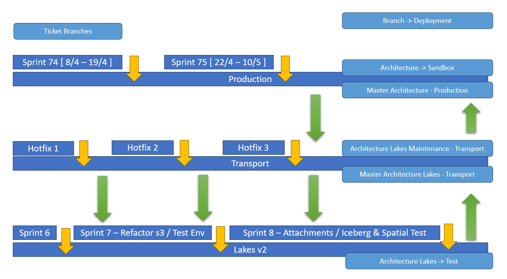

# Merge and deployment process for all environments

See the following document for "Steps for Building to Production(MasterOneVersion(PROD) or MasterDataLakes(TRANSPORT))" <https://taskman.eionet.europa.eu/attachments/332088>

[Edit this section](Merge_and_deployment_process_for_all_environments/edit.md)

## Dev

**This environment is used for testing features before they are deployed on Transport**

The branch in which the developers should merge their branches to is **DevEnv**. The version in pom.xml should be **v3.3-DEV**  
After merging and confirming that the pom.xml file contains the correct version, we should add a build in Jenkins.  
To deploy, we need to restart the services that have been affected by our code changes in Kubernetes.

[Edit this section](Merge_and_deployment_process_for_all_environments/edit.md)

## Test

**This environment is used for testing features before they are deployed on Production**

The branch in which the developers should merge their branches to is **TestEnv**. The version in pom.xml should be **v3.4-TEST**  
After merging and confirming that the pom.xml file contains the correct version, we should add a build in Jenkins.  
To deploy, we need to restart the services that have been affected by our code changes in Kubernetes.

[Edit this section](Merge_and_deployment_process_for_all_environments/edit.md)

## Sandbox

**This environment is used for testing features before they are deployed on Production**

The branch in which the developers should merge their branches to is **SandboxEnv**. The version in pom.xml should be **v3.4-SANDBOX**  
After merging and confirming that the pom.xml file contains the correct version, we should add a build in Jenkins.  
To deploy, we need to restart the services that have been affected by our code changes in Kubernetes.

[Edit this section](Merge_and_deployment_process_for_all_environments/edit.md)

## Production

The branch in which the developers should merge their branches to is **MasterOneVersion**. The version in pom.xml should be **v3.4**  
After merging, we add a commit for the pom.xml file which will contain a new version that will be kept as a back up and a build in jenkins should be added.  
After the build is finished successfully, we need to change the pom.xml file to contain the correct version **v3.4** and add a build in Jenkins.  
To deploy, we need to restart the services that have been affected by our code changes in Kubernetes.

[Edit this section](Merge_and_deployment_process_for_all_environments/edit.md)

## Transport

The branch in which the developers should merge their branches to is **MasterDataLakes**. The version in pom.xml should be **v3.3**  
After merging and confirming that the pom.xml file contains the correct version, we should add a build in Jenkins.  
To deploy, we need to restart the services that have been affected by our code changes in Kubernetes.

[Edit this section](Merge_and_deployment_process_for_all_environments/edit.md)

## Sprints

Sprint | Environment | Branch | Version  | Status   
---|---|---|---|---  
Sprint 81  |  Deployed at production cluster  |  MasterOneVersion  |  v3.4 (v3.4.14)  |  Deployed 14/11/2024   
Sprint 81 - Hotfixes Transport  |  Deployed at transport cluster  |  MasterDatalakes  |  v3.3  |  Deployed 12/11/2024   
Sprint 82  |  Deployed at production cluster  |  MasterOneVersion  |  v3.4 (v3.4.15)  |  Deployed 4/12/2024   
Sprint 83  |  Deployed at production cluster  |  MasterOneVersion  |  v3.4-(v3.4.17)  |  Deployed 23/1/2025   
Sprint 84  |  Deployed at production cluster  |  MasterOneVersion  |  v3.4-(v3.4.18)  |  Deployed 05/02/2025  
Sprint 85  |  Deployed at production cluster  |  MasterOneVersion  |  v3.4-(v3.4.20)  |  Deployed 18/03/2025   
Sprint 86  |  |  MasterOneVersion  |  v3.4-(v3.4.21)  |  To be deployed at production between 31/03/2025 - 04/04/2025  
  
[Edit this section](Merge_and_deployment_process_for_all_environments/edit.md)

## Service Requests

SR | Environment | Branch | Version  | Status  
---|---|---|---|---  
Service Request 3  |  Deployed at production cluster  |  MasterOneVersion  |  v3.4-(v3.4.16)  | Deployed 10/01/2025  
Service Request 4  |  Deployed at production cluster  |  MasterOneVersion  |  v3.4-(v3.4.19)  | Deployed 04/03/2025  
  
[Edit this section](Merge_and_deployment_process_for_all_environments/edit.md)

## Roll back deployment

In deployment yaml of service change the version   
For example: In the dataset pod to roll back from the latest (v3.4) to the previous version (v3.4.15)

Currently deployed:
[code] 
     "containers": [
              {
                "name": "dataset",
                "image": "eeacms/dataset-service:v3.4",
    
[/code]

Change to:
[code] 
     "containers": [
              {
                "name": "dataset",
                "image": "eeacms/dataset-service:v3.4.15",
    
[/code]

After saving the change, the pods will do rolling restart running the previous version of the application

[Edit this section](Merge_and_deployment_process_for_all_environments/edit.md)

## Roll back code

Roll back Sprint commits
[code] 
    Steps to Revert a Commit Using GitHub
      Navigate to the Commit:
        Go to the repository on GitHub.
        Click the Commits tab to view the history.
      Use the Revert Button:
        Locate the commit you want to revert.
        Click the Revert button.
    
    This creates a pull request with a new commit that undoes the changes from the selected commit.
      Merge the Revert Pull Request:
        Review the changes in the revert pull request.
        Merge it into the target branch.
    
[/code]

[Edit this section](Merge_and_deployment_process_for_all_environments/edit.md)

## Layout of Merging Sprints for Spring 2024

## Verification notes

The branch names `DevEnv`, `TestEnv`, `SandboxEnv`, `MasterOneVersion`, and `MasterDataLakes` are confirmed to exist as remote branches in the repository (visible in `.git/packed-refs` and `.git/refs/remotes/origin/`). The wiki's description of these as the integration targets for their respective environments is consistent with what exists in source control.

The Jenkinsfile (Altia-side CI pipeline) does not reference any of the environment branch names described in this wiki. Its branch-conditional logic references only `develop`, `sandbox`, `develop1`, and a specific release candidate branch (`release/v3.1.5.5-RC1`). Docker images in the Altia Jenkinsfile are pushed to the internal registry `k8s-swi001:5000/`, not to `eeacms/` on Docker Hub. The Jenkinsfile.eea (EEA-side pipeline) pushes all services to `eeacms/` on Docker Hub and does not filter by branch at all — it builds and pushes on every run. Neither Jenkinsfile references the named environment branches (`DevEnv`, `TestEnv`, `MasterOneVersion`, etc.).

The rollback section describes changing the image tag in the Kubernetes deployment YAML, which is consistent with how the EEA Jenkinsfile tags images: Jenkinsfile.eea pushes both a version-pinned tag (e.g. `eeacms/dataset-service:v3.4.15`) and a datestamp tag, matching the rollback pattern shown. However, the wiki example shows the production tag as `v3.4` (a moving tag), while the sprint history shows versioned tags such as `v3.4.15`; this is consistent within the wiki itself and does not contradict the source.

One discrepancy: the sprint history table refers to the Transport branch as `MasterDatalakes` (lowercase "l" in "lakes"), while the confirmed remote branch name in the repository is `MasterDataLakes` (capital "L"). The discrepancy is purely typographic and appears within the wiki itself at line 65.
