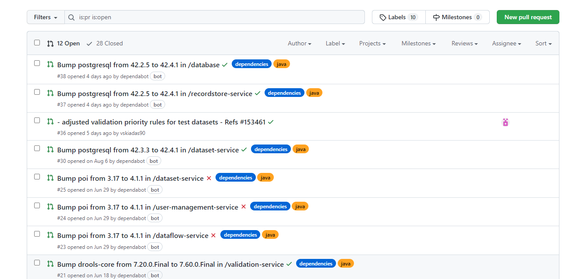
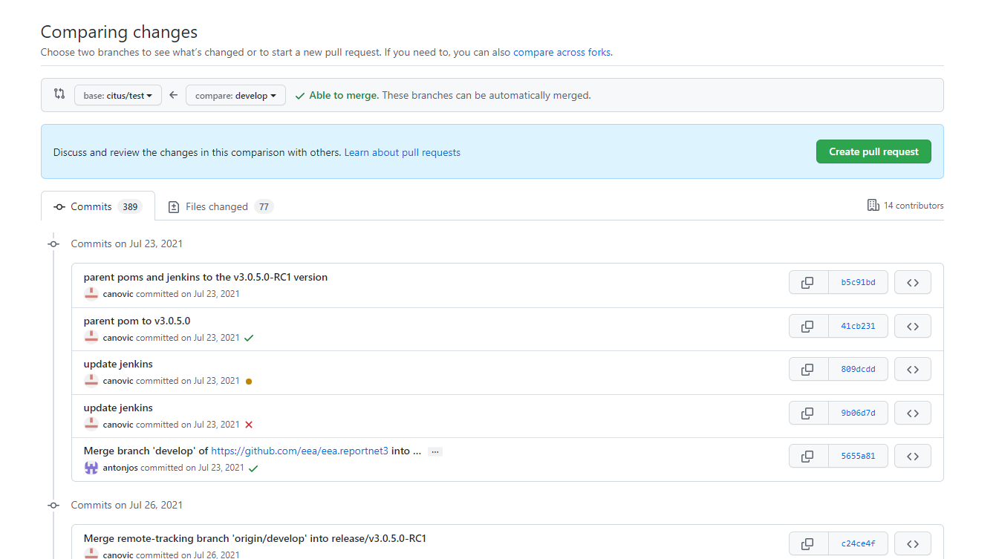
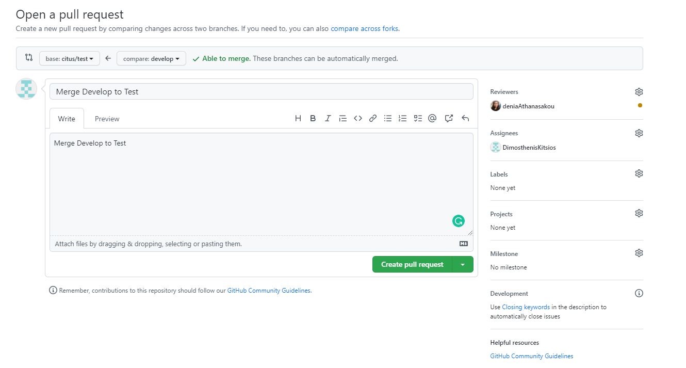
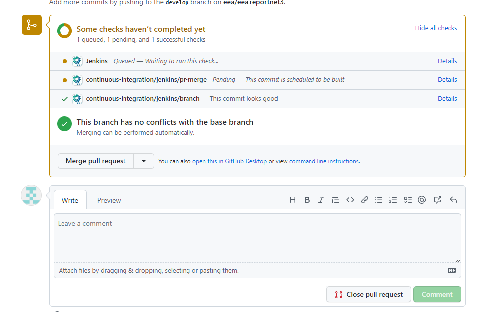

# Transfer branch to another environment

[Edit this section](Transfer_branch_to_another_environment_/edit.md)

## Sequence DEV to PRODUCTION

1\. Jenkings changes not needed anymore. Dynamic configuration from Sotiris

We create PR from our branches to DEV  
We push commits from DEV to TEST (No PR here, our task branch)  
We create PR version from TEST to SANDBOX to PRODUCTION

Permitted paths ONLY : SANDBOX to MASTER and HOTFIX to MASTER

2\. Deploy to evnironment (RN3-deploy-scripts) with RELEASE_NAME and ENVIRONMENT_NAME  
eg: v3.1.5.6, DEV

3\. DO NOT DELETE BRANCH

?Merge branch names with ENVIRONMENTS  
dev ~~> develop  
test -> citus/test  
sandbox~~> sandbox  
production-> master

[Edit this section](Transfer_branch_to_another_environment_/edit.md)

## With merge

  * Select new pull request

  * Select the target branch and the source branch

  * Create pull request

  * When the validations are completed, click Merge Pull Request.

  * Go to Jenkins <https://ci.eionet.europa.eu/job/reportnet/> on your target environment and wait for the build to complete. After successful completion, check the Docker Registry <https://registry.hub.docker.com/r/eeacms/dataset-service/tags(ms> doesn't matter, this link is for dataset service) that the correct tag has been created.

  * Checkout the target branch of merge(in our case citus/test) and commit the parent pom.xml and Jenkinsfile with the state of the files before the merge.  
We need to commit these files after the merge because it will transfer the tag and the branch name from the source branch to the target branch, and we want to revert it.

## Verification notes

This document was last updated in September 2022 and several details no longer match the current source.

The section maps `dev` to `develop`, `test` to `citus/test`, `sandbox` to `sandbox`, and `production` to `master`. The confirmed branch names in the repository are `DevEnv`, `TestEnv`, `SandboxEnv`, and `MasterOneVersion` (visible in `.git/packed-refs`). Neither `citus/test` nor `master` appears as a current active integration branch. The branch `develop` exists locally but serves a different role than the `dev` environment branch `DevEnv`.

The sequence "DEV to TEST, TEST to SANDBOX to PRODUCTION" in the notes is broadly consistent with the current environment table in `Merge_and_deployment_process_for_all_environments.md`, but the specific branch names are outdated.

The Jenkins URL referenced (`https://ci.eionet.europa.eu/job/reportnet3/`) is a different path from the one in `Deployment_procedure_.md` (`https://ci.eionet.europa.eu/view/Github/job/reportnet3-main/job/eea.reportnet3/`). The correct current URL cannot be confirmed from source code alone.

The instruction to revert `parent/pom.xml` and `Jenkinsfile` after merge reflects a workflow where these files carry version and branch-specific configuration that must not bleed across branches. This concern remains valid given that the Jenkinsfile contains hardcoded branch conditions (e.g. the `branch 'develop1'` and `branch 'release/v3.1.5.5-RC1'` guards in the Altia Jenkinsfile).
