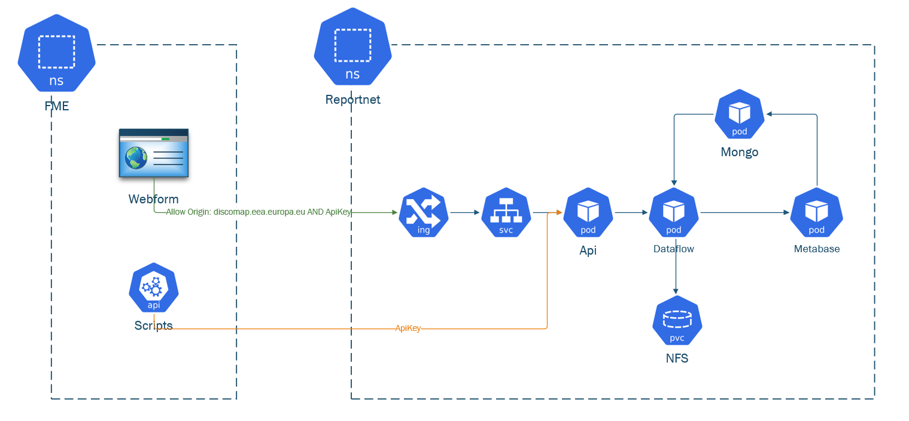

# FME processes

Process link | Schedule | Comments  
---|---|---  
<https://fme.discomap.eea.europa.eu/fmeserver/#/workspaces/run/WISE/RN3_Metadata.fmw> | daily schedule | <https://fme.discomap.eea.europa.eu/fmeserver/#/schedules/edit/Utilities/WISE_RN3_METADATA_WIGEON> \- everyday 20:00 and 08:00  
<https://fme.discomap.eea.europa.eu/fmeserver/#/workspaces/run/BATHING_WATER/Export_EU_dataset.fmw> | daily schedule | <https://fme.discomap.eea.europa.eu/fmeserver/#/schedules/edit/DatabaseUpdates/BWD_ExportDataCollection_to_CWS> everyday 20:30  
<https://fme.discomap.eea.europa.eu/fmeserver/#/workspaces/run/BATHING_WATER/ImportExcel_BWD_with_fmeJobId.fmw> |  external integration, called from within RN3 |   
  
Corrected map of the FME flow from Webform and from scripts with api calls:  

## Verification notes

This page was last updated in August 2023 and lists specific FME workspaces and schedules. These cannot be verified against source code; their accuracy depends on the current state of the FME Server configuration.

**FME Server URL.** The base URL `https://fme.discomap.eea.europa.eu/fmeserver/` is confirmed as correct — it matches the FME host configured in source (`FMECommunicationServiceImpl.java`, `integration.fme.host` Consul key in `Operation_guidelines.md`).

**Repositories mentioned.** The page references two FME repositories: `WISE` and `BATHING_WATER`. The `Operation_guidelines.md` Consul key `config/dataflow/integration.fme.default.repository` defaults to `ReportNetTesting`, meaning the default repository is different from those listed here. The workspaces in `WISE` and `BATHING_WATER` are dataflow-specific configurations that sit outside the default; their existence and schedule are not verifiable from Java source.

**FME integration architecture.** The page references FME being "called from within RN3" for the `ImportExcel_BWD_with_fmeJobId.fmw` workspace. This is consistent with the FME integration described in `IntegrationServices/FMEServer.md`: Reportnet 3's Dataflow Service submits jobs to FME via `POST /fmerest/v3/transformations/submit/{repository}/{workspace}`, and FME callbacks to Reportnet 3 via `POST /fme/operationFinished`. The attached flow diagram's accuracy cannot be verified without viewing the image.
