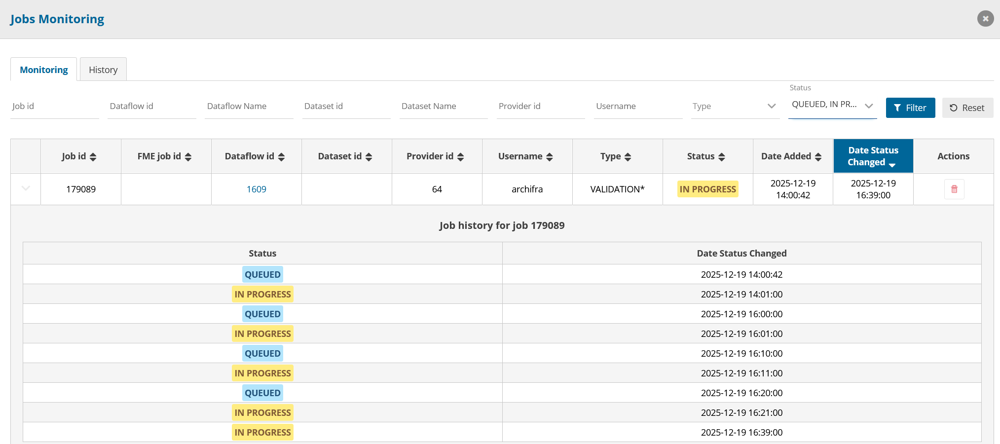

# Remove locks

Use the following endpoint (change the domain if needed)  
[https://api.reportnet.europa.eu/dataset/checkLocks?dataflowId=&dataProviderId=&datasetId=](https://api.reportnet.europa.eu/dataset/checkLocks?dataflowId=&dataProviderId=&datasetId=)  
and add either dataflow, dataflow and provider or dataset values.

e.g. [https://api.reportnet.europa.eu/dataset/checkLocks?dataflowId=123&dataProviderId=&datasetId=](https://api.reportnet.europa.eu/dataset/checkLocks?dataflowId=123&dataProviderId=&datasetId=)  
or [https://api.reportnet.europa.eu/dataset/checkLocks?dataflowId=123&dataProviderId=456&datasetId=](https://api.reportnet.europa.eu/dataset/checkLocks?dataflowId=123&dataProviderId=456&datasetId=)  
or [https://api.reportnet.europa.eu/dataset/checkLocks?dataflowId=&dataProviderId=&datasetId=789](https://api.reportnet.europa.eu/dataset/checkLocks?dataflowId=&dataProviderId=&datasetId=789)

If you get a json response with items, get the id and search for it in the locks table in metabase. Then remove the record.

[Edit this section](Handle_stuck_jobs/edit.md)

# Stuck import jobs

[Edit this section](Handle_stuck_jobs/edit.md)

## Job has status QUEUED for more than 1 hour

Go to jobs table and set the status to CANCELED

[Edit this section](Handle_stuck_jobs/edit.md)

## Job has status IN_PROGRESS and in the tasks table there are two FINALIZE tasks

Remove one of the FINALIZE tasks and set the status of the other FINALIZE task to IN_QUEUE

[Edit this section](Handle_stuck_jobs/edit.md)

## Other reasons

Cancel the job through the ui or 

  1. Go to jobs table and set the status to CANCELED
  2. Go to process table and if it is IN_PROGRESS or IN_QUEUE set the status to CANCELED
  3. Go to tasks table and if a record is IN_PROGRESS or IN_QUEUE set the status to CANCELED

[Edit this section](Handle_stuck_jobs/edit.md)

# Stuck validation jobs

[Edit this section](Handle_stuck_jobs/edit.md)

## Tasks have status IN_PROGRESS for too long (more than 30 minutes) and we haven't manually restarted them already

Set the statuses to IN_QUEUE so that they are restarted

[Edit this section](Handle_stuck_jobs/edit.md)

## Validation tasks are FINISHED but process or job remain IN_PROGRESS

  1. If there are IN_PROGRESS or IN_QUEUE processes set the status to CANCELED
  2. Go to job_process table and remove the entry for the specific job_id
  3. Remove any existing locks
  4. Set the job's status to QUEUED so that the job is restarted

**Other way:**

  1. Set the process IN_PROGRESS
  2. Set one task to status IN_QUEUE

[Edit this section](Handle_stuck_jobs/edit.md)

## Job status is set up as QUEUED and IN_PROGRESS multiple times / Job is IN_PROGRESS but process is stuck with status IN_QUEUE for more than a couple of hours

  1. Remove locks related to the dataset id
  2. Cancel the process and/or tasks
  3. Remove the entry for the job in the job_process table
  4. Set the job status QUEUED in order to restart it.

[Edit this section](Handle_stuck_jobs/edit.md)

## Validation is looping between `QUEUED` and `IN_PROGRESS`

This is caused because there are locks for this validation, make sure to remove all related locks and it will proceed.  
*Note: When the job is IN_PROGRESS to QUEUED, the locks removal may not work thus the job will stay in loop. Remove locks when job has status QUEUED!  
Below is a screenshot that showcases this loop:  

[Edit this section](Handle_stuck_jobs/edit.md)

# Stuck release job

[Edit this section](Handle_stuck_jobs/edit.md)

## In queue tasks for more than 2 hours

Set the status of the IN_QUEUE tasks to IN_PROGRESS and add a date_start date that is more than 1 hour ago so that they are picked up again by JobForRestartingReleaseTasks

[Edit this section](Handle_stuck_jobs/edit.md)

## Process and tasks are finished but job is IN_PROGRESS

  1. Remove any existing locks
  2. Go to dataset table and check that for the datasets released column is false
  3. Check that in snapshot table there is at least one entry for each dataset with dc_released true and date_released not null. If so, proceed to the next step.
  4. Set the job's status to FINISHED

[Edit this section](Handle_stuck_jobs/edit.md)

## Job is finished but reporter sees spinner in release button

  1. Remove any existing locks.
  2. Go to dataset table and check that for the datasets releasing column is false

[Edit this section](Handle_stuck_jobs/edit.md)

## Other reasons

[Edit this section](Handle_stuck_jobs/edit.md)

### Release job needs to be canceled

Cancel the job through the ui or 

  1. If there are IN_PROGRESS or IN_QUEUE tasks set the status to CANCELED
  2. If there are IN_PROGRESS or IN_QUEUE processes set the status to CANCELED
  3. Remove any existing locks
  4. Set the job's status to CANCELED
  5. Go to dataset table and check that for the datasets releasing column is false

**Important: If release needs to be canceled manually, after canceling it, go to snapshot table in metabase and if there are entries for the datasets that were releasing that have date_released same as the release date, set the date_released to NULL and dc_released to false.**

[Edit this section](Handle_stuck_jobs/edit.md)

### Release job needs to be restarted

  1. If there are IN_PROGRESS or IN_QUEUE tasks set the status to CANCELED
  2. If there are IN_PROGRESS or IN_QUEUE processes set the status to CANCELED
  3. Remove any existing locks
  4. Remove snapshots related to the job by setting their release date to null and dc_released to false
  5. Set the job's status to CANCELED
  6. Find the related validation job id by checking the release job parameters
  7. Set the validation job status to IN_PROGRESS
  8. Set one of the validation job's processes to IN_PROGRESS
  9. Set one of the validation job's tasks to IN_QUEUE

The validation job will finish and trigger a kafka event to recreate a release job.  
If the validation job doesn't finish immediately, scheduled task JobForFinalizingInProgressValidationJobsWithFinishedTasks will pick it up and finish it and will also trigger the release kafka event.

[Edit this section](Handle_stuck_jobs/edit.md)

# Other types of jobs

If they are stuck IN_PROGRESS for too long and they are not running anymore, cancel them through the UI or 

  1. If there are IN_PROGRESS or IN_QUEUE tasks set the status to CANCELED
  2. If there are IN_PROGRESS or IN_QUEUE processes set the status to CANCELED
  3. Remove any existing locks
  4. Set the job's status to CANCELED

[Edit this section](Handle_stuck_jobs/edit.md)

# Notes

**Import jobs can not be restarted because they are not handled by the JobForExecutingQueuedJobs scheduled task. So if they are stuck they can not be recovered and need to be canceled.**

To check if something is running in the database:  
Go to datasets -> New sql and run the following query:
[code] 
    SELECT pid, age(clock_timestamp(), query_start), usename, application_name, query FROM pg_stat_activity WHERE state != 'idle' AND query NOT ILIKE '%pg_stat_activity%' ORDER BY query_start DESC;
    
[/code]

[Edit this section](Handle_stuck_jobs/edit.md)

# Scheduled Tasks

[Edit this section](Handle_stuck_jobs/edit.md)

### JobForCancelingLongRunningImportTasks

**Frequency** : Runs every 30mins.

**Purpose** : This scheduled job detects and handles stuck or excessively long-running import jobs and their associated tasks/processes in Reportnet 3. It prevents resources from being blocked indefinitely by timing out jobs that are either stuck in QUEUED or have tasks running too long in IN_PROGRESS.

**Configurable thresholds** : 

  * `scheduling.inProgress.import.task.max.ms.fail` (7200000) → maximum duration (in milliseconds) an individual import task can remain in **IN_PROGRESS** before being considered stuck.
  * `scheduling.queued.import.job.max.ms.fail` (3600000) → maximum duration (in milliseconds) an import job can remain in **QUEUED** before being considered stuck

**What it checks and what actions it performs:**

**Stuck QUEUED import jobs**

  * Finds all import jobs with status **QUEUED**
  * Calculates how long the job has been in **QUEUED**
  * If duration > `scheduling.queued.import.job.max.ms.fail`
    * Updates job info with **IMPORT_JOB_FAILED_STUCK_QUEUED**
    * Sets job status to **FAILED**
    * Logs the cancellation

**Long-running IN_PROGRESS import jobs with stuck tasks**

  * Finds all import jobs with status **IN_PROGRESS**
  * For each job, retrieves its associated processes
  * Checks if any task in those processes has been in **IN_PROGRESS** longer than `scheduling.inProgress.import.task.max.ms.fail`
  * If long-running tasks are found: 
    * Updates those tasks' status to **CANCELED**
    * Updates the corresponding process status to **CANCELED**
    * Updates the overall job status to **FAILED**
    * Removes dataset locks
    * Sends a Kafka notification: `EventType.LONG_RUNNING_IMPORT_FAILED_EVENT`
    * Logs all actions

[Edit this section](Handle_stuck_jobs/edit.md)

### JobForCancellingImportJobsWithoutTasks

**Frequency** : At the start of every hour.

**Purpose** : Detects and cleans up **IMPORT** jobs that are stuck in **IN_PROGRESS** status for an extended period without any associated tasks being created.  
This typically indicates a failure in task initiation (e.g., process started but tasks never materialized).  
It cancels the affected processes, fails the job, removes dataset locks, and sends a notification.  
Note: Jobs belonging to "Big Data" dataflows are explicitly ignored, as they are designed not to create tasks.

**Configurable thresholds** : 

  * `scheduling.inProgress.import.jobs.without.tasks.max.time` (7200000) → Maximum time (in milliseconds) a regular IMPORT job can be **IN_PROGRESS** without tasks before being canceled.
  * `scheduling.inProgress.fme.import.jobs.without.tasks.max.time` (7200000) → Separate maximum time (in milliseconds) specifically for FME import jobs without tasks.

**What it checks and what actions it performs:**

  * Finds all IMPORT jobs in **IN_PROGRESS** status.
  * Filters those exceeding their respective max duration threshold (different thresholds for regular vs. FME imports).
  * Skips jobs where the dataflow is marked as "Big Data" (isBigDataflow()).
  * For remaining jobs: 
    * Retrieves associated processes.
    * Checks each process for the presence of tasks (via findTasksByProcessId).
    * If a process has zero tasks, it is considered stuck.
  * If any process in the job has no tasks: 
    * Updates those process(es) to status **CANCELED**.
    * Changes the job status to **FAILED**.
    * Removes dataset locks (using admin credentials to acquire a token and call deleteLocksToImportProcess).
    * Sends a Kafka notification event: `IMPORT_CANCELED_EVENT` with message "no tasks created".

[Edit this section](Handle_stuck_jobs/edit.md)

### JobForCancellingJobsWithoutProcess

**Frequency** : Every 30 minutes

**Purpose** : Detects and cleans up jobs that are stuck in **IN_PROGRESS** status for too long without any associated processes being created.  
This indicates a failure very early in job execution (job started but process initiation never happened).  
It cancels the job, releases any relevant locks, and sends appropriate notifications.  
Note: Explicitly ignores job types that are designed not to create processes sych as **ETL_IMPORT** and **DELETE**

**Configurable thresholds** : 

  * `scheduling.inProgress.job.without.process.max.time` (10) → Maximum time (in minutes) a job can remain in **IN_PROGRESS** without processes before being canceled.

**What it checks**

  * Finds all jobs (any type) with status **IN_PROGRESS** that have exceeded the configured max time since status change.
  * For each such job: 
    * Retrieves associated processes.
    * If no processes exist and the job type is not **ETL_IMPORT** or **DELETE** → considered stuck.

**What actions it performs**

  * Changes job status to **CANCELED** .
  * Releases locks specific to the job type (using admin authentication).
  * Sends a Kafka notification/event tailored to the job type, including an error message "No processes created".

[Edit this section](Handle_stuck_jobs/edit.md)

### JobForCancellingValidationsAndReleasesWithoutTasks

**Frequency** : Runs at the start of every hour

**Purpose** : Detects and cleans up **VALIDATION** and **RELEASE** processes that are stuck in **IN_PROGRESS** status for too long without any tasks being created.  
This indicates a failure in task initiation for validation/release workflows.  
It cancels the affected process(es), any sibling processes in the same job, releases locks, cancels the parent job (if exists), and sends appropriate notifications.

**Configurable thresholds** : 

  * `scheduling.inProgress.validation.process.without.task.max.time` (60) → Maximum time (in minutes) a validation/release process can remain **IN_PROGRESS** without tasks before being canceled.

**What it checks**

  * Finds all processes of type **VALIDATION** or **RELEASE** with status **IN_PROGRESS** that have exceeded the configured max time.
  * For each such process: 
    * Checks if it has zero tasks.
    * Skips if the associated job (if any) is already **CANCELED**.

**What actions it performs:**

  * Primary stuck process: 
    * Updates the process status to **CANCELED**.
    * Removes locks on the dataset
  * If the job is a **RELEASE** (or validation with release flag): 
    * Identifies all other processes belonging to the same job.
    * For any sibling processes that are not already **FINISHED** or **CANCELED** : 
      * Cancels any running/queued tasks.
      * Updates those processes to **CANCELED**.
      * Removes their locks (for validation-type processes).
    * Releases all release-related locks on the dataflow/provider
  * If a job exists for the process, updates job status to **CANCELED**.
  * Sends Kafka event with error message "No tasks created". 
    * For **VALIDATION** : `VALIDATION_CANCELED_EVENT`.
    * For **RELEASE** : 
      * Normal: `RELEASE_CANCELED_EVENT`
      * Silent release: `SILENT_RELEASE_FAILED_EVENT`

[Edit this section](Handle_stuck_jobs/edit.md)

### JobForCleanupOfFinishedJobs

**Frequency** : Once per day at midnight.

**Purpose** : Performs housekeeping by permanently removing old completed or terminated jobs from the database.  
This prevents the **JOBS** table from growing indefinitely and keeps the job history manageable.

**What it checks**

  * Finds all jobs with one of the following final statuses: **FINISHED** , **REFUSED** , **CANCELED** , **CANCELED_BY_ADMIN** or **FAILED**
  * Only targets jobs whose status has remained unchanged for more than one day

**What actions it performs:**

  * Permanently deletes these jobs from the **JOBS** table.

[Edit this section](Handle_stuck_jobs/edit.md)

### JobForExecutingQueuedJobs

**Frequency** : Every one minute.

**Purpose** : It continuously monitors for jobs in **QUEUED** status and attempts to start their execution when conditions allow.  
It acts as the trigger that moves queued jobs into **IN_PROGRESS** .

**What it checks**

  * Retrieves all jobs with status **QUEUED** .
  * For each job: 
    * Authenticates as admin and sets security context with the job creator's roles.
    * Checks if the job can currently be executed via jobService.canJobBeExecuted(job)
    * Additional specific checks for certain job types (e.g., only one release running per dataflow).

**What actions it performs:**

  * Depending on job type, it calls the appropriate preparation and execution method:

[Edit this section](Handle_stuck_jobs/edit.md)

### JobForFinalizingInProgressImportJobsWithFinishedOrCanceledTasks

**Frequency** : Every hour

**Purpose** : Handles IMPORT jobs that are stuck in **IN_PROGRESS** status even though all their tasks have already completed (**FINISHED** or **CANCELED**).  
This can happen if the finalization step (updating process/job status, removing locks, sending notifications) was missed or failed.  
The task detects such "orphaned" completed imports and properly finalizes them, ensuring: 

  * Correct final status (**FINISHED** or **CANCELED**)
  * Dataset locks are released
  * Users receive the appropriate completion/cancellation notification

**Configurable thresholds** : 

  * `scheduling.inProgress.import.job.completed.task.max.time` (30) → Maximum time (in minutes) that the most recently completed (**FINISHED** or **CANCELED**) task can have been in that state before the job is considered stuck and eligible for finalization.

**What it checks**

  * Finds all IMPORT jobs with status **IN_PROGRESS**.
  * For each job (assumes one process per import job): 
    * Counts unfinished tasks (**IN_QUEUE** or **IN_PROGRESS**).
    * If any unfinished tasks exist → skips (still genuinely in progress).
    * If no unfinished tasks: 
      * Checks if there is at least one task that has been in **FINISHED** or **CANCELED** state longer than the configured threshold.
      * If yes, determines overall outcome from the latest such task's status (**FINISHED** or **CANCELED**).

**What actions it performs:**

  * If all tasks effectively **FINISHED** : 
    * Updates process status to **FINISHED** (if still **IN_PROGRESS**).
    * Updates job status to **FINISHED**.
    * Removes dataset import locks.
    * Sends success notification: 
      * `IMPORT_REPORTING_COMPLETED_EVENT` (for REPORTING or TEST datasets)
      * `IMPORT_DESIGN_COMPLETED_EVENT` (for DESIGN datasets)
      * Notification includes file name, dataflow/dataset/table names where available.
  * If all tasks effectively **CANCELED** : 
    * Updates process status to **CANCELED** (if still **IN_PROGRESS**).
    * Updates job status to **CANCELED**.
    * Removes dataset import locks.
    * Sends `IMPORT_CANCELED_EVENT` notification with error message "Tasks have been canceled".

[Edit this section](Handle_stuck_jobs/edit.md)

### JobForFinalizingInProgressValidationJobsWithFinishedTasks

**Frequency** : Runs at the start of every hour

**Purpose** : Handles **VALIDATION** jobs that are stuck in **IN_PROGRESS** status even though all their validation tasks have already finished.  
This recovery task detects cases where task execution completed successfully, but the finalization step (updating process/job status, releasing locks, sending notifications) failed or was skipped.  
It properly finalizes the job, updates statuses, releases locks (where applicable), and sends the correct completion/cancellation notifications.

**Configurable thresholds** : 

  * `scheduling.inProgress.validation.job.finished.task.max.time` (30) → Maximum time (in minutes) that the most recently finished validation task can have been in **FINISHED** state before the job is considered stuck and eligible for finalization.

**What it checks**

  * Finds all **VALIDATION** jobs with status **IN_PROGRESS**.
  * For each job, it distinguishes between two cases: 
    * Normal validation (release = false) – usually single-dataset: 
      * Assumes one process.
      * Checks if all tasks are finished and the latest finished task has been in **FINISHED** state longer than the threshold.
    * Validation with release (release = true) – multi-dataset release validation: 
      * Checks all associated processes.
      * A process is considered finished only if ther are no tasks in **IN_QUEUE** or **IN_PROGRESS** and the latest finished task has been **FINISHED** longer than the threshold.
      * Skips any process still in **IN_QUEUE**.
      * Tracks if any process has canceled tasks.

**What actions it performs:**

  * For normal validation (release = false): 
    * If process is finished: 
      * Updates process status to **FINISHED** (if still **IN_PROGRESS**).
      * Removes release locks on the dataset
      * Updates job status to **FINISHED**.
      * Sends `VALIDATION_FINISHED_EVENT` notification.
      * If any tasks were canceled, also sends `VALIDATION_CANCELED_EVENT`.
  * For validation with release (release = true): 
    * If all provider dataset processes are finished and none are stuck in **IN_QUEUE** : 
      * Updates any lingering IN_PROGRESS processes to **FINISHED**.
      * Updates job status to **FINISHED**.
      * Sends `VALIDATION_RELEASE_FINISHED_EVENT`.
      * If any process had canceled tasks, also sends `VALIDATION_CANCELED_EVENT` with error "Tasks have canceled status".
    * Special case: if one process is stuck in IN_QUEUE, triggers execution of validation for that specific process

[Edit this section](Handle_stuck_jobs/edit.md)

### JobForFinalizingReleaseJobsWithFinishedTasks

**Frequency** : Every 30 minutes.

**Purpose** : This task handles **RELEASE** jobs that are stuck in **IN_PROGRESS** status after their underlying processes and tasks have completed (or partially failed).  
It serves two main recovery roles: 

  * Successful completion finalization – When all expected processes are present, all tasks are **FINISHED** , and processes have remained **FINISHED** long enough,it marks the release job as **FINISHED** , releases locks, creates feedback messages, and sends completion notifications.
  * Partial/incomplete release detection – When the number of created processes does not match the expected number of datasets (after waiting the configured time), it marks the job as **FAILED** , releases locks, rolls back snapshots, and sends failure notifications.

**Configurable thresholds** : 

  * `scheduling.inProgress.release.job.finished.process.max.time` (30) → Maximum wait time (in minutes) after the last process finishes (or earliest process starts, if none finished) before considering the release eligible for finalization or failure due to incompleteness.

**What it checks**

  * Finds all **RELEASE** jobs with status **IN_PROGRESS**.
  * For each job: 
    * Retrieves expected dataset IDs for the dataflow + provider.
    * Retrieves actual process IDs linked to the job.
    * Handles two scenarios via `checkAndFailIncompleteReleaseJob`
      * If process count ≠ dataset count, waits threshold, then fails job if still mismatched.
      * If counts match, checks that in each process: 
        * All tasks must be **FINISHED**.
        * Process status must be **FINISHED**.
        * Process finishing date must be older than the threshold.

**What actions it performs:**

  * Incomplete release (missing processes after timeout) 
    * Releases all release locks
    * Updates job status to **FAILED**.
    * Sets job info to `ERROR_RELEASE_PARTIALLY_COMPLETED`.
    * Rolls back snapshot records.
    * Sends `RELEASE_CANCELED_EVENT` notification or `SILENT_RELEASE_FAILED_EVENT` if the release is silent.
  * All processes and tasks finished (after timeout) 
    * Updates any lingering **IN_PROGRESS** processes to **FINISHED**.
    * Releases all release locks.
    * Clears releasing flag on reporting datasets.
    * Validates last snapshot (for non-silent releases): must have release=true and dateReleased set.
    * Updates job status to **FINISHED**.
    * For non-silent releases it creates automatic feedback message in collaboration and sends `RELEASE_COMPLETED_EVENT` notification to the user.
    * For silent releases sends `SILENT_RELEASE_COMPLETED_EVENT`.

[Edit this section](Handle_stuck_jobs/edit.md)

### JobForFmeStatusPolling

**Frequency** : Every 10 minutes

**Purpose** : Monitors FME-based **IMPORT** jobs that are running externally on the FME server.  
Since FME executions are asynchronous and external to Reportnet3, this task actively polls the FME server for status updates on running FME import jobs.  
It ensures that: 

  * The internal job status reflects the real FME execution state.
  * Failed FME jobs are detected and properly failed in Reportnet3.
  * Successful FME jobs that never deliver a callback file (e.g., due to network issues) are eventually timed out and failed.

**Configurable thresholds** : 

  * `integration.fme.polling.token` → Authentication token for accessing the FME REST API.
  * `scheduling.inProgress.import.fme.jobs.without.callback.max.time` (1800000) → Maximum time (in milliseconds) after FME reports **SUCCESS** (via timeFinished) that Reportnet3 will wait for a file callback before failing the job.

**What it checks**

  * Finds all FME import jobs that are eligible for polling.
  * For each job: 
    * Polls FME REST endpoint: `https://fme.discomap.eea.europa.eu/fmerest/v3/transformations/jobs/id/{fmeJobId}`
    * Extracts `status` and `timeFinished` from JSON response.
    * Updates internal `fmeStatus` if changed.

**What actions it performs:**

  * On FME status = **ABORTED** / **FME_FAILURE** / **JOB_FAILURE** : 
    * Cancels all associated processes (status → **CANCELED** ).
    * Updates job status to **FAILED** .
    * Removes dataset import locks
    * Sends Kafka notification: `FME_IMPORT_JOB_FAILED_EVENT` with message "Fme job failed".
  * On FME status = **SUCCESS** : 
    * If no file callback has been received (`fmeCallback = false` in job parameters): 
      * Checks timeFinished timestamp from FME.
      * If more than configured max time has passed since `timeFinished`, treats it as failed (no file delivered) and performs same failure actions as above.
  * On unknown or malformed FME response: 
    * Logs error, continues to next job (job remains **IN_PROGRESS** until next poll or other recovery task handles it).

[Edit this section](Handle_stuck_jobs/edit.md)

### JobForHandlingQueuedReleaseTasks

**Frequency** : Every hour

**Purpose** : This task addresses a specific issue in **RELEASE** workflows where parallel execution of release tasks can stall.  
Release processes often involve multiple tasks which are initially queued (**IN_QUEUE**). Validation pods picks up queued tasks, set them **IN_PROGRESS** tasks and execute them.  
However, if no task is ever marked as **IN_PROGRESS** (e.g., due to a missed trigger or failed initial start), the entire release process can hang with all tasks stuck in **IN_QUEUE** despite the process being **IN_PROGRESS**. This task acts as a safety trigger: it ensures that at least one queued task is promoted to **IN_PROGRESS** so that the regular release execution mechanism can pick it up and continue the release.

**What it checks**

  * Finds all **RELEASE** processes that are in status **IN_PROGRESS** and have at least one task in **IN_QUEUE**.
  * For each such process, counts current **IN_PROGRESS** tasks and if zero **IN_PROGRESS** tasks exist, it proceeds.

**What actions it performs:**

  * Retrieves all **IN_QUEUE** tasks for the process.
  * Sorts them by task ID (ascending) to ensure deterministic order.
  * Takes the first (lowest ID) queued task: 
    * Updates its status to **IN_PROGRESS**.
    * Sets its startingDate to its original createDate (important for timing/logic in downstream executors).
    * Saves the updated task via recordstore call.

[Edit this section](Handle_stuck_jobs/edit.md)

### JobForRemovingOldDaysLocks

**Frequency** : Once per day at 08:00

**Purpose** : Performs daily housekeeping by removing expired or stale locks that were left over from the previous day(s).  
Locks in Reportnet3 are used to prevent concurrent modifications (e.g., during import, validation, release). Normally they are released when the operation finishes successfully or is canceled/failed.  
This task acts as a safety net to clean up any locks that were not properly released due to crashes, unhandled exceptions, network issues, or abandoned sessions.

**What actions it performs:**

  * Invokes dataset controller and clear all the locks created in the previous day.

[Edit this section](Handle_stuck_jobs/edit.md)

### JobForRestartingDelayedValidationTasks

**Frequency** : Every 5 minutes.

**Purpose** : Detects **VALIDATION** tasks that are stuck in **IN_PROGRESS** status for too long.  
Instead of failing the entire job, it restarts the delayed task by resetting its status to **IN_QUEUE** , allowing the validation engine to pick it up again and retry execution.  
This provides automatic retry/recovery for individual validation tasks without manual intervention.

**Configurable thresholds** : 

  * `scheduling.inProgress.validation.task.min.time` (30) → Minimum threshold (used for older task versions ≤1).
  * `scheduling.inProgress.validation.task.mid.time` (60) → Mid threshold (used for task versions 2–4).
  * `scheduling.inProgress.validation.task.max.time` (180) → Maximum threshold (used for task versions ≥5).

**What it checks**

  * Finds all validation tasks currently **IN_PROGRESS** that have been running longer than the min threshold.
  * For each such task: 
    * Retrieves full task details.
    * Calculates actual age in minutes since `startingDate`.
    * Determines the appropriate max allowed time based on the task's `version`.

**What actions it performs:**

  * Calls `validationControllerZuul.restartTask(taskId)` to sets task status back to **IN_QUEUE**
  * Logs the restart with task ID, version, and age.

[Edit this section](Handle_stuck_jobs/edit.md)

### JobForRestartingInProgressJobsWithInQueueProcess

**Frequency** : Every 10 minutes

**Purpose** : Detects non-release **VALIDATION** jobs that are stuck in **IN_PROGRESS** status while their associated process(es) remain in **IN_QUEUE** for too long.  
This situation typically occurs when process creation succeeded (job moved to **IN_PROGRESS**), but the actual validation process failed to start properly.  
Instead of failing the job immediately, this task restarts it cleanly. This allows the job to be picked up again by the normal dispatcher and re-executed from scratch.

**Configurable thresholds** : 

  * `scheduling.inQueue.process.inProgress.job.max.ms` (300000) → Maximum time (in milliseconds) an **IN_PROGRESS** validation job can have an **IN_QUEUE** process before being restarted.

**What it checks**

  * Finds all **VALIDATION** jobs (release flag can be true or false) with status **IN_PROGRESS**.
  * For each job: 
    * Calculates duration since job entered **IN_PROGRESS**.
    * Skips if duration ≤ threshold.
    * Retrieves associated processes.
    * Skips if any process is already **IN_PROGRESS** (real work happening).
    * Skips if no **IN_QUEUE** processes exist.
    * Proceeds only if all processes are stuck in **IN_QUEUE** and threshold exceeded.

**What actions it performs:**

  * Clear locks (once per job):
  * Delete stuck processes.
  * Restart job by updating job status to **QUEUED**.

[Edit this section](Handle_stuck_jobs/edit.md)

### JobForRestartingLongRunningImportJobs

**Frequency** : Every 30 minutes.

**Purpose** : Detects **IMPORT** jobs that have been stuck in **IN_PROGRESS** status for an excessively long time.  
Instead of immediately failing/canceling them, this task attempts a non-destructive restart. This gives long-running imports a chance to recover before escalating to failure.

**Configurable thresholds** : 

  * `scheduling.inProgress.import.task.max.ms.restart` (7200000) → Maximum duration (in milliseconds) an **IN_PROGRESS** import job can run before being eligible for restart.

**What it checks**

  * Finds all IMPORT jobs with status **IN_PROGRESS**.
  * For each job: 
    * Calculates duration since the job entered **IN_PROGRESS**.
    * If duration > threshold, marks for restart.

**What actions it performs:**

  * Retriggers the import by performing a call to `dataSetController`

[Edit this section](Handle_stuck_jobs/edit.md)

### JobForRestartingReleaseTasks

**Frequency** : Every hour.

**Purpose** : Detects individual **RELEASE** tasks that have been stuck in **IN_PROGRESS** for too long. Instead of failing the entire release, it attempts a smart partial restart of the task:  
This enables recovery of releases that stalled mid-process without restarting the entire release from scratch.

**Configurable thresholds** : 

  * `scheduling.inProgress.release.task.max.time` (30) → Maximum time (in minutes) a release task can remain **IN_PROGRESS** before being considered stuck and eligible for restart.

**What it checks**

  * Queries for all release tasks currently **IN_PROGRESS** that have exceeded the configured max time.
  * For each such task: 
    * Parses task metadata from JSON
    * Checks if the current split-file segment `splitFileId` has already been fully copied

**What actions it performs:**

  * If current segment is complete: 
    * Increments splitFileId
    * Clears the old split-file name (so next segment starts fresh).
  * Calls `restoreSpecificFileSnapshotData(datasetId, snapshotId, newSplitFileId, numberOfSplitFiles, processId, currentSplitFileName)` to resume the release task from the correct point.

The task status remains **IN_PROGRESS** — it is not reset to **IN_QUEUE**. This is intentional: the task continues from where it left off (or the next segment).

## Verification notes

This page was last updated 2025-12-19 and is one of the most important operational runbooks. The majority of its content is verified against source.

**Job statuses.** The statuses used throughout (`QUEUED`, `IN_PROGRESS`, `CANCELED`, `FAILED`, `FINISHED`, `REFUSED`, `CANCELED_BY_ADMIN`) match `JobStatusEnum` exactly as defined in `common-interfaces/src/main/java/org/eea/interfaces/vo/orchestrator/enums/JobStatusEnum.java`.

**Job types.** The job types referenced (`IMPORT`, `VALIDATION`, `RELEASE`, `EXPORT`, `ETL_IMPORT`, `DELETE`) are all present in `JobTypeEnum` (same package). `COPY_TO_EU_DATASET` and `FILE_EXPORT` also exist in `JobTypeEnum` but are not discussed, which is not an error — the page focuses on the types most likely to get stuck.

**Task statuses.** The runbook uses `IN_QUEUE` as a task status throughout. However, the `ProcessStatusEnum` (metabase process table) uses `IN_QUEUE`, `IN_PROGRESS`, `FINISHED`, `CANCELED`. The `task` table uses `ProcessStatusEnum` for its `status` column as confirmed by `postgresql_db.md`. There is no separate task-specific status enum with a `FINALIZE` value. The section "Job has status IN_PROGRESS and in the tasks table there are two FINALIZE tasks" refers to tasks whose `task_type` is `FINALIZE` — but the `TaskType` enum contains only `VALIDATION_TASK`, `IMPORT_TASK`, `RELEASE_TASK`, `COPY_TO_EU_DATASET_TASK`, `RESTORE_REPORTING_DATASET_TASK`, `RESTORE_DESIGN_DATASET_TASK`, and `COPY_REFERENCE_DATASET_TASK`. There is no `FINALIZE` task type in the current `TaskType` enum. This section may be outdated or refer to an informal label used in SQL rather than a `task_type` enum value.

**Database tables.** The `jobs`, `process`, `task`, and `job_process` tables referenced throughout are confirmed in `postgresql_db.md`: `jobs` and `job_process` live in the Orchestrator DB; `process` and `task` live in the Metabase DB. The reference to "locks table in metabase" is confirmed: the `lock` table exists in the Metabase DB.

**`checkLocks` endpoint.** The page shows the endpoint called as an HTTP GET with query parameters in the URL: `https://api.reportnet.europa.eu/dataset/checkLocks?dataflowId=...`. However, in `DatasetControllerImpl.java` the endpoint is declared as `@PostMapping(value = "/checkLocks")` — it is a POST, not a GET. Calling it as a GET via a browser URL bar will not work. The query parameters (`datasetId`, `dataflowId`, `dataProviderId`) are correct as `@RequestParam` values, but the HTTP method shown in the wiki is wrong.

**Scheduled jobs.** All thirteen scheduled task classes named in the "Scheduled Tasks" section exist in `orchestrator-service/src/main/java/org/eea/orchestrator/scheduling/`. The descriptions of their behaviour, configurable thresholds, and Kafka events are consistent with the source code. One additional scheduler not mentioned in the wiki is `JobForRemovingIcebergTablesWithExpiredEditingLocks`, which is not relevant to stuck-job handling but represents a gap in coverage.
