# Operation guidelines

[Edit this section](Operation_guidelines/edit.md)

## Configuration Management

  * **Table of contents**
  * Operation guidelines
    * Configuration Management
      * Configuration Parameters server
      * Configuration Parameters for Application
      * Configuration Parameters for API Gateway
      * Configuration Parameters for Communication
      * Configuration Parameters for Dataflow
      * Configuration Parameters for Dataset
      * Configuration Parameters for Document
      * Configuration Parameters for Recordstore
      * Configuration Parameters for Rod
      * Configuration Parameters for Ums
      * Configuration Parameters for Validation
      * How to change the URLs for the service
    * Modifying parameters
      * Modifying values by deployment
      * Modifying values by manual update
    * Logging, Monitoring and Metrics
      * Logging
      * Monitoring
      * Metrics
    * Environment Operational Procedures
      * Scale Up and Scale Down a given component
      * Restart a component
      * Restart a particular process
    * Connecting to K8S
      * Configuring local environment
      * Executing commands
    * Maintenance mode
      * Activating maintenance mode

Reportnet 3 has been configured to use a Configuration Management server (Consul) in order to have a centralised place where the configuration will be kept for all the components.  
All the components will connect to Consul to retrieve their configuration parameters on the start-up.  
In addition, we can distinguish between two types of configuration parameters: 

  * Environment related parameters: Value to be set to these parameters depends of the environment (Development, Acceptance, Production) where the component is deployed. Typical configuration parameters of this type are database connection parameters, for example.
  * Component related parameters: Value to be set to these parameters is only related to the component itself, and can be remain the same between different environments.  
While “Component related Configuration Parameters” are specified in a straightforward way (a combination of a key, specifying the configuration parameter, plus a value), “Environment related Configuration Parameters” have been set up following the pattern: ${KEYCLOAK_ADMIN_TOKEN_TIMEOUT:300000}. As it can be noticed, this type of parameters has the following structure: {ENVIRONMENT_VARIABLE: default_value}

The parameter will be defined using 2 parts: 
  * ENVIRONMENT_VARIABLE refers to an internal Environment Variable to be set in the Docker Image to be run as part of the Kubernetes deployment. Component will try first to use the value declared in this environment variable.
  * default_value is, as its name says, a default value to be used if the environment variable is not present.  
Not all Environment variables are declared in the deployment files for each component, only those that might change more frequently. However, the parameters are structured this way to make it easier to modify values during deployment if it was necessary.

[Edit this section](Operation_guidelines/edit.md)

### Configuration Parameters server

As it has been mentioned above, all the configuration parameters for Reportnet have been centralised in a configuration server (Consul), allowing the system administrators to manage them in an easy and straightforward way.  
Consul provides a User Interface to manage configuration parameters through a web browser, as well as a REST API to manage the configuration parameters using a REST client .  
To access to the configuration parameters, access to Consul User Interface (under the Key/Value menu option): 

  * http[s]://[consul-ui-server]:[consul-port]/ui/dc1/kv

Configuration parameters are organised in a hierarchical way: 
  * config (parent folder)  
\- application (parameters that affects to all of the microservices, if the same parameter is defined at microservice level it will be override)  
\- apiGateway (specific parameters for API Gateway)  
\- validation (specific parameters for Validation)  
-...

[Edit this section](Operation_guidelines/edit.md)

### Configuration Parameters for Application

Key  | Description  | Value   
---|---|---  
config/application/spring.profiles.active | Profile used to create Spring context.   
If profile is "production" then swagger console is switched off.   
if Profile is "local", single cache node configuration is used  | production  
config/application/eea.external.publicKeys | Public keys to use to validate external request coming from trusted systems like SEP | ${EXTERNAL_PUBLIC_KEYS:SEP:-----BEGIN CERTIFICATE-----MIIDPTCCAiWgAwIBAgIELKfsgzANBgkqhkiG9w0BAQsFADBPMRAwDgYDVQQGEwdCZWxnaXVtMREwDwYDVQQHEwhCcnVzc2VsczEMMAoGA1UEChMDRVVDMQwwCgYDVQQLEwNFVUMxDDAKBgNVBAMTA0VVQzAeFw0yMDA3MTQxOTU0MzhaFw0yMDEwMTIxOTU0MzhaME8xEDAOBgNVBAYTB0JlbGdpdW0xETAPBgNVBAcTCEJydXNzZWxzMQwwCgYDVQQKEwNFVUMxDDAKBgNVBAsTA0VVQzEMMAoGA1UEAxMDRVVDMIIBIjANBgkqhkiG9w0BAQEFAAOCAQ8AMIIBCgKCAQEAj+WR8W07/yfXeXvdz54Byoc2ujlN01E1Z+jg9IIqa3mLs22IomCgcvbgTlR3ojoLur18gi5OIWqBm8bSYQenWIcQFmtYn3kezC3uYa8oSFSRP8wfBprJ7/u6PlXlnNYPj6F8XXeRavN4CTyr8yWbVmdkETIS0DjaE0+OraSKGlJCj7eFSN0lKagBXDID42gshBLpDrRjcrv6Olh6A6911iN7zIM38F6ST+VGyVNizSC51EkZobbqdTjp1qleNi8IrGQeGIiOKjkYvQtnUTrzlHMzfi1zn+HbJ9By4OKVBNhSYJS6mm+vI4Fw6Vfz+PnmtEltWD0p2Vel1HufZWVhHQIDAQABoyEwHzAdBgNVHQ4EFgQUJaCen7kgMaSsZvSpdTEesmrMl2EwDQYJKoZIhvcNAQELBQADggEBAFSftovxNrYSvhINbEkpNBd3QqVQFzKtH8lMlBGnWMlzbDnj1KdP+DYmTHhvneT5c8b5uuhAkMy5xXZNkB9hY1cHG3SAesxyAafj1Wi7bm6F1/VQ3zG3rKo1/cI2Nc2v4Tyf/6B8xa/wA8rfT7XCOeA2eNR/XM/VYU/Fc3Jb1QRXBEAvi3VP2+37NV8I+BWncG6OZp85wXghnzQit5nxAHV9PwanO6v34X1K6Sp2Klce6pUvftr9JvskrMyM3z32vQsu/ZOr7xx0iCd4hqgvAADIY9XR8YHlOTWI0iV/r1WX3xMNjbF/NJxK4NZYFVKyy2Vhh0vT49wTTtufHLfWtA0=-----END CERTIFICATE-----}  
config/application/eea.keycloak.admin.password | Reportnet admin password to connect to keycloak reportnet. Not the keycloak admin password | ${KEYCLOAK_ADMIN_PASSWORD:admin}  
config/application/eea.keycloak.admin.user | Reportnet admin user to connect to keycloak from reportnet. Not the keycloak admin user | ${KEYCLOAK_ADMIN_USER:reportnet_admin}  
config/application/eea.keycloak.admin.token.timeout | Keycloak generated token TTL | ${KEYCLOAK_ADMIN_TOKEN_TIMEOUT:300000}  
config/application/eea.keycloak.clientId | Open id client id to connect to keycloak | ${KEYCLOAK_CLIENT_ID:reportnet}  
config/application/eea.keycloak.host | Host where keycloak is available | ${KEYCLOAK_HOST:k8s-node002.devoami.altia.es:32290}  
config/application/eea.keycloak.publicKey | Public key to validate keycloak generated token | ${KEYCLOAK_CLIENT_PUBLIC_KEY:MIIBIjANBgkqhkiG9w0BAQEFAAOCAQ8AMIIBCgKCAQEAgbMIQ/yJEarq3gz5Ie+wqXs6p878xDeZcM/u8zu/f950BLAcNoNrXTt6lyFThhqxnD4O2N6Ffz4TIOigNwHsXbVGPZy2N1o8Smdaxk+YvrbzOXFELYEna2CZtwV6Gl7nkoLjmZVS143QunYLJ3d34ZTRskp5CYrFJRjaCBnB5LXGilAzaEdLRb4Rr6jU9xker7HGOx4/ZWeNkE3IwLkCzkKeGO8Jz7HS+xzwaMuYXCIl/8WD8e0fcKb6RzruDfepGtQmoVtmmzLF+3kQJOHN0vu+QeYkF7mLkkBAbXDbEgihILnOyocF1S+pEsxaHPkiVeslH32ieV1NWbqf7t3UPwIDAQAB}  
config/application/eea.keycloak.secret | Secret to connect to Keycloak from Reportnet | ${KEYCLOAK_SECRET:0380996f-a7ad-4667-8ba4-14995e408d24}  
config/application/eea.keycloak.realmName | Name of the Keycloak's realm where the application is configured | ${KEYCLOAK_REAM_NAME:Reportnet}  
config/application/eea.keycloak.scheme | Scheme to invoke keycloak via http | ${KEYCLOAK_SCHEME:http}  
config/application/hystrix.shareSecurityContext | Auto-configures a Hystrix concurrency strategy plugin hook to transfer the SecurityContext from your main thread to the one used by the Hystrix command | true  
config/application/eea.keycloak.redirect_uri | Redirect url to take the users once they have been authenticated. Required as part of the OpenId Protocol | ${KEYCLOAK_REDIRECT_URI:https://reportnet.europa.eu/eulogin/}  
config/application/hystrix.threadpool.default.coreSize | Number of pools processing requests | ${HYXTRYX_CONCURRENT_REQUESTS:200}  
config/application/spring.jpa.properties.hibernate.dialect | Hibernate dialect to interact with database | ${HIBERNATE_DIALECT:org.hibernate.dialect.PostgreSQLDialect}  
config/application/spring.jpa.properties.hibernate.jdbc.lob.non_contextual_creation | This property is a workaround to avoid an error on hibernate regarding clob fields creation | true  
config/application/spring.datasource.metasource.url | Connection string to metabase database | ${METABASE_CONNECTION_URL:jdbc:postgresql://localhost/metabase}  
config/application/spring.jpa.hibernate.metabase.ddl-auto | Value to manage ddl during hibernate starting in metabase data base | ${METABASE_DDL_AUTO:validate}  
config/application/spring.datasource.metasource.username | Username to connect to metabase database | ${METABASE_CONNECTION_USER:root}  
config/application/spring.datasource.metasource.password | Password to connect to metabase database | ${METABASE_CONNECTION_PASSWORD:root}  
config/application/spring.datasource.dataset.password | Password to connect to dataset database | ${DATASETS_PASSWORD:root}  
config/application/spring.datasource.dataset.username | Usernameto connect to dataset database | ${DATASETS_USERNAME:root}  
config/application/spring.datasource.metasource.driver-class-name | Driver class name to connecto to metabase database | ${METABASE_DRIVER_CLASS:org.postgresql.Driver}  
config/application/spring.jpa.hibernate.ddl-auto | Value to manage ddl during hibernate starting in dataset data base | ${DATASET_DDL_AUTO:validate}  
config/application/mongodb.hibernate.ddl-auto | Value to manage ddl during hibernate starting in mongo data base | ${MONGO_DB_DDL_AUTO:validate}  
config/application/spring.cache.type | Type of cache to be used | redis  
config/application/spring.redis.host | Host where redis can be found. Only for local testing purposes | ${REDIS_HOST:k8s-node004.devoami.altia.es}  
config/application/spring.redis.port | Port where redis can be found. Only for local testing purposes | ${REDIS_PORT:32562}  
config/application/spring.redis.sentinel.master | Name of the sentinel master node | ${REDIS_SENTINEL_MASTER:mymaster}  
config/application/spring.redis.sentinel.nodes | Url to the redis cluster | ${REDIS_SENTINEL_NODES:redis:26379}  
config/application/spring.cache.redis.time-to-live | Default TTL for redis in miliseconds | ${REDIS_TTL:43200000}  
config/application/spring.redis.jedis.pool.max-active | Maximum number of active sessions | ${REDIS_POOL_MAX_ACTIVE:500}  
config/application/spring.redis.jedis.pool.max-idle | Maximum number of idle connections | ${REDIS_POOL_MAX_IDLE:500}  
config/application/spring.redis.jedis.pool.min-idle | Miniimum number of idle connections | ${REDIS_POOL_MIN_IDLE:5}  
config/application/spring.redis.jedis.pool.min-evitable-idle-time | The minimum idle time in milliseconds of a resource in the resource pool. | ${REDIS_POOL_MIN_EVITABLE_IDLE_TIME:300000}  
config/application/spring.redis.jedis.pool.max-wait | Maximum time to wait to get a resource | ${REDIS_POOL_MAX_WAIT:120000}  
config/application/kafka.bootstrapAddress | Kafka ip and port | ${KAFKA_BOOTSTRAP_URL:localhost:9092}  
config/application/mongodb.hosts | Comma separated mongo cluster hosts | ${MONGO_HOSTS:localhost:27017}  
config/application/lock.releaseDelay | time to wait before a Lock is removed automatically | ${LOCK_RELEASE_MILLISECONDS:600000}  
config/application/spring.health.db.check.frequency | Frenquency to check database status | ${DB_CHECK_FREQUENCY:10000}  
config/application/spring.health.redis.check.frequency | Frenquency to check redis status | ${REDIS_CHECK_FREQUENCY:10000}  
config/application/spring.zipkin.base-url | Zipkin url  | ${ZIPKIN_URL:https://zipkin-ui:9411/}  
  
[Edit this section](Operation_guidelines/edit.md)

### Configuration Parameters for API Gateway

Key  | Description  | Value   
---|---|---  
config/apiGateway/feign.client.config.default.connectTimeout | Maximum time to recive a coonectTimeout when we use feign client | ${FEIGN_CLIENT_READ_TIMEOUT:65000}  
config/apiGateway/feign.client.config.default.loggerLevel | Type of feign client log(NONE,BASIC...)  | ${FEIGN_CLIENT_LOG_LEVEL:basic}  
config/apiGateway/feign.client.config.default.readTimeout | Maximim time to recive a timeout when we use feign client | ${FEIGN_CLIENT_READ_TIMEOUT:65000}  
config/apiGateway/hystrix.command.default.circuitBreaker.requestVolumeThreshold | Sets the minimum number of requests in a rolling window that will trip the circuit | ${HYSTRIX_REQUEST_VOLUMEN_THRESHOLD:20}  
config/apiGateway/hystrix.command.default.circuitBreaker.sleepWindowInMilliseconds | This property sets the amount of time, after tripping the circuit, to reject requests before allowing attempts again to determine if the circuit should again be closed. | ${HYSTRIX_SLEEP_WINDOW:1000}  
config/apiGateway/hystrix.command.default.execution.isolation.thread.timeoutInMilliseconds | Maximum time to recive a coonectTimeout when we use feign client in one thread | ${HYSTRIX_TIMEOUT:65000}  
config/apiGateway/management.endpoint.health.show-details | Showes Actuator health details | always  
config/apiGateway/management.endpoints.web.exposure.include | Property that indicates what Actuator endpoints must be exposed via http | *  
config/apiGateway/ribbon.ConnectTimeout | Maximum time to consider timeout | ${RIBBON_CONNECT_TIMEOUT:100000}  
config/apiGateway/ribbon.MaxAutoRetries | Maximum number of attempts when microservice do not receive responses | ${RIBBON_MAX_AUTO_RETRY:0}  
config/apiGateway/ribbon.MaxAutoRetriesNextServer | Maximum number of attempts when microservice do not receive responses | ${RIBBON_MAX_AUTO_RETRY_NEXT_SERVER:2}  
config/apiGateway/ribbon.MaxConnectionsPerHost | Maximum numer of conections in the same host | ${RIBBON_MAX_CONNECTION_PER_HOST:100}  
config/apiGateway/ribbon.MaxTotalHttpConnections | Total Maximun conections with HTTP protocol | ${RIBBON_MAX_HTTP_CONNECTION:100}  
config/apiGateway/ribbon.OkToRetryOnAllOperations | Property to say if retry operation if thats failt | ${RIBBON_OK_RETRY_ALL_OPERATION:true}  
config/apiGateway/ribbon.ReadTimeout | Maximim time to recive a timeout in microservice | ${RIBBON_READ_TIMEOUT:100000}  
config/apiGateway/ribbon.ServerListRefreshInterval | Interval refresh server list | ${RIBBON_SERVER_LIST_REFRESH_INTERVAL:2000}  
config/apiGateway/ribbon.retryableStatusCodes | Codes that retry , we need to configure here all | ${RIBBON_RETRY_STATUS_CODE:500,404}  
config/apiGateway/spring.sleuth.sampler.probability | Configure the % of sending that redirect zipkin  | ${SLEUTH_SAMPLER_PROBABILITY:1.0}  
config/apiGateway/spring.sleuth.web.skipPattern | Exclude some diferents kind of files | ${SLEUTH_SKIP_PATTERN:(^cleanup.* | +favicon.* | +actuator.* | +prometheus.*)}  
config/apiGateway/zuul.retryable | To clustered all microservices | true  
config/apiGateway/zuul.routes.collaboration.path | Path of zuul routes collaboration | /collaboration/**  
config/apiGateway/zuul.routes.collaboration.serviceId | id of the collaboration routes | collaboration  
config/apiGateway/zuul.routes.collaboration.stripPrefix |  strip Prefix of files when we see it | false  
config/apiGateway/zuul.routes.communication.path | Path of zuul routes communication | /communication/**  
config/apiGateway/zuul.routes.communication.serviceId | id of the communication routes | communication  
config/apiGateway/zuul.routes.communication.stripPrefix | strip Prefix of files when we see it | false  
config/apiGateway/zuul.routes.dataflow.path | Path of zuul routes dataflow | /dataflow/**  
config/apiGateway/zuul.routes.dataflow.serviceId | id of the dataflow routes | dataflow  
config/apiGateway/zuul.routes.dataflow.stripPrefix | strip Prefix of files when we see it | false  
config/apiGateway/zuul.routes.representative.path | Path of zuul routes representative | /representative/**  
config/apiGateway/zuul.routes.representative.serviceId | Representative id | dataflow  
config/apiGateway/zuul.routes.representative.stripPrefix | strip Prefix of files when we see it | false  
config/apiGateway/zuul.routes.weblink.path | Path of zuul routes weblink | /weblink/**  
config/apiGateway/zuul.routes.weblink.serviceId | Id of weblink | dataflow  
config/apiGateway/zuul.routes.weblink.stripPrefix | strip Prefix of files when we see it | false  
config/apiGateway/zuul.routes.dataschema.path | Path of zuul routes dataschema | /dataschema/**  
config/apiGateway/zuul.routes.dataschema.serviceId | Id of datasetschema | dataset  
config/apiGateway/zuul.routes.dataschema.stripPrefix | strip Prefix of files when we see it | false  
config/apiGateway/zuul.routes.dataset.path | Path zuul on dataset | /dataset/**  
config/apiGateway/zuul.routes.dataset.serviceId | Id of dataset service in zuul | dataset  
config/apiGateway/zuul.routes.dataset.stripPrefix | strip Prefix of files when we see it | false  
config/apiGateway/zuul.routes.representative.path | Path zuul representative | /representative/**  
config/apiGateway/zuul.routes.representative.serviceId | Id of representative | dataflow  
config/apiGateway/zuul.routes.representative.stripPrefix | strip Prefix of files when we see it | false  
config/apiGateway/zuul.routes.codelist.path | Path zuul codelist | /codelist/**  
config/apiGateway/zuul.routes.codelist.serviceId | Id of codelist | dataset  
config/apiGateway/zuul.routes.codelist.stripPrefix | strip Prefix of files when we see it | false  
config/apiGateway/zuul.routes.datasetmetabase.path | Path zuul datasetMetabase | /datasetmetabase/**  
config/apiGateway/zuul.routes.datasetmetabase.serviceId | Datasetmetabase service | dataset  
config/apiGateway/zuul.routes.datasetmetabase.stripPrefix | strip Prefix of files when we see it | false  
config/apiGateway/zuul.routes.document.path | Path zuul document | /document/**  
config/apiGateway/zuul.routes.document.serviceId | Document service id | document  
config/apiGateway/zuul.routes.document.stripPrefix | strip Prefix of files when we see it | false  
config/apiGateway/zuul.routes.indexSearch.path | indexSearch Path | /indexSearch/**  
config/apiGateway/zuul.routes.indexSearch.serviceId | indexSearch serviceid | indexSearch  
config/apiGateway/zuul.routes.indexSearch.stripPrefix | strip Prefix of files when we see it | false  
config/apiGateway/zuul.routes.inspireHarvester.path | inspireHarvester zuul path | /inspireHarvester/**  
config/apiGateway/zuul.routes.inspireHarvester.serviceId | Service id inspireHarvester | inspireHarvester  
config/apiGateway/zuul.routes.inspireHarvester.stripPrefix | strip Prefix of files when we see it | false  
config/apiGateway/zuul.routes.recordstore.path | recordStore path | /recordstore/**  
config/apiGateway/zuul.routes.recordstore.serviceId | service id recordstore | recordstore  
config/apiGateway/zuul.routes.recordstore.stripPrefix | strip Prefix of files when we see it | false  
config/apiGateway/zuul.routes.ums.path | Zuul path ums  | /user/**  
config/apiGateway/zuul.routes.ums.serviceId | Zuul id ums | ums  
config/apiGateway/zuul.routes.ums.stripPrefix | strip Prefix of files when we see it | false  
config/apiGateway/zuul.routes.validation.path | Validation path zuul | /validation/**  
config/apiGateway/zuul.routes.validation.serviceId | validation zuul id | validation  
config/apiGateway/zuul.routes.validation.stripPrefix | strip Prefix of files when we see it | false  
config/apiGateway/zuul.routes.rules.path | Rules zuul path | /rules/**  
config/apiGateway/zuul.routes.rules.serviceId | Rules zuul id | validation  
config/apiGateway/zuul.routes.rules.stripPrefix | strip Prefix of files when we see it | false  
config/apiGateway/zuul.routes.snapshot.path | Snapshot path | /snapshot/**  
config/apiGateway/zuul.routes.snapshot.serviceId | id Snapshot zuul | dataset  
config/apiGateway/zuul.routes.snapshot.stripPrefix | strip Prefix of files when we see it | false  
config/apiGateway/spring.servlet.multipart.max-file-size | Maximun size when we save file to snapshot | ${TOMCAT_MAX_FILE_SIZE:104857600}  
config/apiGateway/spring.servlet.multipart.max-request-size | Maximun time when we save file to snapshot | ${TOMCAT_MAX_REQUEST_SIZE:209715200}  
config/apiGateway/zuul.routes.datacollection.path | datacollection Path | /datacollection/**  
config/apiGateway/zuul.routes.datacollection.serviceId | datacollection id zuul | dataset  
config/apiGateway/zuul.routes.datacollection.stripPrefix | strip Prefix of files when we see it | false  
config/apiGateway/zuul.routes.obligation.path | Obligation zuul routes | /obligation/**  
config/apiGateway/zuul.routes.obligation.serviceId | service zuul id | rod  
config/apiGateway/zuul.routes.obligation.stripPrefix | strip Prefix of files when we see it | false  
config/apiGateway/zuul.routes.obligation_country.path | Obligation country path | /obligation_country/**  
config/apiGateway/zuul.routes.obligation_country.serviceId | Obligation country id | rod  
config/apiGateway/zuul.routes.obligation_country.stripPrefix | strip Prefix of files when we see it | false  
config/apiGateway/zuul.routes.obligation_client.path | Path obligation | /obligation_client/**  
config/apiGateway/zuul.routes.obligation_client.serviceId | Obligation service id | rod  
config/apiGateway/zuul.routes.obligation_client.stripPrefix | strip Prefix of files when we see it | false  
config/apiGateway/zuul.routes.obligation_issue.path | ROD PATH in zuul | /obligation_issue/**  
config/apiGateway/zuul.routes.obligation_issue.serviceId | ROD ID | rod  
config/apiGateway/zuul.routes.obligation_issue.stripPrefix | strip Prefix of files when we see it | false  
config/apiGateway/zuul.routes.integration.path | Integration zuul dataflow | /integration/**  
config/apiGateway/zuul.routes.integration.serviceId | integration id zuul | dataflow  
config/apiGateway/zuul.routes.integration.stripPrefix | strip Prefix of files when we see it | false  
config/apiGateway/zuul.routes.contributor.path | contributor path zuul | /contributor/**  
config/apiGateway/zuul.routes.contributor.serviceId | Id dataflow zuul | dataflow  
config/apiGateway/zuul.routes.contributor.stripPrefix | strip Prefix of files when we see it | false  
config/apiGateway/zuul.routes.eudataset.path | Path of zuul routes EUDATASET | /euDataset/**  
config/apiGateway/zuul.routes.eudataset.serviceId | Id edudataset zuul | dataset  
config/apiGateway/zuul.routes.eudataset.stripPrefix | strip Prefix of files when we see it | false  
config/apiGateway/zuul.routes.fme.path | Path of zuul routes FME | /fme/**  
config/apiGateway/zuul.routes.fme.serviceId | ServiceId when we access FME | dataflow  
config/apiGateway/zuul.routes.fme.stripPrefix | strip Prefix of files when we see it | false  
config/apiGateway/dataflow.ribbon.ReadTimeout | Maximum time to recieve one response in microservices | ${RIBBON_READ_TIMEOUT:65000}  
config/apiGateway/zuul.routes.testdataset.path | Path of zuul routes to testdataset | /testDataset/**  
config/apiGateway/zuul.routes.testdataset.serviceId | ServiceId testdataset | dataset  
config/apiGateway/zuul.routes.testdataset.stripPrefix | strip Prefix of files when we see it | false  
  
[Edit this section](Operation_guidelines/edit.md)

### Configuration Parameters for Communication

Key  | Description  | Value   
---|---|---  
config/communication/feign.client.config.default.connectTimeout | Maximum time to recive a coonectTimeout when we use feign client | ${FEIGN_CLIENT_READ_TIMEOUT:65000}  
config/communication/feign.client.config.default.loggerLevel | Type of feign client log(NONE,BASIC...)  | ${FEIGN_CLIENT_LOG_LEVEL:basic}  
config/communication/feign.client.config.default.readTimeout | Maximim time to recive a timeout when we use feign client | ${FEIGN_CLIENT_READ_TIMEOUT:65000}  
config/communication/hystrix.command.default.circuitBreaker.requestVolumeThreshold | Sets the minimum number of requests in a rolling window that will trip the circuit | ${HYSTRIX_REQUEST_VOLUMEN_THRESHOLD:20}  
config/communication/hystrix.command.default.circuitBreaker.sleepWindowInMilliseconds | This property sets the amount of time, after tripping the circuit, to reject requests before allowing attempts again to determine if the circuit should again be closed. | ${HYSTRIX_SLEEP_WINDOW:1000}  
config/communication/hystrix.command.default.execution.isolation.thread.timeoutInMilliseconds | Maximum time to recive a coonectTimeout when we use feign client in one thread | ${HYSTRIX_TIMEOUT:65000}  
config/communication/spring.sleuth.sampler.probability | Configure the % of sending that redirect zipkin  | ${SLEUTH_SAMPLER_PROBABILITY:1.0}  
config/communication/spring.sleuth.web.skipPattern | Exclude some diferents kind of files | ${SLEUTH_SKIP_PATTERN:(^cleanup.* | +favicon.* | +actuator.* | +prometheus.*)}  
config/communication/management.endpoint.health.show-details | Showes Actuator health details | always  
config/communication/management.endpoints.web.exposure.include | Property that indicates what Actuator endpoints must be exposed via http | *  
config/communication/spring.sleuth.integration.websockets.enabled | Property to enable/disable sleuth websockets | false  
config/communication/spring.mail.host | Mail server host | ironport1.eea.europa.eu  
config/communication/spring.mail.port | Mail server port | 25  
config/communication/spring.mail.username | User who sends the mail | [no-reply@reportnet.europa.eu](mailto:no-reply@reportnet.europa.eu)  
config/communication/spring.mail.properties.mail.smtp.auth | Smtp auth | false  
config/communication/spring.mail.properties.mail.smtp.starttls.enable | Enable TLS | true  
config/communication/spring.mail.properties.mail.active | Enable/disable the mail sending | true  
  
[Edit this section](Operation_guidelines/edit.md)

### Configuration Parameters for Dataflow

Key  | Description  | Value   
---|---|---  
config/dataflow/feign.client.config.default.connectTimeout | Maximum time to recive a coonectTimeout when we use feign client | ${FEIGN_CLIENT_READ_TIMEOUT:65000}  
config/dataflow/feign.client.config.default.loggerLevel | Type of feign client log(NONE,BASIC...)  | ${FEIGN_CLIENT_LOG_LEVEL:basic}  
config/dataflow/feign.client.config.default.readTimeout | Maximim time to recive a timeout when we use feign client | ${FEIGN_CLIENT_READ_TIMEOUT:65000}  
config/dataflow/hystrix.command.default.circuitBreaker.requestVolumeThreshold | Sets the minimum number of requests in a rolling window that will trip the circuit | ${HYSTRIX_REQUEST_VOLUMEN_THRESHOLD:20}  
config/dataflow/hystrix.command.default.circuitBreaker.sleepWindowInMilliseconds | This property sets the amount of time, after tripping the circuit, to reject requests before allowing attempts again to determine if the circuit should again be closed. | ${HYSTRIX_SLEEP_WINDOW:1000}  
config/dataflow/hystrix.command.default.execution.isolation.thread.timeoutInMilliseconds | Maximum time to recive a coonectTimeout when we use feign client in one thread | ${HYSTRIX_TIMEOUT:65000}  
config/dataflow/spring.sleuth.sampler.probability | Configure the % of sending that redirect zipkin  | ${SLEUTH_SAMPLER_PROBABILITY:1.0}  
config/dataflow/spring.sleuth.web.skipPattern | Exclude some diferents kind of files | ${SLEUTH_SKIP_PATTERN:(^cleanup.* | +favicon.* | +actuator.* | +prometheus.*)}  
config/dataflow/management.endpoint.health.show-details | Showes Actuator health details | always  
config/dataflow/management.endpoints.web.exposure.include | Property that indicates what Actuator endpoints must be exposed via http | *  
config/dataflow/spring.jpa.properties.hibernate.jdbc.batch_size | Batch size to save collection to database | ${DATASET_BACH_JPA_SIZE:100}  
config/dataflow/spring.jpa.properties.hibernate.order_inserts | Property tells Hibernate to take the time to group inserts by entity | true  
config/dataflow/spring.jpa.properties.hibernate.order_updates | Property tells Hibernate to take the time to group updates by entity | true  
config/dataflow/integration.fme.host | Host where FME can be found | ${FME_HOST:fme.discomap.eea.europa.eu}  
config/dataflow/integration.fme.scheme | Scheme to invoke FME via HTTP | ${FME_SCHEMA:https}  
config/dataflow/integration.fme.token | Token value to invoke FME | ${FME_TOKEN:Basic UmVwb3J0bmV0MzpSZXBvcnRuZXQzXzIwMjAh}  
config/dataflow/integration.fme.callback.urlbase | URL passed as parameter to FME so it can callb back to Reportnet | ${R3_CALLBACK_URL:http://rn3sandbox-api.altia.es}  
config/dataflow/integration.fme.default.repository | FME Repository name where Reportnet Jobs are stored | ${FME_REPOSITORY:ReportNetTesting}  
config/dataflow/integration.fme.eu.job | Job name to export Eu DataCollections | ${FME_EU_JOB:Export_EU_dataset.fmw}  
config/dataflow/integration.fme.topic | FME Topic to subscribe to know whether a job has finished ok or ko | ${FME_TOPIC:Reportnet3_Test_Topic}  
config/dataflow/stream.download.timeout | Timeout to start a download file via streaming | ${STREAM_TIMEOUT:360000}  
  
[Edit this section](Operation_guidelines/edit.md)

### Configuration Parameters for Dataset

Key  | Description  | Value   
---|---|---  
config/dataset/feign.client.config.default.connectTimeout | Maximum time to recive a coonectTimeout when we use feign client | ${FEIGN_CLIENT_READ_TIMEOUT:65000}  
config/dataset/feign.client.config.default.loggerLevel | Type of feign client log(NONE,BASIC...)  | ${FEIGN_CLIENT_LOG_LEVEL:basic}  
config/dataset/feign.client.config.default.readTimeout | Maximim time to recive a timeout when we use feign client | ${FEIGN_CLIENT_READ_TIMEOUT:65000}  
config/dataset/hystrix.command.default.circuitBreaker.requestVolumeThreshold | Sets the minimum number of requests in a rolling window that will trip the circuit | ${HYSTRIX_REQUEST_VOLUMEN_THRESHOLD:20}  
config/dataset/hystrix.command.default.circuitBreaker.sleepWindowInMilliseconds | This property sets the amount of time, after tripping the circuit, to reject requests before allowing attempts again to determine if the circuit should again be closed. | ${HYSTRIX_SLEEP_WINDOW:1000}  
config/dataset/hystrix.command.default.execution.isolation.thread.timeoutInMilliseconds | Maximum time to recive a coonectTimeout when we use feign client in one thread | ${HYSTRIX_TIMEOUT:65000}  
config/dataset/spring.sleuth.sampler.probability | Configure the % of sending that redirect zipkin  | ${SLEUTH_SAMPLER_PROBABILITY:1.0}  
config/dataset/spring.sleuth.web.skipPattern | Exclude some diferents kind of files | ${SLEUTH_SKIP_PATTERN:(^cleanup.* | +favicon.* | +actuator.* | +prometheus.*)}  
config/dataset/management.endpoint.health.show-details | Showes Actuator health details | always  
config/dataset/management.endpoints.web.exposure.include | Property that indicates what Actuator endpoints must be exposed via http | *  
config/dataset/spring.jpa.properties.hibernate.jdbc.batch_size | Batch size to save collection to database | ${DATASET_BACH_JPA_SIZE:100}  
config/dataset/spring.jpa.properties.hibernate.order_inserts | Property tells Hibernate to take the time to group inserts by entity | true  
config/dataset/spring.jpa.properties.hibernate.order_updates | Property tells Hibernate to take the time to group updates by entity | true  
config/dataset/dataset.loadDataDelimiter | Delimiter char in csv files to separate cells |  Pipe Character   
config/dataset/spring.jpa.hibernate.flushMode | Hibernate flush mode | commit  
config/dataset/spring.jpa.hibernate.show-sql | Flag that indicates whether to show sql or not | false  
config/dataset/spring.servlet.multipart.max-file-size | Maxium file size to upload to Reportnet in bytes | ${TOMCAT_MAX_FILE_SIZE:104857600}  
config/dataset/spring.servlet.multipart.max-request-size | Maxium request size to Reportnet in bytes | ${TOMCAT_MAX_REQUEST_SIZE:209715200}  
config/dataset/dataset.propagation.fieldBatchSize | Maximum batch size of records to update when adding a new field to the schema | ${DATASCHEMA_FIELD_BATCH_SIZE:3000}  
config/dataset/dataset.fieldMaxLength | Maximum number characters that any field may have in data loading | ${FIELD_MAX_LENGTH:10000}  
config/dataset/wait.continue.copy.ms | Time to wait between dataset creation and copying data from dataset origin. If it goes to fast it may happen that the phisical structure is not ready yet on database | ${COPY_SCHEMA_WAIT_MS:3000}  
  
[Edit this section](Operation_guidelines/edit.md)

### Configuration Parameters for Document

Key  | Description  | Value   
---|---|---  
config/document/feign.client.config.default.connectTimeout | Maximum time to recive a coonectTimeout when we use feign client | ${FEIGN_CLIENT_READ_TIMEOUT:65000}  
config/document/feign.client.config.default.loggerLevel | Type of feign client log(NONE,BASIC...)  | ${FEIGN_CLIENT_LOG_LEVEL:basic}  
config/document/feign.client.config.default.readTimeout | Maximim time to recive a timeout when we use feign client | ${FEIGN_CLIENT_READ_TIMEOUT:65000}  
config/document/hystrix.command.default.circuitBreaker.requestVolumeThreshold | Sets the minimum number of requests in a rolling window that will trip the circuit | ${HYSTRIX_REQUEST_VOLUMEN_THRESHOLD:20}  
config/document/hystrix.command.default.circuitBreaker.sleepWindowInMilliseconds | This property sets the amount of time, after tripping the circuit, to reject requests before allowing attempts again to determine if the circuit should again be closed. | ${HYSTRIX_SLEEP_WINDOW:1000}  
config/document/hystrix.command.default.execution.isolation.thread.timeoutInMilliseconds | Maximum time to recive a coonectTimeout when we use feign client in one thread | ${HYSTRIX_TIMEOUT:65000}  
config/document/spring.sleuth.sampler.probability | Configure the % of sending that redirect zipkin  | ${SLEUTH_SAMPLER_PROBABILITY:1.0}  
config/document/spring.sleuth.web.skipPattern | Exclude some diferents kind of files | ${SLEUTH_SKIP_PATTERN:(^cleanup.* | +favicon.* | +actuator.* | +prometheus.*)}  
config/document/management.endpoint.health.show-details | Showes Actuator health details | always  
config/document/management.endpoints.web.exposure.include | Property that indicates what Actuator endpoints must be exposed via http | *  
config/document/spring.servlet.multipart.max-file-size | Maxium file size to upload to Reportnet in bytes | ${TOMCAT_MAX_FILE_SIZE:104857600}  
config/document/spring.servlet.multipart.max-request-size | Maxium request size to Reportnet in bytes | ${TOMCAT_MAX_REQUEST_SIZE:209715200}  
config/document/targetDirectory | Oakd target directory | ${OAK_DIRECTORY_GC:./target}  
config/document/nameOakCollection | Oak target collection | ${MONGO_DB_DEFAULT_COLLECTION:oak}  
config/document/oakUser | Oak User | ${MONGO_DB_USER:admin}  
  
[Edit this section](Operation_guidelines/edit.md)

### Configuration Parameters for Recordstore

Key  | Description  | Value   
---|---|---  
config/recordstore/feign.client.config.default.connectTimeout | Maximum time to recive a coonectTimeout when we use feign client | ${FEIGN_CLIENT_READ_TIMEOUT:65000}  
config/recordstore/feign.client.config.default.loggerLevel | Type of feign client log(NONE,BASIC...)  | ${FEIGN_CLIENT_LOG_LEVEL:basic}  
config/recordstore/feign.client.config.default.readTimeout | Maximim time to recive a timeout when we use feign client | ${FEIGN_CLIENT_READ_TIMEOUT:65000}  
config/recordstore/hystrix.command.default.circuitBreaker.requestVolumeThreshold | Sets the minimum number of requests in a rolling window that will trip the circuit | ${HYSTRIX_REQUEST_VOLUMEN_THRESHOLD:20}  
config/recordstore/hystrix.command.default.circuitBreaker.sleepWindowInMilliseconds | This property sets the amount of time, after tripping the circuit, to reject requests before allowing attempts again to determine if the circuit should again be closed. | ${HYSTRIX_SLEEP_WINDOW:1000}  
config/recordstore/hystrix.command.default.execution.isolation.thread.timeoutInMilliseconds | Maximum time to recive a coonectTimeout when we use feign client in one thread | ${HYSTRIX_TIMEOUT:65000}  
config/recordstore/spring.sleuth.sampler.probability | Configure the % of sending that redirect zipkin  | ${SLEUTH_SAMPLER_PROBABILITY:1.0}  
config/recordstore/spring.sleuth.web.skipPattern | Exclude some diferents kind of files | ${SLEUTH_SKIP_PATTERN:(^cleanup.* | +favicon.* | +actuator.* | +prometheus.*)}  
config/recordstore/management.endpoint.health.show-details | Showes Actuator health details | always  
config/recordstore/management.endpoints.web.exposure.include | Property that indicates what Actuator endpoints must be exposed via http | *  
config/recordstore/pathSnapshot | Path where snapshots files are stored | ${SNAPSHOT_PATH:/reportnet3-data/snapshots/}  
config/recordstore/spring.datasource.url | Connection string to datasets | {RECORDSTORE_CONNECTION_STRING:jdbc:postgresql://localhost/datasets}  
config/recordstore/sqlGetAllDatasetsName | QUery to get all datasets name | select nspname,nspowner,nspacl from pg_namespace where (? like '' and nspname like 'dataset%') or (nspname like ?);  
config/recordstore/dataset.creation.notification.ms | Time to wait before releasing schema creation event | ${DATASET_CREATION_NOTIFICATION_MS:6000}  
config/recordstore/snapshot.bufferSize | Buffer size for reading from snapshot file | ${RESTORE_SNAPSHOT_FILE_BUFER:65536}  
config/recordstore/dataset.users | Database users. It will be used to give access rights to the created databases and their objects | ${DATASET_USERS:recordstore,validation,dataset}  
config/recordstore/snapshot.task.parallelism | Parallel tasks running snapshot restoring processes | ${SNAPSHOT_TASK_PARALLELISM:4}  
  
[Edit this section](Operation_guidelines/edit.md)

### Configuration Parameters for Rod

Key  | Description  | Value   
---|---|---  
config/rod/feign.client.config.default.connectTimeout | Maximum time to recive a coonectTimeout when we use feign client | ${FEIGN_CLIENT_READ_TIMEOUT:65000}  
config/rod/feign.client.config.default.loggerLevel | Type of feign client log(NONE,BASIC...)  | ${FEIGN_CLIENT_LOG_LEVEL:basic}  
config/rod/feign.client.config.default.readTimeout | Maximim time to recive a timeout when we use feign client | ${FEIGN_CLIENT_READ_TIMEOUT:65000}  
config/rod/hystrix.command.default.circuitBreaker.requestVolumeThreshold | Sets the minimum number of requests in a rolling window that will trip the circuit | ${HYSTRIX_REQUEST_VOLUMEN_THRESHOLD:20}  
config/rod/hystrix.command.default.circuitBreaker.sleepWindowInMilliseconds | This property sets the amount of time, after tripping the circuit, to reject requests before allowing attempts again to determine if the circuit should again be closed. | ${HYSTRIX_SLEEP_WINDOW:1000}  
config/rod/hystrix.command.default.execution.isolation.thread.timeoutInMilliseconds | Maximum time to recive a coonectTimeout when we use feign client in one thread | ${HYSTRIX_TIMEOUT:65000}  
config/rod/spring.sleuth.sampler.probability | Configure the % of sending that redirect zipkin  | ${SLEUTH_SAMPLER_PROBABILITY:1.0}  
config/rod/spring.sleuth.web.skipPattern | Exclude some diferents kind of files | ${SLEUTH_SKIP_PATTERN:(^cleanup.* | +favicon.* | +actuator.* | +prometheus.*)}  
config/rod/management.endpoint.health.show-details | Showes Actuator health details | always  
config/rod/management.endpoints.web.exposure.include | Property that indicates what Actuator endpoints must be exposed via http | *  
config/rod/rod.url | Url where ROD can be found | ${ROD_URL:https://rod.eionet.europa.eu}  
  
[Edit this section](Operation_guidelines/edit.md)

### Configuration Parameters for Ums

Key  | Description  | Value   
---|---|---  
config/ums/feign.client.config.default.connectTimeout | Maximum time to recive a coonectTimeout when we use feign client | ${FEIGN_CLIENT_READ_TIMEOUT:65000}  
config/ums/feign.client.config.default.loggerLevel | Type of feign client log(NONE,BASIC...)  | ${FEIGN_CLIENT_LOG_LEVEL:basic}  
config/ums/feign.client.config.default.readTimeout | Maximim time to recive a timeout when we use feign client | ${FEIGN_CLIENT_READ_TIMEOUT:65000}  
config/ums/hystrix.command.default.circuitBreaker.requestVolumeThreshold | Sets the minimum number of requests in a rolling window that will trip the circuit | ${HYSTRIX_REQUEST_VOLUMEN_THRESHOLD:20}  
config/ums/hystrix.command.default.circuitBreaker.sleepWindowInMilliseconds | This property sets the amount of time, after tripping the circuit, to reject requests before allowing attempts again to determine if the circuit should again be closed. | ${HYSTRIX_SLEEP_WINDOW:1000}  
config/ums/hystrix.command.default.execution.isolation.thread.timeoutInMilliseconds | Maximum time to recive a coonectTimeout when we use feign client in one thread | ${HYSTRIX_TIMEOUT:65000}  
config/ums/spring.sleuth.sampler.probability | Configure the % of sending that redirect zipkin  | ${SLEUTH_SAMPLER_PROBABILITY:1.0}  
config/ums/spring.sleuth.web.skipPattern | Exclude some diferents kind of files | ${SLEUTH_SKIP_PATTERN:(^cleanup.* | +favicon.* | +actuator.* | +prometheus.*)}  
config/ums/management.endpoint.health.show-details | Showes Actuator health details | always  
config/ums/management.endpoints.web.exposure.include | Property that indicates what Actuator endpoints must be exposed via http | *  
config/ums/eea.keycloak.admin.token.expiration | Keycloak generated Token exporation time in miliseconds | ${KEYCLOAK_ADMIN_TOKEN_TIMEOUT:300000}  
  
[Edit this section](Operation_guidelines/edit.md)

### Configuration Parameters for Validation

config/validation/feign.client.config.default.connectTimeout | Maximum time to recive a coonectTimeout when we use feign client | ${FEIGN_CLIENT_READ_TIMEOUT:65000}  
---|---|---  
config/validation/feign.client.config.default.loggerLevel | Type of feign client log(NONE,BASIC...) | ${FEIGN_CLIENT_LOG_LEVEL:basic}  
config/validation/feign.client.config.default.readTimeout | Maximim time to recive a timeout when we use feign client | ${FEIGN_CLIENT_READ_TIMEOUT:65000}  
config/validation/hystrix.command.default.circuitBreaker.requestVolumeThreshold | Sets the minimum number of requests in a rolling window that will trip the circuit | ${HYSTRIX_REQUEST_VOLUMEN_THRESHOLD:20}  
config/validation/hystrix.command.default.circuitBreaker.sleepWindowInMilliseconds | This property sets the amount of time, after tripping the circuit, to reject requests before allowing attempts again to determine if the circuit should again be closed. | ${HYSTRIX_SLEEP_WINDOW:1000}  
config/validation/hystrix.command.default.execution.isolation.thread.timeoutInMilliseconds | Maximum time to recive a coonectTimeout when we use feign client in one thread | ${HYSTRIX_TIMEOUT:65000}  
config/validation/management.endpoint.health.show-details | Show details in validation | always  
config/validation/management.endpoints.web.exposure.include | Property to put what endpoints are already expose | *  
config/validation/spring.jpa.hibernate.flushMode | We use commit to save in jpa after do a update, delete insert  | commit  
config/validation/spring.jpa.hibernate.show-sql | Property who define if we show sql querys in logs  | ${SHOW_SQL:false}  
config/validation/spring.jpa.properties.hibernate.jdbc.batch_size | Bach with clusters of querys | ${DATASET_BACH_JPA_SIZE:3000}  
config/validation/spring.jpa.properties.hibernate.order_inserts | Order when we inser | true  
config/validation/spring.jpa.properties.hibernate.order_updates | Order when we update | true  
config/validation/spring.sleuth.sampler.probability | Configure the % of sending that redirect zipkin  | ${SLEUTH_SAMPLER_PROBABILITY:1.0}  
config/validation/spring.sleuth.web.skipPattern | Exclude some diferents kind of files | ${SLEUTH_SKIP_PATTERN:(^cleanup.* | +favicon.* | +actuator.* | +prometheus.*)}  
config/validation/validation.fieldBatchSize | Maximun size batch | ${VALIDATION_FIELD_BATCH_SIZE:15000}  
config/validation/validation.recordBatchSize | Maximun records in the batch | ${VALIDATION_RECORD_BATCH_SIZE:15000}  
config/validation/validation.tasks.release.tax | Number of tasks to be relased in pararell per finished task | ${VALIDATION_TASKS_RELEASE_TAX:2}  
config/validation/validation.tasks.initial.tax | Inicial number tasks to be lauched in pararell in a validation process | ${VALIDATION_TASKS_INITIAL_TAX:2}  
config/validation/validation.tasks.parallelism | Maximun pararell threads working in validation processes | ${VALIDATION_TASKS_PARALLELISM:8}  
  
[Edit this section](Operation_guidelines/edit.md)

### How to change the URLs for the service

1) Configure the Consul system  
Go to <http://kvm-rkube-01.pdmz.eea:30014/ui/dc1/services>  
\- Navigate to Key/Value --> config --> application --> eea.keycloak.redirect_uri  
\- Modify the value for: ${KEYCLOAK_REDIRECT_URI:https://rn3test.eionet.europa.eu/eulogin/}

2) In the Frontend microservice  
Checkout the deployments scripts, and in the Helm Chart under the path helm/frontend-service/ check the values.yaml (I'm highlighting the values you should changes): 

  1. Default values for reportnet.
  2. This is a YAML-formatted file.
  3. Declare variables to be passed into your templates.

  1. Specific Values for Api Gateway

  1. Environment Variables  

[code]    backend: http://rn3backend.eionet.europa.eu ## Update with the new backend url
    
    frontendPort: 30888
    
    keycloak: true
    
    eulogin: http://rn3auth.eionet.europa.eu/auth/realms/Reportnet/protocol/openid-connect/auth?client_id=reportnet&redirect_uri=http%3A%2F%2Frn3test.eionet.europa.eu%2Feulogin%2F&response_mode=fragment&response_type=code&scope=openid
    
    websocket: ws://rn3backend.eionet.europa.eu/communication/reportnet-websocket
    
    tagSufix: 
    replicas: 1
    repo: eeacms
    # Other Variables
    
[/code]

Upgrade the frontend deployment:  

[code]
    # helm upgrade --install frontend $WORKSPACE/helm/reportnet-frontend/service -n reportnet -i --wait
    (being $WORKSPACE the folder where you have checked out the deployment scripts).
    
[/code]

  
Restart Keycloak  

[code]
    kubectl scale deployment keycloak --replicas=0 -n reportnet
    kubectl scale deployment keycloak --replicas=1 -n reportnet
    
[/code]

[Edit this section](Operation_guidelines/edit.md)

## Modifying parameters

There are two ways to modify properties: 

  1. By deployment
  2. By manual update

None of the above ways makes a Service to get the new configuration. It will be required to restart the Service so it can get the new configuration

[Edit this section](Operation_guidelines/edit.md)

### Modifying values by deployment

Service deployment is made using Helm v3. Every Service has it's own deployment chart consisting on two folders: Preconfig and Service  
**Preconfig** : Contains a chart that launches a task that reads the Service properties file and pushes them to Consul via Rest. The following command launches this process :
[code] 
    $ helm install <serviceName>-preconfig $WORKSPACE/helm/reportnet-<serviceName>/preconfig -n $TARGET_ENV --> launches de configuration process
    $ helm uninstall <serviceName>-preconfig -n $TARGET_ENV --> uninstall the previous helm release to clean the env up
    
[/code]

**Service** : Some of the environment variables and other service variables can be set during the service deployment. This is done thanks to --set helm flag that works as follows:
[code] 
    helm -n NAMESPACE upgrade RELEASE_NAME CHART_PATH --set VARIABLE=VALUE
    
[/code]

  * NAMESPACE: name of the namespace, for instance, reportnet
  * RELEASE_NAME: name of helm release to be installed/updated
  * CHART_PATH: path to the chart folder, this means, the Microservice Service folder
  * VARIABLE: is the variable defined in value.yaml file inside the chart folder
  * VALUE: the desired value

For instance, let's take a look to dataflow deployment:
[code] 
    helm -n reportnet upgrade dataflow ./reportnet-dataflow/service  --set version=3.0.0,sentry.environment=production,replicas=1,fme.integration.callback.urlbase=https://api.reportnet.europa.eu -i
    
[/code]

Value.yaml file looks like this:

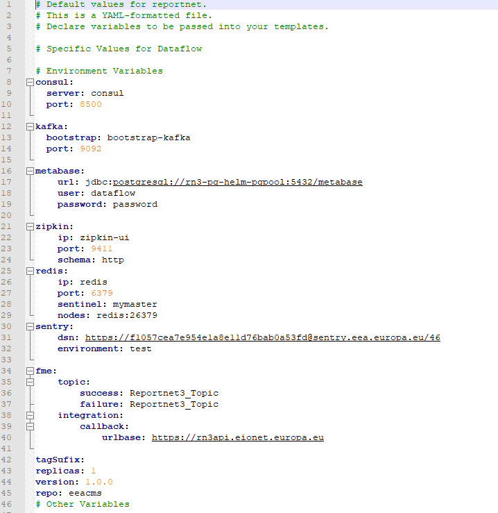

Dataflow-deployment.yaml shows (among other things) the environment variables that are going to be modified:

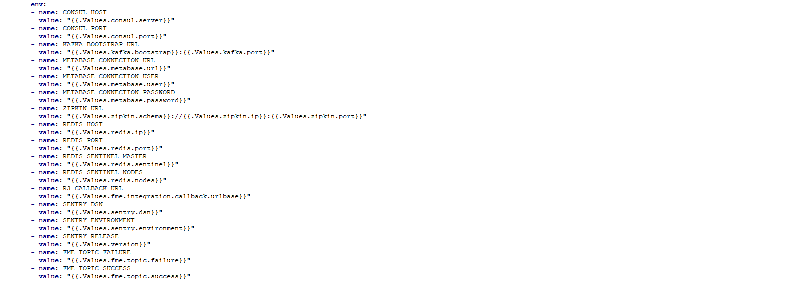

Let's take a look to the urlbase property defined in dataflow to allow FME to interact with Reportnet:

config/dataflow/integration.fme.callback.urlbase=${R3_CALLBACK_URL:http://rn3sandbox-api.altia.es}

In value.yaml we have the value fme.integration.callback.urlbase with a value (this is considered as default value for the release)

In the deployment file it is shown that the value fme.integration.callback.urlbase is mapped against the environment variable **R3_CALLBACK_URL**

The variable config/dataflow/integration.fme.callback.urlbase is defined as follows: **${R3_CALLBACK_URL:http://rn3sandbox-api.altia.es}** This means that if **R3_CALLBACK_URL** is not defined then use <http://rn3sandbox-api.altia.es>

So by doing --set fme.integration.callback.urlbase=https://api.reportnet.europa.eu we are setting environment variable R3_CALLBACK_URL to <https://api.reportnet.europa.eu> and that's the value that will be used in dataflow service.

[Edit this section](Operation_guidelines/edit.md)

### Modifying values by manual update

For updating a Configuration Parameter using Consul: 

  1. Navigate to the Configuration Parameter property using Consul User Interface.
  2. Set the new Value in the Edit screen
  3. Press Save to confirm the changes.

Doing it this way could lead to errors since a deployment process will override any manual configuration made on Consul. If you update the configuration manually please be aware that the modification needs to be written as well on the corresponding properties file if that modification is meant to last

[Edit this section](Operation_guidelines/edit.md)

## Logging, Monitoring and Metrics

This section will describe the different procedures to Monitor and Logging in the different components of Reportnet 3.0

[Edit this section](Operation_guidelines/edit.md)

### Logging

At this moment, logging is being kept internally in each component.   
In order to view the logs for a given component, use the kubectl logs command . 

  1. List the pods existing in Reportnet namespace. The command is: kubectl -n reportnet get pod. Here is a [basic loggin guide](https://kubernetes.io/docs/concepts/cluster-administration/logging/#basic-logging-in-kubernetes)
  2. Select the pod to inspect and run the logs command. The command is: kubectl -n reportnet logs -f <name of the pod>

[Edit this section](Operation_guidelines/edit.md)

### Monitoring

At this stage, monitoring is achieved via the SpringBoot Actuator health endpoint, exposed through Consul Service Registry  
When accessing to Consul User Interface, Services section, the Admin will be able to see all the services registered within consult with an history of Successful and Unsuccessful checks  
Clicking over a service, the Administrator will be able to see the specific checks that are failing, and the reason why:

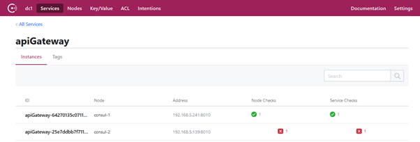

_Consul detail on Service Check for API Gateway_

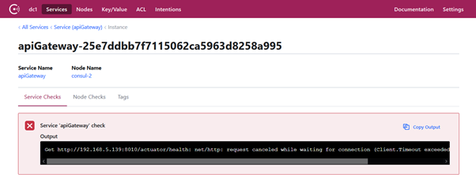

_Consul unsuccessful check detail_

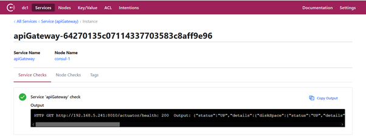

_Consul successful check detail_

In case of successful check detail, SpringBoot actuator health point messages are displayed, including information about the service:

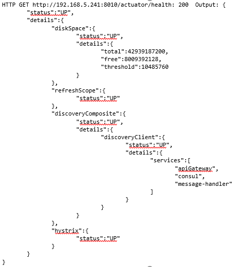

[Edit this section](Operation_guidelines/edit.md)

### Metrics

All of the services contains metrics endpoints that can be consume by any monitoring metric console such as Grafana or CheckMK. The metrics will be exposed via Prometheus

For Business microservices the metrics can be checked via Spring Actuator endpoints:
[code] 
    culr http://<serviceIp>:<servicePort>/actuator/prometheus
    
[/code]

  * serviceIP: ip/host where the service can be found by the Metric Console Tool
  * servicePort: port where the service can be found by the Metric Console Tool
  * prometheus: is a reporting framework that offers more metrics than standar Actuator endpoint (/actuator/metrics). That's why it's better to use this endpoint.  
For Dataset these would be the metrics:

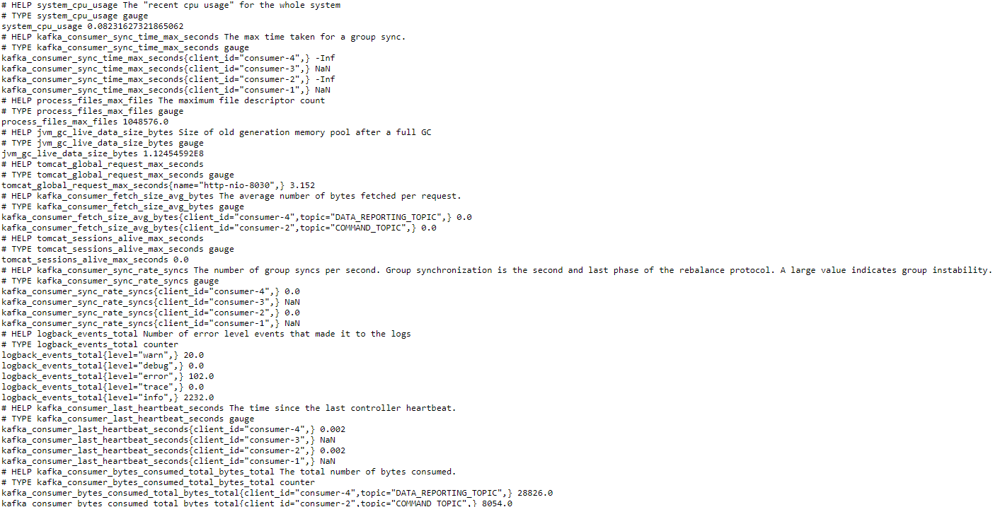

for the rest of the services 

  * Kafka: <http://[kafkaExporterServiceIp]:[KafkaExporterServicePort]/metrics>
  * Zookeeper: <http://[ZookeeperExporterServiceIp]:[ZookeeperExporterServicePort]/metrics>
  * Redis: [http://[&lt;RedisMetricsServiceIp]:[RedisMetricsServicePort]/metrics](http://\[&lt;RedisMetricsServiceIp\]:\[RedisMetricsServicePort\]/metrics)
  * Postgres: <http://[PostgresMetricsServiceIp]:[PostgresMetricsServicePort]/metrics>
  * Mongo: <http://[MongoReplicaNodeIp]:[MongoReplicaNodePort]/metrics>. Keep in mind that every node has it's own metric endpoint exposed on port 9216

If internal ip's and ports are not available to Metric Console then exporter services will need to be exoposed out of the cluster via NodePort. To do this it is necessary to run the following command:
[code] 
    kubectl -n NAMESPACE get svc --> This will retrieve the list of services
    kubectl -n NAMESPACE expose svc SERVICE --name=EXTERNAL-SERVICE-NAME --type=NodePort --port=INTERNAL_PORT
    
[/code]

As an example let's see Zookeeper:  

[code]
    kubectl -n reportnet expose svc zookeeper-metrics --type=NodePort --name=zookeeper-metrics-external --port=9141
    
[/code]

As a result the following service is created:

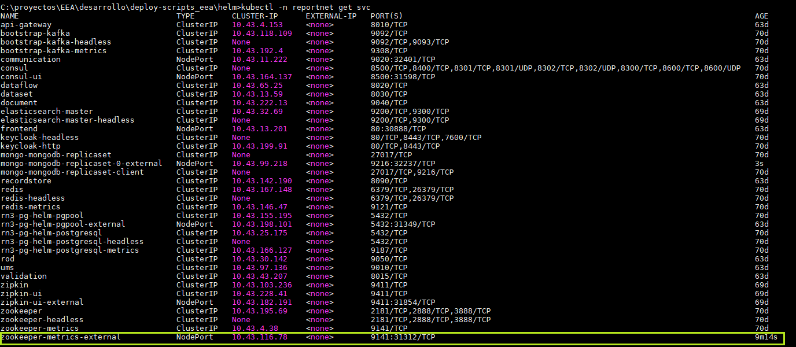

For Mongo is a bit different as the endpoint is created as a container inside the pods themselves so it must be done as follows:
[code] 
    kubectl -n NAMESPACE get pod --> This will retrieve the list of pods
    kubectl -n NAMESPACE expose pod MONGO_NODE_POD_NAME --name=EXTERNAL-SERVICE-NAME --type=NodePort --port=9216 <-- This is the internal port exposed in the port
    
[/code]

As an example:
[code] 
    kubectl -n reportnet expose pod mongo-mongodb-replicaset-0 --type=NodePort --name=mongo-mongodb-replicaset-0-external --port=9216 
    
[/code]

As a result the folowing service is created:

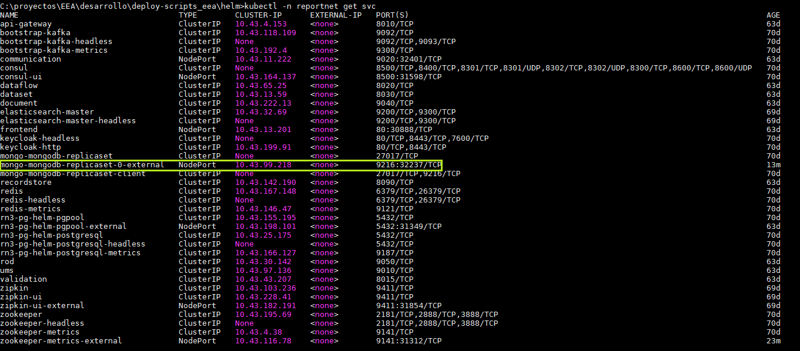

**Mongo will require one external exposure per Replicaset Node**

At the moment, endpoints for metrics and healtch checks are exposed as follows:

<http://kvm-rn3prod-04.pdmz.eea:32727/actuator/health> \--> ApiGateway health  
<http://kvm-rn3prod-04.pdmz.eea:32727/actuator/prometheus> \--> ApiGateway metrics  
<http://kvm-rn3prod-04.pdmz.eea:32401/actuator/health> \--> Communication health  
<http://kvm-rn3prod-04.pdmz.eea:32401/actuator/prometheus> \--> Communication metrics  
<http://kvm-rn3prod-04.pdmz.eea:30248/actuator/health> \--> Dataflow health   
<http://kvm-rn3prod-04.pdmz.eea:30248/actuator/prometheus> \--> Dataflow metrics  
<http://kvm-rn3prod-04.pdmz.eea:32686/actuator/health> \--> Dataset health  
<http://kvm-rn3prod-04.pdmz.eea:32686/actuator/prometheus> \--> Dataset metrics  
<http://kvm-rn3prod-04.pdmz.eea:32554/actuator/health> \--> Document health  
<http://kvm-rn3prod-04.pdmz.eea:32554/actuator/prometheus> \--> Document metrics  
<http://kvm-rn3prod-04.pdmz.eea:31981/actuator/health> \--> Recordstore health  
<http://kvm-rn3prod-04.pdmz.eea:31981/actuator/prometheus> \--> Recordstore metrics  
<http://kvm-rn3prod-04.pdmz.eea:32090/actuator/health> \--> Rod health  
<http://kvm-rn3prod-04.pdmz.eea:32090/actuator/prometheus> \--> Rod metrics  
<http://kvm-rn3prod-04.pdmz.eea:32079/actuator/health> \--> UMS health  
<http://kvm-rn3prod-04.pdmz.eea:32079/actuator/prometheus> \--> UMS metrics  
<http://kvm-rn3prod-04.pdmz.eea:30451/actuator/health> \--> Validation   
<http://kvm-rn3prod-04.pdmz.eea:30451/actuator/prometheus> \--> Validation metrics

<http://kvm-rn3prod-04.pdmz.eea:31312/metrics> \--> zookeeper  
<http://kvm-rn3prod-04.pdmz.eea:31812/metrics> \--> kafka  
<http://kvm-rn3prod-04.pdmz.eea:32237/metrics> \--> mongo-0  
<http://kvm-rn3prod-04.pdmz.eea:32464/metrics> \--> mongo-1  
<http://kvm-rn3prod-04.pdmz.eea:31143/metrics> \--> mongo-2  
<http://kvm-rn3prod-04.pdmz.eea:31493/metrics> \--> redis  
<http://kvm-rn3prod-04.pdmz.eea:32350/metrics> \--> postgres

All metrics are available in a visual fashion in the kibana console: <https://metrics.eea.europa.eu/app/dashboards#/view/52a2d430-8d6c-11ec-b306-57f7501fa0e3?_g=(filters:!(),refreshInterval:(pause:!f,value:5000),time:(from:now-15m,to:now))>

[Edit this section](Operation_guidelines/edit.md)

## Environment Operational Procedures

Procedures to deploy or upgrade components have been described in the [Reportnet Deployment wiki](https://taskman.eionet.europa.eu/projects/reportnet-3/wiki/Reportnet_Deployment)  
Additionally, in the following sections we are going to describe additional procedures that can be useful on a day-by-day basis.  
These operational procedures are based on the usage of [kubectl commands](https://kubernetes.io/docs/reference/kubectl/cheatsheet/)

[Edit this section](Operation_guidelines/edit.md)

###  Scale Up and Scale Down a given component

Scaling a component means to update the number of instances of the component that are running:  
*Scale Up means to add new instances.  
*Scale Down means to remove existing instances.

Kubectl command for scaling up or down instance is the same, being differenced by the number of replicas that are intended to deploy: if the number of replicas indicated in the command is higher than the existing one, the we are scaling up; otherwise we are scaling down.  
To know the number of replicas currently deployed, execute the following command:

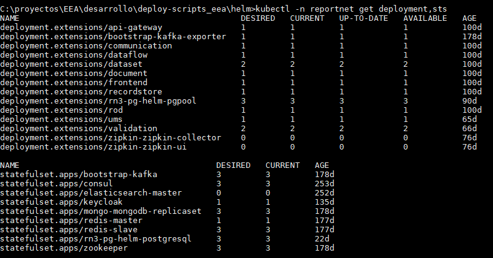

For example, for deployment api-gateway, there is one instance (as indicates the columns READY, UP-TO-DATE and AVAILABLE).  
For scaling up that component, use the following command:

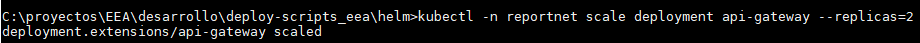

Now, number of replicas for api-gateway has been updated to 2 (it could take a while until the new instance is READY and AVAILABLE):

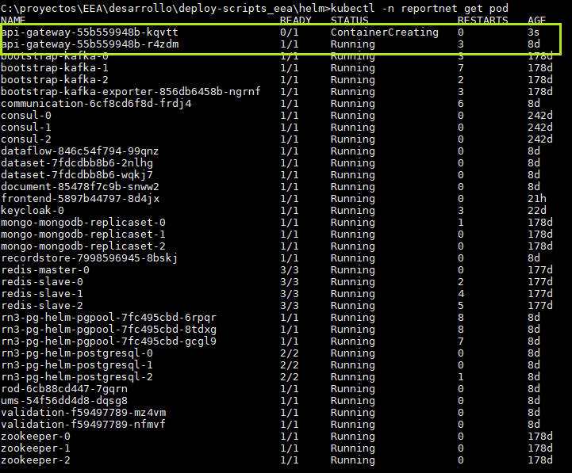

For scaling down the api-gateway component, use the same command with a number of replicas lower than the existing one:

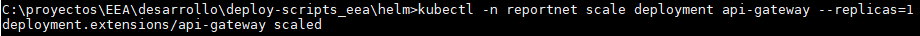

Command requires the following format:

kubectl -n **NAMESPACE** scale **TYPE** **NAME** \--replicas = **NUMBER**

  * NAMESPACE is the Kubernetes namespace where the components are being deployed
  * TYPE is the type of Kubernetes construct to scale (deployment or statefulset)
  * NAME is the name of the construct to scale
  * NUMBER is the number of replicas to create

[Edit this section](Operation_guidelines/edit.md)

### Restart a component

In some occasions it could be required to re-start a component, for example, when a configuration property has been updated in Consul, and it is needed that component to use the new property.  
The safest procedure to do that is to:

  * Scale down the component to 0 replicas.
  * Scale back up the component to the number of replicas required.

[Edit this section](Operation_guidelines/edit.md)

### Restart a particular process

  * End all the pods: kubectl -n reportnet scale deploy <DeployName> \--replicas=0 
  * Starts X pods of the given deploy: kubectl -n reportnet scale deploy <DeployName> \--replicas=X
  * To retrieve deploys: kubectl -n reportnet get deploy

The deploys we want are: api-gateway, dataflow, dataset, validation, communication, document, ums, rod (reportnet business microservices)

[Edit this section](Operation_guidelines/edit.md)

## Connecting to K8S

Connection to K8S cluster will be done via kubectl. In order to install/uninstall services helm v3 will be used as well

[Edit this section](Operation_guidelines/edit.md)

### Configuring local environment

Kubectl can be installed following the steps described [here](https://kubernetes.io/docs/tasks/tools/install-kubectl/)

helm v3 can be installed following the steps described [here](https://helm.sh/docs/intro/install/)

Once these 2 clients have been installed the connection for kubectl must be configured. For this navigate to the Rancher console of the desired environment and get the kubernetes cli configuration:

  * Dev: <https://kvm-rancher-s4.eea.europa.eu/env/1a872/kubernetes/kubectl>
  * Staging: <https://kvm-rancher-s4.eea.europa.eu/env/1a7026/kubernetes/kubectl>
  * Prod: <https://kvm-rancher-s2.eea.europa.eu/env/1a4420/kubernetes/kubectl>

Once Rancher has been accessed just click on "Generate config" button as shown bellow:

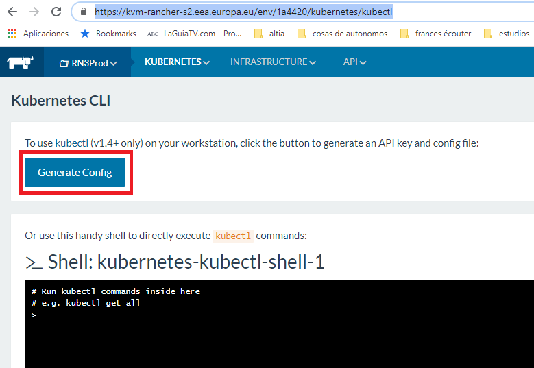

As result the following content is generated:

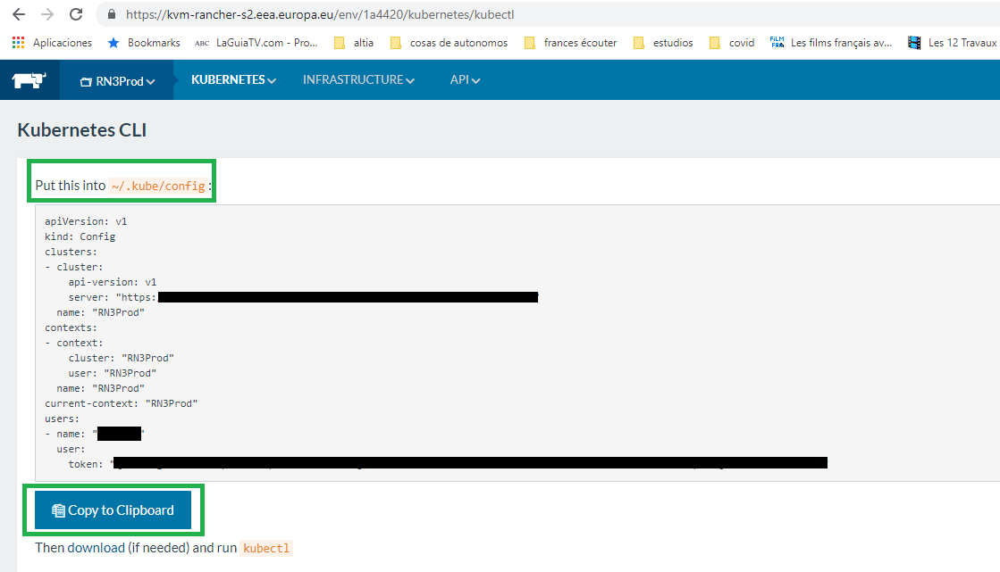

The content must be placed in a file called config in the folder ~/.kube/config (Unix) or C:\Users\<user>\\.kube (Windows)

Note: Access to Rancher must be granted to the user before generating the config file

[Edit this section](Operation_guidelines/edit.md)

### Executing commands

Once local environment has been configured open a shell and set HOME=<UserFolder>. set HOME=C:\Users\<User> in windows

after this, the shell is ready to connect against k8s cluster:

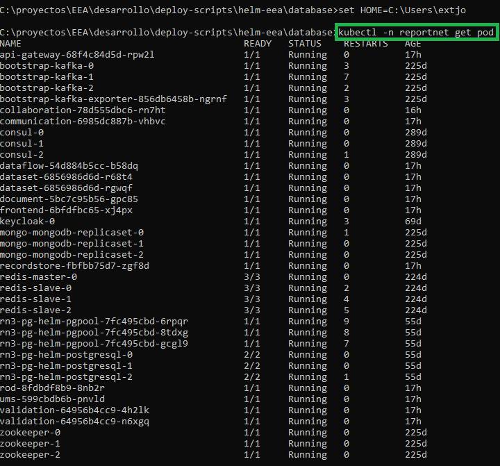

[Edit this section](Operation_guidelines/edit.md)

## Maintenance mode

In order to let the users know that the environment is not available and preventing them from doing more requests to the server there is a chance to activate a maintenance mode

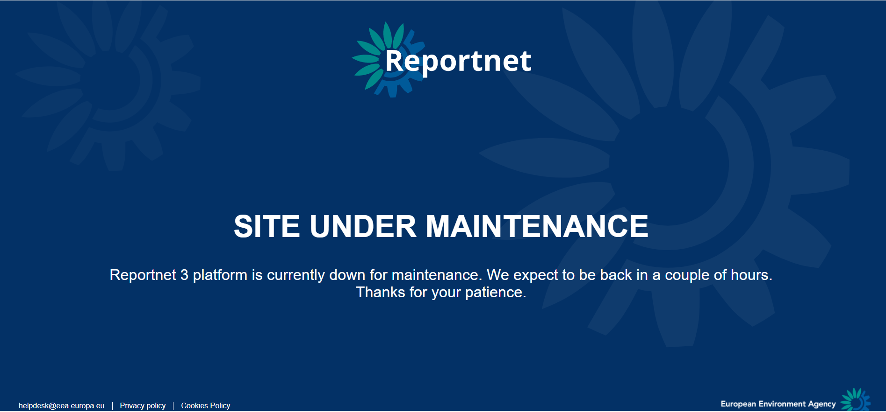

[Edit this section](Operation_guidelines/edit.md)

### Activating maintenance mode

First step is scaling the maintenance service to one replicas (by default it is scaled to 0 to save resources): kubectl -n NAMESPACE scale deploy maintenance --replicas = 1

Second step is to redirect in Rancher the inbound traffic to reportnet/maintenance service instead of reportnet/frontend service

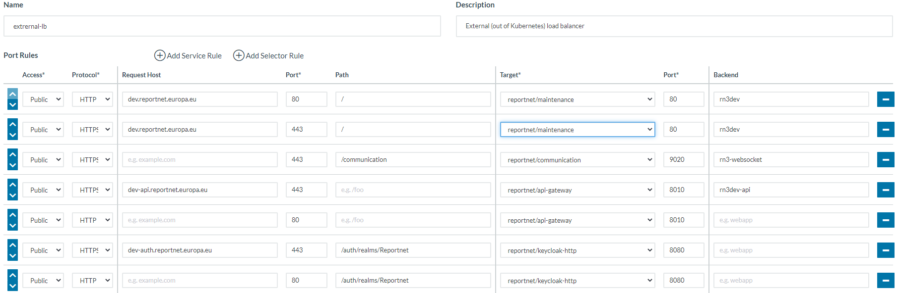

Finally, when the problem has been fixed undo steps performed above

## Verification notes

This document was last updated in October 2020 and is significantly stale relative to the current codebase. The following specific issues were identified.

**Missing services.** The Consul service list and the deployment name list in the "Restart a particular process" section omit `orchestrator`, `collaboration`, and `indexsearch` — all of which exist as deployable services in the current codebase (`orchestrator-service`, `collaboration-service`, `indexsearch-service`). The document lists only: `api-gateway, dataflow, dataset, validation, communication, document, ums, rod`.

**Consul key structure.** The Consul key tables under each service heading (application, apiGateway, communication, dataflow, dataset, document, recordstore, rod, ums, validation) are consistent with the Spring Cloud Config / Consul integration pattern visible in the source. Keys such as `config/application/lock.releaseDelay`, `config/recordstore/dataset.users`, and `config/validation/validation.fieldBatchSize` match property names found in the codebase. However there is no `config/orchestrator/` section anywhere in the document, which is an omission given the Orchestrator Service is a significant component.

**Hystrix / Ribbon / Zuul references.** The document describes Netflix Zuul, Ribbon, and Hystrix configuration keys extensively. These libraries were part of the Spring Cloud Netflix stack and were deprecated; the current `api-gateway` service name remains, but whether the Ribbon and Hystrix keys are still active cannot be confirmed from source code alone. The document's hardcoded default values (e.g. the Keycloak public key, certificate, and host `k8s-node002.devoami.altia.es`) are environment-specific and unlikely to reflect the current production environment.

**Hardcoded production endpoints.** The metrics endpoint table lists specific NodePort values on `kvm-rn3prod-04.pdmz.eea` (e.g. `:32727`, `:32401`). These are environment-specific and will be incorrect after any re-deployment. They should not be treated as authoritative.

**Rancher version.** The Rancher console URLs (`kvm-rancher-s4.eea.europa.eu/env/1a872`) reference Rancher v1.x environment paths. Current deployments are likely running Rancher v2.x, which uses a different URL structure. The kubectl config generation procedure described will differ from current Rancher.

Overall the Consul key structure, the deployment mechanism (Helm preconfig + service pattern), and the `kubectl scale` / `kubectl logs` procedures remain valid as conceptual guidance, but all specific values, hostnames, and service lists should be considered indicative only.
