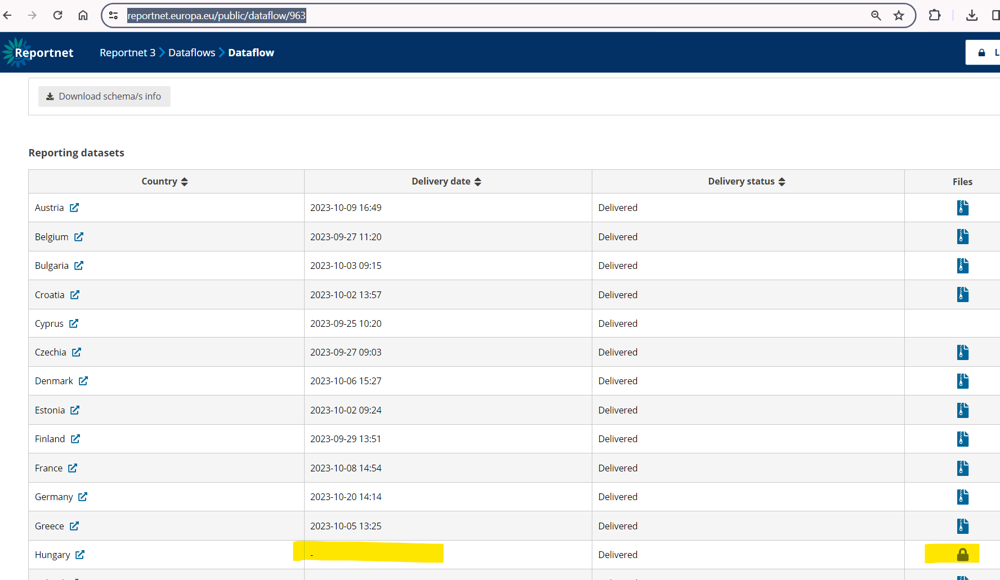

# Released data not visible in public page

During the release process, there is a checkbox to select if the data should not be available to the public.  
!  
  
!  
If this checkbox was selected by accident, the data can be made available to the public following the steps below:

First, in metabase, at the table "representative" we are looking for the entry with column dataflow_id matching the dataflow the data are released to and   
with column data_provider_id matching the data provider this issue is related to we can find the specific entry.  
For that entry, the boolean column restrict_from_public should be set to FALSE.

Next, the release date must be set. To do that, we start again in metabase.  
In the table "dataset" and filtering by the dataflowid column, we can find the dataset id for the released data we need to set a release date.  
Using the id we found in the "dataset" table we can filter the table "snapshot" by the column reporting_dataset_id and find the snapshot we need to set a release date to.  
The date_released column should be null, but the description column should contain the date when the release process happened and will look like this: "Release 2023-11-08 09:43:03 CET".  
This is the date we need to set in the date_released column. Finally, the column restrict_from_public should be set as false in table "snapshot", as well.

## Verification notes

All table names and column names referenced in this procedure are verified against database migration scripts and `postgresql_db.md`.

**`representative` table, `restrict_from_public` column.** Confirmed: `V30__Alter_repesentative_and_Dataset.sql` adds `restrict_from_public bool NULL DEFAULT false` to the `representative` table. The `dataflow_id` and `data_provider_id` columns referenced as the lookup criteria are confirmed in the `representative` table definition.

**`dataset` table, `dataflowid` column.** Confirmed: the `dataset` table has a `dataflowid` column (note: no underscore between `dataflow` and `id` in the column name, unlike `dataflow_id` on other tables). The wiki's instruction to "filter by the dataflowid column" is correct.

**`snapshot` table, `date_released` and `restrict_from_public` columns.** Confirmed: `V4__Alter_Snapshot.sql` adds `date_released timestamp NULL`; `V53__add_column_restrict_from_public_in_snapshot.sql` adds `restrict_from_public bool NULL`. The `reporting_dataset_id` join column and the `dc_released` column (renamed from `release` in V18) also exist. The procedure does not mention `dc_released` — if `date_released` is set but `dc_released` is `false`, the data may still not appear publicly. Operators should ensure `dc_released` is set to `true` on the relevant snapshot as well.
