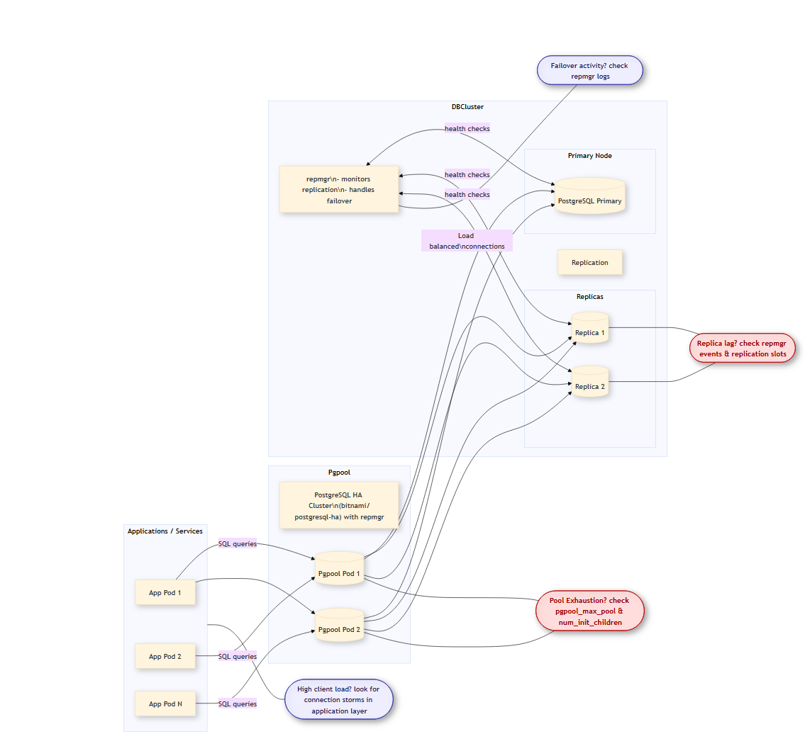

# Replicated Postgres troubleshooting

[Edit this section](Replicated_Postgres_troubleshooting/edit.md)

## Kubernetes Postgres formation

[Edit this section](Replicated_Postgres_troubleshooting/edit.md)

## "sorry, too many clients already"

  1. Scale down Dataset, Dataflow, Recordstore, Validation down to 3 
  2. Find the pgool container that has "too many clients" logs 
  3. Restart the pgpool
  4. Wait for the containers to rebalance
  5. Scale the services from Step 1 to 4

## Verification notes

No source code verification applicable — operational runbook; accuracy depends on current infrastructure configuration, not source code.

The four services identified as connection-pool consumers — Dataset, Dataflow, Recordstore, and Validation — are consistent with the current codebase: all four have their own Spring datasource configurations pointing to the PostgreSQL cluster. The pgpool component (`rn3-pg-helm-pgpool`) is confirmed as the connection pooler in `Check_And_Fix_Database_Errors.md` and in `postgresql_db.md`. This is the most recently updated page in the operations folder (2026-03-13) and the procedure is brief enough to remain accurate.
