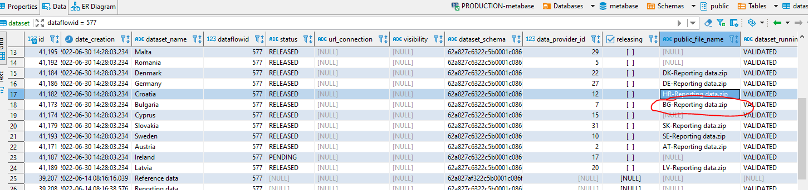

# Add/re-create missing public files in dataflow

[Edit this section](Add_or_Recreate_missing_public_files_in_dataflow/edit.md)

## Adding missing files

In recordstore pods in the path :  
/reportnet3-data/snapshots/dataflow-{your dadaflow}/dataProvider-{your dataProvider id}  
Example: for datflow 557 and provider id 7 (Bulgaria) : /reportnet3-data/snapshots/dataflow-577/dataProvider-7

Place a file with this naming convention: {Country two letter iso code}-Reporting data.zip  
Example: BG-Reporting data.zip for Bulgaria

In metabase Database and table dataset set the public_file_name field for the country record to the filename you have uploaded:  
Example: BG-Reporting data.zip

[Edit this section](Add_or_Recreate_missing_public_files_in_dataflow/edit.md)

## Re-creating missing files

To recreate these files, follow these steps:

  * **API Call** : Make an API call to generate the missing files. Each API call is specific to a dataflow and a provider. Ensure that you have a Bearer token ready to authorize the API call. You can find a Postman collection attached with the necessary requests.

  * **Monitoring Progress** : After initiating the POST call, please monitor the pods closely to identify which one is responsible for creating the files. The time it takes to generate the files depends on the volume of data, including tables and rows that need to be consolidated into a single file.

> For instance, processing a total of 3 million records took approximately 30 minutes to produce the required file.

By following these steps, you can recreate the missing files needed for your dataflow and provider.

## Verification notes

**`public_file_name` column — verified.** The `dataset` table has a `publicFileName` field (stored as `public_file_name` in the database, confirmed via the migration files and `dataset.md` which lists `publicFileName` as a base entity field). Setting this column to the uploaded filename is the correct approach.

**File path convention.** The snapshot path `/reportnet3-data/snapshots/dataflow-{id}/dataProvider-{id}` is a filesystem convention on the Record Store pods. This path should be verified against the current persistent volume mount configuration, as it is not defined in migration files and could change with infrastructure updates.

**Re-creation API call.** The runbook references a POST API call for regenerating public files but does not specify the endpoint. Based on the Dataset Service source, the relevant endpoint is likely in the snapshot or export controllers. Operators should consult the attached Postman collection or the service API documentation to identify the correct endpoint before running this step.
