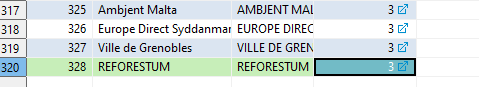

# Add provider to dataflow

Example task <https://taskman.eionet.europa.eu/issues/153276>

Go to database: metabase, table: data_provider

Order by Id

Select from table with code : 'REFORESTUM' and make sure the code does not exist

Add new record with next id for the requested

## Verification notes

The `data_provider` table is confirmed in `V1__Init_Metabase_BD.sql` with columns `id` (int8), `label` (varchar), `type` (varchar), `code` (varchar), and `group_id` (int8). The runbook's approach of searching by the `code` column and inserting a new row with the next ID is structurally correct.

However, the table has no auto-increment sequence for `id` (unlike many other metabase tables which use `bigserial`). The `id` is a plain `int8` with a manually managed primary key. The runbook's instruction to "Add new record with next id" is therefore the correct approach, but operators must manually compute the next available ID rather than relying on a sequence. If a sequence has been added separately to the running environment, this should be verified before inserting.

The `group_id` column (FK to `data_provider_group`) must also be populated with the appropriate group for the new provider, as the Dataflow Service uses `dataprovider_group_id` to determine how providers are treated. The runbook does not mention this requirement.
