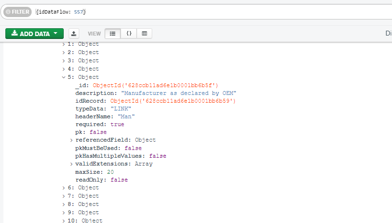

# Delete bad records from dataset

Refer to task :

[#154741](/issues/154741 "Bug: Clean empty records for HYUNDAI \(Closed\)")

A simple solution in a "schema" layered data is it to identify the error value and trace it to the record key.  
Then use the record keys to do the delete either with cascade or using the dependency lookup.

[Edit this section](Delete_bad_records_from_dataset/edit.md)

## Find the key

In Mongo schema of dataflow 557 identify the key field to separate the "rogue" records from the clean ones. This is the "Man" field

[Edit this section](Delete_bad_records_from_dataset/edit.md)

## Test if it is the right key

Test if the record count from field_values table with identified field match the number of verified records   

[code]
    select count(id) from dataset_37709.field_value fv where id_field_schema = '628ccb11ad6e1b0001bb6b5f' and value not like '' 
    
[/code]

  
Count: 110969  

[code]
    select count(id) from dataset_37900.field_value fv where id_field_schema = '628ccb11ad6e1b0001bb6b5f' and value not like ''
    
[/code]

  
Count: 208090

[Edit this section](Delete_bad_records_from_dataset/edit.md)

## Right/Wrong records

The record ids from the above queries (select id_record instead of select count(id)) are the correct ones.

[Edit this section](Delete_bad_records_from_dataset/edit.md)

## Clean up the tables

Clean up the tables by reverting the filter "not like" to "like"

For 37709:

The record table (using the empty field values)  

[code]
    delete from dataset_37709.record_value where id in (select id_record from dataset_37709.field_value fv where id_field_schema = '628ccb11ad6e1b0001bb6b5f' and value like '')
    
[/code]

  
The field table (using the non existing records)  

[code]
    delete from dataset_37709.field_value where id_record not in (select id from dataset_37709.record_value)
    
[/code]

For 37900:

The record table (using the empty field values)  

[code]
    delete from dataset_37900.record_value where id in (select id_record from dataset_37900.field_value fv where id_field_schema = '628ccb11ad6e1b0001bb6b5f' and value like '')
    
[/code]

  
The field table (using the non existing records)  

[code]
    delete from dataset_37900.field_value where id_record not in (select id from dataset_37900.record_value)
    
[/code]

In case of **foreign key conflict** use the cascade in the record_value records

## Verification notes

The SQL in this runbook operates against per-dataset PostgreSQL schemas (e.g. `dataset_37709`, `dataset_37900`). The table names `field_value` and `record_value` are correct: both are defined in the dataset service's per-tenant schema as `FIELD_VALUE` and `RECORD_VALUE` (see `dataset.md`, "Data model" section). The column `id_field_schema` in `field_value` corresponds to the `idFieldSchema` ObjectId stored as a string, which is the join key between the schema definition in MongoDB and the relational data — this usage is correct.

The delete strategy (delete from `record_value` first, then orphan-clean `field_value`) is sound given the FK relationship where `field_value.id_record` references `record_value.id`. If cascade constraints are present on `field_value`, the two-step delete is still safe; if not, the orphan-clean step is required.

No table names are incorrect. The schema and column names used in the queries match the source-derived documentation and the migration files.
