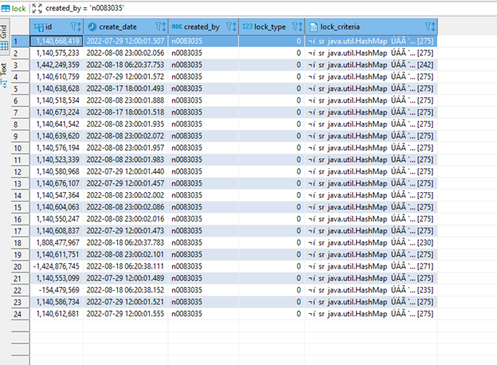
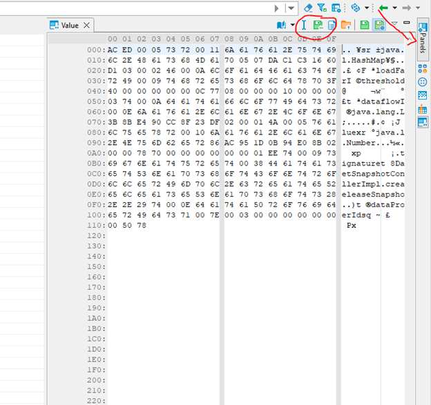
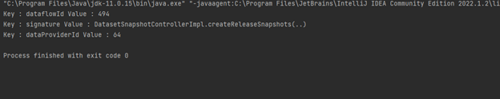
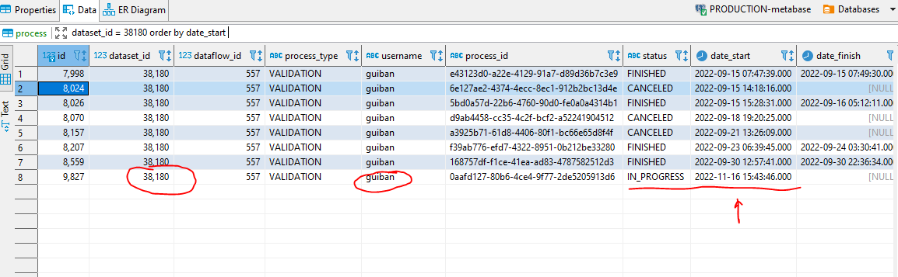
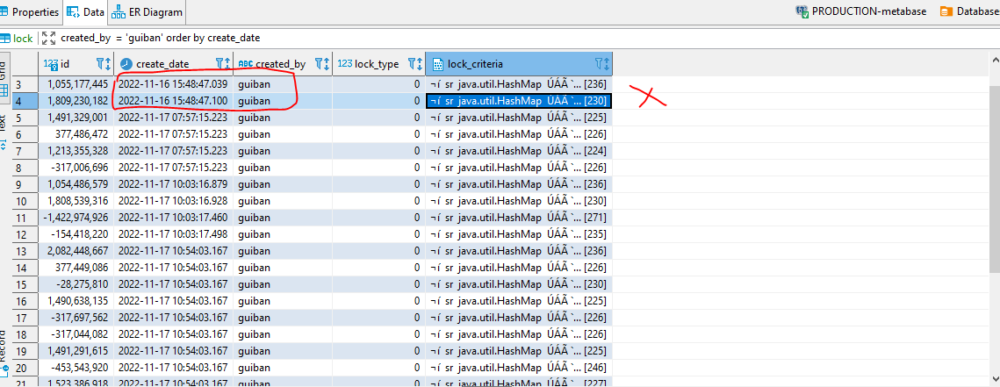

# Get lock record information

[Edit this section](Get_lock_record_information/edit.md)

## Identify lock

If the processes and the tasks for a specific dataflow (eg 494) or dataset are in status “FINISHED” or “CANCELED”

Find the user from the error log

org.eea.exception.EEAException: Method locked: LockVO(id=1140638628, createDate=2022-08-18 06:00:01.574, createdBy=n0083035, lockType=METHOD, lockCriteria={dataflowId=494, signature=DatasetSnapshotControllerImpl.createReleaseSnapshots(..), dataProviderId=70})

query for locks in the database: metabase, table: locks for the specific user “n0083035”

[Edit this section](Get_lock_record_information/edit.md)

## Get the java code from lock record and save it to the desktop

[Edit this section](Get_lock_record_information/edit.md)

### Run the java code

Download the code from lock_criteria_export.zip (Intellij/Maven project) and run it.

The lock is for dataflow : 494 and provider : 64 (this is an old lock and should be removed)

[Edit this section](Get_lock_record_information/edit.md)

## Request to remove multiple locks per dataset (validation example)

Get the dataset id and query process table (database: metabase) to get the user name

Get the related locks for the user/date from lock table (database: metabase)   
All locks for the specific step should have the same datetime

Delete the 2 locks with matching date and user

## Verification notes

**Table name discrepancy.** The runbook refers to "table: locks" in its prose description ("query for locks in the database: metabase, table: locks"). The actual table name, as defined in `V1__Init_Metabase_BD.sql`, is `public.lock` (singular, no trailing 's'). Queries against a `locks` table will fail. All SQL should target the `lock` table.

**Lock table schema.** The `lock` table has columns: `id` (int4), `create_date` (timestamp), `created_by` (varchar), `lock_type` (int4), and `lock_criteria` (bytea). The `lock_criteria` column is stored as a serialised binary (bytea), which is why the runbook describes exporting and running a Java utility to decode it — this is accurate behaviour given the schema.

**Process table reference.** The runbook's second section queries the `process` table to retrieve the username associated with a dataset. The `process` table (created in `V65__create_table_process.sql`) has a `username` column and a `dataset_id` column, confirming this approach is valid.

The runbook was last updated August 2022. The lock table schema has not changed since V1, so the procedural steps remain applicable.
